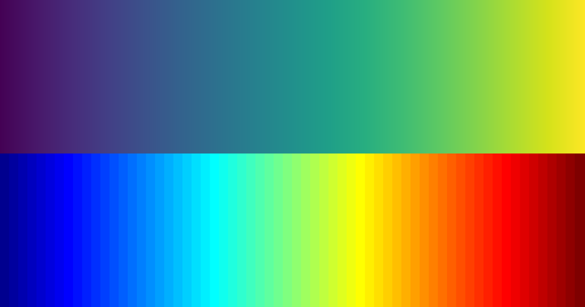

# Graphiken mit ggplot2

(Cordula Hunt)

```{r setup, include=FALSE}
library(tidyverse)
knitr::opts_chunk$set(echo = TRUE)
# colors: #8fd744 #35b779 #21918d #31688e
```

## Exkurs: Warum viridis?

Das `viridis` Paket in R stellt eine Reihe an Colormaps bereit, die
folgenden Anspruch an sich stellen:

-   gute **Lesbarkeit** und Unterscheidbarkeit in Graphiken
-   auch bei **Farbenblindheit** oder **Farbsehschwäche**
-   bleibt bei **Grauskala**(-druck) erhalten

Praktisch bedeutet das, die Farbkarten sind:

-   **farbenfroh**: sie umspannen weite Teile der Farbpalette damit
    Unterschiede einfach zu erkennen sind
-   **einheitlich**: Punkte nah beieinander haben ähnliche Farben und
    Punkte weit auseinander stark unterschiedliche Farben - und das
    möglichst konsistent über den gesamten Farbraum hinweg\
    $\rightarrow$ *ein fester Abstand wird also an verschiedenen Stellen
    im Farbraum als perzeptuell gleich wahrgenommen, dh. keine mal
    schnellen mal langsamen Farbton- oder Helligkeitsänderungen*

Gerade die Einheitlichkeit ist wichtig, sie sorgt dafür, dass keine
Gebiete überbetont werden, während Kontrast an anderen Strellen nicht
gegeben ist. Hier die viridis Farbskala oben und jet (langjährig die
Standardfarben in Matlab) unten:

<center>

{width="250"}

</center>

Bei jet stechen besonders Gelb und Türkis heraus - in einer Graphik gibt
das Artefakte durch die Darstellung, weil unauffällige Daten durch die
Farbwahl auf einmal außergewöhnlich wirken. Außerdem werden an anderen
Stellen Unterschiede in den Daten dadurch unterschlagen, dass in weiten
Teilen des roten und blauen Spektrums in jet fast keine Farbstufen
enthalten sind. viridis versucht dieses Problem zu beheben und wirkt
homogen - ohne "Spitzen und Täler".

Zusätzlich muss berücksichtigt werden, dass Graphiken auch bei
Grauskaladruck noch interpretierbar bleiben. Das macht eine Grauskala
aus viridis und jet:

<center>

{width="250"}

</center>

Bei der oberen viridis Skala vermindert sich die Interpretierbarkeit nur
minimal, während man bei der unteren Skala nicht mehr zwischen hohen und
niedrigen Werten unterscheiden kann. Tatsächlich wirkt es so, als ob die
mittleren Bereiche besonders auffällig wären - Bereiche die meistens um
die 0 herum liegen!

Im `viridis` Paket gibt es 8 Colormaps, aus denen man wählen kann und
die alle diese Kriterien erfüllen:

<center>

{width="80%"}

</center>

::: {.footnotes}
source: [viridis
Dokumentation](https://www.rstudio.com/resources/cheatsheets/)
:::

## `ggplot2` - Einführung

`ggplot2` ist ein Paket zur graphischen Darstellung in R, das auf dem
Buch ["The Grammar of
Graphics"](https://www.amazon.com/Grammar-Graphics-Statistics-Computing/dp/0387245448/ref=as_li_ss_tl)
von Leland Wilkinson basiert. Wie bei `dplyr` ist die Codestruktur an
Grammatik orientiert und somit einfach nachzuvollziehen. Ablauf der
Graphikerstellung in `ggplot2` lässt sich wie folgend zusammenfassen:

-   [Daten]{style="color:#8fd744"} bereitstellen

-   Wie werden Variablen in der Graphik in [Ästhetik
    umgewandelt]{style="color:#35b779"}? - `aesthetics()`

    -   Was ist die x-Achse, was die y-Achse?
    -   Wonach wird farbkodiert?
    -   ...

-   Welche [graphische Darstellung]{style="color:#21918d"}?

    -   Scatterplot - `geom_point()`
    -   Histogram - `geom_histogram()`
    -   Linienplot - `geom_line()`
    -   ...

-   Ggf. weitere [Details]{style="color:#31688e"} definieren, wie zB die
    Achsenlabel

Um eine Graphik zu "bauen" kann man also dieser Struktur folgen:

<br>

**ggplot**(data = [DATA]{style="color:#8fd744"},
aes([MAPPINGS]{style="color:#35b779"})) +

> [GEOM_FUNCTION]{style="color:#21918d"} (mapping =
> aes([MAPPINGS]{style="color:#35b779"}), position =
> [POSITION]{style="color:#31688e"}) +

> [LABEL_FUNCTION]{style="color:#31688e"} +

> [THEME_FUNCTION]{style="color:#31688e"} +

> [COORDINATE_FUNCTION]{style="color:#31688e"} +

> [SCALE_FUNCTION]{style="color:#31688e"} +

> [FACET_FUNCTION]{style="color:#31688e"}

<br> Dabei sind [DATA]{style="color:#8fd744"},
[MAPPINGS]{style="color:#35b779"} und
[GEOM_FUNCTION]{style="color:#21918d"} notwendig, während [der
Rest]{style="color:#31688e"} nicht notwendig ist, da es gute
Standardeinstellungen gibt.

<br> **Vorsicht**: In `ggplot2` sind Lagen mit `+` verknüpft und nicht
mit `%>%`! <br>

::: {.footnotes}
source: [ggplot2 Cheat
Sheet](https://www.rstudio.com/resources/cheatsheets/)
:::

## Vor der Visualisierung: Die Daten

Wir arbeiten mit einem Datensatz, der die Superhelden von Marvel und DC
miteinander vergleicht. Die Daten finden sich auf GitHub
("<https://github.com/cosmoduende/r-marvel-vs-dc>"), sind aber auf zwei
Files aufgeteilt, die wir erst einzeln laden und dann zusammenführen
müssen. Um eine Vorlage zu geben, ist der Code dafür hier aufgenommen,
ist aber zu fortgeschritten für den meisten Gebrauch, und kann für
dieses Kapitel auch ignoriert werden.

Erst werden die zwei Files von GitHub heruntergeladen und den Variablen
`MarvelCharacters` und `MarvelStats` zugewiesen. Dabei werden fehlende
Werte als `NA` kodiert:

```{r message=FALSE}
MarvelCharacters <- read_csv("https://raw.github.com/cosmoduende/r-marvel-vs-dc/main/dataset_shdb/heroesInformation.csv", 
                             na = c("-", "-99.0"))
MarvelStats <- read_csv("https://raw.github.com/cosmoduende/r-marvel-vs-dc/main/dataset_shdb/charactersStats.csv")
```

Wir wählen nur die Charaktere aus Marvel und DC aus und machen ein
bisschen weiteres preprocessing:

```{r}
marvelDcInfo <- MarvelCharacters %>%
  rename(Name = name) %>%                  # `name` soll `Name` heißen
  filter(Publisher == "Marvel Comics" |    # wir wählen nur Charaktere von Marvel oder... 
           Publisher == "DC Comics")  %>%  # ...von DC
  filter(!duplicated(Name)) %>%            # alle Duplikate löschen wir
  select(Name, Gender, Race, Publisher, Weight, Height) # wir wollen nur bestimmte Spalten
```

Dann fügen wir die Datensätze zusammen:

```{r}
MarvelDC <- inner_join(marvelDcInfo, MarvelStats, by = "Name")
MarvelDC<- MarvelDC %>% 
  # einige Zeilen sind falsch kodiert und enthalten eine andere Skala,
  # deswegen schließen wir alle Zeilen mit Intelligence = 1 aus. 
  filter(Intelligence > 1) 
```

Damit haben wir einen Datensatz `MarvelDC`mit dem wir weiterarbeiten
können!

Um `ggplot` [Daten]{style="color:#8fd744"} zu geben können wir sie
entweder in den Klammern definieren:

    ggplot(data = MarvelDC)    # Info: das "data = " kann auch weggelassen werden.

Oder man gibt sie via Pipeline an `ggplot` weiter - beides ist
äquivalent:

    MarvelDC %>%
    ggplot()

Dieser Code funktioniert allerdings noch nicht, da wir nur die
[Daten]{style="color:#8fd744"} haben, aber noch keine
[MAPPINGS]{style="color:#35b779"} und auch keine
[GEOM_FUNCTION]{style="color:#21918d"} - die beiden anderen
erforderlichen Angaben.

## Ästhetische Mapping

Das [ästhetische Mapping]{style="color:#35b779"} (`aesthetics`) kann
entweder direkt in `ggplot` definiert werden, dann gilt es für **alle**
weiteren Schritte, oder es kann in der jeweiligen [graphischen
Funktion]{style="color:#21918d"} definiert werden, dann gilt es nur für
diese `geom_*` Funktion.

<center>

::: {style="float: center; width: 80%;"}
| `aesthetics` | Bedeutung                                                            |
|--------------|----------------------------------------------------------------------|
| x            | Welche Variable soll auf die x-Achse?                                |
| y            | Welche Variable soll auf die y-Achse?                                |
| shape        | Nach den Werten welcher Variable soll die Form vergeben werden?      |
| color        | Nach den Werten welcher Variable soll die Farbe vergeben werden?     |
| fill         | Nach den Werten welcher Variable soll die Füllfarbe vergeben werden? |
:::

</center>

<br> `aesthetics` in `ggplot()` werden an alle `geom_*` weitergegeben.
`aesthetics` in `geom_*` sind spezifisch für diese [graphische
Funktion]{style="color:#21918d"} (und können geerbte Werte
überschreiben).

<br> Hier ein Beispiel, das sich wie folgend liest: "Nehme MarvelDC als
[Daten]{style="color:#8fd744"}. Die [x-Achse]{style="color:#35b779"}
soll `Publisher` sein und die [y-Achse]{style="color:#35b779"} `Combat`.
Stelle das in einem [Boxplot]{style="color:#21918d"} dar."

```{r, fig.dim=c(4, 4), fig.align='center'}
ggplot(data = MarvelDC, aes(x = Publisher, y = Combat)) +
  geom_boxplot()    
```

Um eine [farbliche]{style="color:#35b779"} Trennung nach Geschlecht zu
haben, erweitern wir das Beispiel: "Nehme MarvelDC als
[Daten]{style="color:#8fd744"}. Die [x-Achse]{style="color:#35b779"}
soll `Publisher` sein und die [y-Achse]{style="color:#35b779"} `Combat`.
Stelle das in einem [Boxplot]{style="color:#21918d"} dar. Wähle
unterschiedliche [Farben]{style="color:#35b779"} für `Gender` und fülle
die Plots damit."

```{r, fig.width=6, fig.asp=0.7, fig.align='center'}
ggplot(data = MarvelDC, aes(x = Publisher, y = Combat)) +
  geom_boxplot(aes(fill = Gender))    
```

## Graphischen Funktionen

Mit den [graphischen Funktionen]{style="color:#21918d"} (`geom_*`) gibt
man an, welche Art der graphischen Darstellung man will. Beispiele sind:

<center>

::: {style="float: center; width: 80%;"}
| `aesthetics`       | Anzahl Variablen: | x ist dabei:   | y ist dabei:   |
|--------------------|-------------------|----------------|----------------|
| `geom_bar()`       | 1                 | diskret        | \-             |
| `geom_histogram()` | 1                 | kontinuierlich | \-             |
| `geom_qq()`        | 1                 | kontinuierlich | \-             |
| `geom_boxplot()`   | 2                 | diskret        | kontinuierlich |
| `geom_violin()`    | 2                 | diskret        | kontinuierlich |
| `geom_point()`     | 2                 | kontinuierlich | kontinuierlich |
| `geom_smooth()`    | 2                 | kontinuierlich | kontinuierlich |
:::

</center>

::: {.footnotes}
source: [ggplot2 Cheat
Sheet](https://www.rstudio.com/resources/cheatsheets/)
:::

### Säulen- und Balkendiagramm

`geom_bar` ist eine [graphische Funktion]{style="color:#21918d"} um
Häufigkeiten einer diskreten Variable in einem
[Säulen-]{style="color:#21918d"} oder
[Balkendiagramm]{style="color:#21918d"} zu visualisieren.

```{r, fig.dim=c(4, 4), fig.align='center'}
ggplot(data = MarvelDC,        # Nehme Daten MarcelDC
       aes(x = Publisher)) +   # auf der x-Achse soll Publisher sein
  geom_bar()                   # stelle in einem Barplot dar
```

Marvel hat doppelt soviele Superhelden wie DC! Wollen wir wissen, wie
viele es genau sind, können wir mithilfe eines
[Graphik-Labels]{style="color:#21918d"} die Zählung hinzufügen:

```{r, fig.dim=c(4, 4), fig.align='center'}
ggplot(data = MarvelDC, 
       aes(x = Publisher)) +
  geom_bar() +
  geom_label(stat = "count",  # vergebe Label mithilfe der Statistik "zählen"
             aes(label = ..count..)) 
```

Indem wir eine [Farbkodierung]{style="color:#35b779"} vergeben, können
wir in diesem Säulendiagramm das Geschlechterverhältnis beurteilen. Da
hier mit [Farben gefüllt]{style="color:#35b779"} wird, ist das Argument
`fill`.

```{r, fig.dim=c(5, 4), fig.align='center'}
ggplot(data = MarvelDC,      
       aes(x = Publisher,    
           fill = Gender)) +    # vergebe Füllfarbe nach Geschlecht
  geom_bar()                 
```

In der Graphik oben haben wir den default-Parameter für
[Position]{style="color:#31688e"} verwendet, weil wir nichts anderes
definiert haben. Das ist `stack`. Bei `stack`werden die Teile
übereinander "gestapelt" dargestellt. Da weit mehr Charaktere aus Marvel
stammen, kann die [Position]{style="color:#31688e"} `fill` dafür sorgen,
dass wir das Geschlechterverhältnis besser beurteilen können. `fill`
erstellt Balken gleicher Länge, sodass eine Beurteilung der relativen
Anteile leichter fällt. Erst nehmen wir allerdings die `NA` Fälle
heraus, damit wir bei Marvel und DC je nur zwei Kategorien haben.

```{r, fig.dim=c(5, 4), fig.align='center'}
MarvelDC %>%                  
  filter(!is.na(Gender)) %>%    # Schließe Gender=NA aus
  ggplot(aes(x = Publisher,    
             fill = Gender)) + 
  geom_bar(position = "fill")   # mache alle Balken gleich lang
```

Die [x]{style="color:#35b779"} oder [y]{style="color:#35b779"} Angabe
entscheidet darüber, ob ein [Säulen-]{style="color:#21918d"} oder
[Balkendiagramm]{style="color:#21918d"} entsteht. Oben haben wir die
Daten als `x` an die Funktion gegeben und ein
[Säulendiagramm]{style="color:#21918d"} erhalten. Geben wir die Daten
als `y` weiter, erhalten wir ein
[Balkendiagramm]{style="color:#21918d"}:

```{r, fig.dim=c(6, 3), fig.align='center'}
MarvelDC %>%               
  filter(!is.na(Gender)) %>%
  ggplot(aes(y = Publisher,     # auf der y-Achse soll Publisher sein 
             fill = Gender)) +
  geom_bar(position = "fill")
```

Dieselbe Information können wir auch in Kreisform darstellen, in
sogenannten [Polarkoordinaten]{style="color:#31688e"}:

```{r, fig.dim=c(6, 6), fig.align='center'}
MarvelDC %>%
  filter(!is.na(Gender)) %>%
  ggplot(aes(y = Publisher, 
             fill = Gender)) +
  geom_bar(position = "fill") +
  coord_polar()                 # stelle das in Polarkoordinaten dar
```

Hier sieht man, dass bei DC Comics weniger als ein Viertel aller Helden
weiblich sind, während es bei Marvel etwas mehr als ein Viertel sind.

### Histogramm

`geom_histogram` ist eine [graphische Funktion]{style="color:#21918d"}
um Häufigkeiten einer kontinuierlichen Variable zu visualisieren.
Beispielsweise können wir schauen, wie schnell die Superhelden unterwegs
sind:

```{r, fig.dim=c(5, 4), fig.align='center'}
ggplot(MarvelDC,                
       aes(x = Speed)) +        # auf der x-Achse soll Speed sein  
  geom_histogram(               # stelle das in einem Histogramm dar
    bins = 10)                  # Anzahl der Kategorien soll 10 sein
```

Unterscheidet sich die Geschwindigkeit der Helden zwischen Marvel und
DC?

```{r, fig.dim=c(6, 4), fig.align='center'}
ggplot(MarvelDC, 
       aes(x = Speed, 
           fill = Publisher)) + 
  geom_histogram(bins = 10,             
                 alpha = 0.7,         # "Durchsichtigkeit" bei 70%
                 position = "dodge")  # Position Balken: nebeneinander
```

Offensichtlich nicht, die Verteilungen sind sich relativ ähnlich.

Bei `Speed` fällt uns allerdings direkt auf, dass es nicht sehr
normalverteilt aussieht. Ein [Histogramm]{style="color:#21918d"} lässt
hier einen ersten Eindruck zu, aber eine visuelle Prüfung der
Normalverteilung sollten wir lieber über einen
[qq-Plot]{style="color:#21918d"} vornehmen.

### QQ-Plot

Also erstellen wir einen [qq-Plot]{style="color:#21918d"} von `Speed`,
sowohl mit Punkten als auch mit Vergleichslinie:

```{r, fig.dim=c(5, 4), fig.align='center'}
ggplot(MarvelDC, 
       aes(sample = Speed)) +  # erstelle Quantile von: Speed
  geom_qq() +                  # erstelle QQ-Plot Punkte
  geom_qq_line()               # erstelle QQ-Plot Vergleichslinie
```

Bei `Speed` zeigen sich deutliche Abweichungen von einer
Normalverteilung. Diese Variable ist nicht normalverteilt. Das gilt auch
für alle anderen Eigenschaften (hier nicht gezeigt). Nur der
Summenscore, `Total`, zeigt im [qq-Plot]{style="color:#21918d"} eine
Verteilung nahe der Normalverteilung:

```{r, fig.dim=c(5, 4), fig.align='center'}
ggplot(MarvelDC, 
       aes(sample = Total)) + # erstelle Quantile von: Total
  geom_qq() + 
  geom_qq_line()
```

### Boxplot

`geom_boxplot`ist eine [graphische Funktion]{style="color:#21918d"} um
kontinuierliche Verteilungen getrennt nach einer diskreten Gruppierung
darzustellen. Die Frage, die wir beantworten wollen lautet: Hat Marvel
oder DC die stärkeren Superhelden? - Dafür betrachten wir den `Total`
Wert jedes Helden.

```{r, fig.dim=c(4, 4), fig.align='center'}
ggplot(MarvelDC, 
       aes(x = Publisher, y = Total)) + 
  geom_boxplot()
```

Auf den ersten Blick mithilfe eines [Boxplots]{style="color:#21918d"}
gibt es keine Unterschiede zwischen Marvel Comics und DC Comics.

```{r, fig.width=6, fig.asp=0.7, fig.align='center'}
ggplot(MarvelDC, 
       aes(x = Publisher, y = Total, 
           fill= Gender)) + 
  geom_boxplot()
```

Betrachten wir `Total` aufgespalten nach Geschlecht, so scheint Marvel
etwas stärkere Männer und schwächere Frauen zu haben - allerdings sind
die Unterschiede so gering, dass es sich wahrscheinlich um zufällige
Schwankungen und nicht um belastbare Effekte handelt! Wir gehen also
davon aus, dass keins der Universen dem anderen überlegen ist.

### Violinen-Plot

`geom_violin` ist ebenfalls eine [graphische
Funktion]{style="color:#21918d"} um kontinuierliche Verteilungen
getrennt nach einer diskreten Gruppierung darzustellen - und lässt etwas
mehr Aufschluss auf die Daten zu (zB wie die grobe Verteilung der Werte
ist).

```{r, fig.width=6, fig.asp=0.7, fig.align='center'}
ggplot(MarvelDC, 
       aes(x = Publisher, y = Total, 
           fill= Gender)) + 
  geom_violin(            # stelle in einem Violinenplot dar
    trim=FALSE)           # schneide Spitzen nicht ab
```

### Beeswarm Plot mit dem Paket `ggbeeswarm`

Das package `ggbeeswarm` bietet eine ähnliche Darstellung durch die
[graphische Funktion]{style="color:#21918d"} `geom_quasirandom`:

```{r, fig.width=6, fig.asp=0.7, fig.align='center'}
library(ggbeeswarm)
MarvelDC %>%
  filter(!is.na(Gender)) %>%
  ggplot(aes(y = Total, x = Publisher,
             colour = Gender)) +
  
  geom_quasirandom(dodge.width = 1) # stelle das als beeswarm dar
```

Weder [Violinen-Plot]{style="color:#21918d"} noch
[Beeswarm-Plot]{style="color:#21918d"} deuten darauf hin, dass Marvels
Superhelden stärker und cooler sind, als die von DC. Wir müssen also
weiterhin bei der Annahme bleiben, dass beide Universen gleich gut sind.

### Scatterplot

Ein [Scatterplot]{style="color:#21918d"} mit `geom_point` stellt die
[Daten]{style="color:#8fd744"} als Punkte im Raum zweier
kontinuierlicher Variablen dar. Beispielsweise können wir `Power` und
`Durability` aller Helden gegeneinander darstellen:

```{r, fig.width=6, fig.asp=0.8, fig.align='center', warning=FALSE}
ggplot(data = MarvelDC, 
       aes(x = Power, y = Durability)) + 
  geom_point()                           # stelle als Scatterplot dar
```

Auch diese Graphik können wir einfach nach Publisher
[farblich]{style="color:#35b779"} kodieren. Hier sollen die Punkte
[Farbe]{style="color:#35b779"} haben, aber es wird nichts mit Farbe
gefüllt, deswegen ist das Argument hier `color`:

```{r, fig.width=7, fig.asp=0.7, fig.align='center', warning=FALSE}
ggplot(data = MarvelDC, 
       aes(x = Power, y = Durability, 
           color = Publisher)) +      # getrennte Farben für Publisher
  geom_point()    
```

Die Daten beider `Publisher`sind weit verteilt, es ist also keineswegs
so, dass DCs Superhelden weniger `Power`haben, als die von Marvel.

Wollen wir zusätzlich nach Geschlecht unterscheiden, so geht das
beispielsweise über die [Form]{style="color:#35b779"} der Punkte
mithilfe des Arguments `shape`:

```{r, fig.width=7, fig.asp=0.7, fig.align='center', warning=FALSE}
ggplot(data = MarvelDC, 
       aes(x = Power, y = Durability, 
           color = Publisher, 
           shape = Gender)) +    # getrennte Formen für Gender
  geom_point()    
```

### (Linearer) Fit

Die `Power` und `Durability`Daten können wir mit einer Funktion fitten.
Damit können wir visuell prüfen, ob es bei Marvel und DC einen anderen
Zusammenhang zwischen `Power`und `Durability`gibt. Dafür verwendet man
die [graphischen Funktion]{style="color:#21918d"} `geom_smooth`. Um ein
**lineares** Modell zu erhalten, müssen wir das Argument `method = "lm"`
für "linear model" setzen. Um y durch x vorherzusagen, brauchen wir die
Formel `y ~ x`:

```{r, fig.width=7, fig.asp=0.7, fig.align='center', warning=FALSE}
ggplot(data = MarvelDC, 
       aes(x = Power, y = Durability, 
           color = Publisher, 
           shape = Gender)) +
  geom_point()    + 
  geom_smooth(method = "lm",      # lineares Modell
              formula = 'y ~ x',  # y sagen wir durch x vorher
              se = FALSE)         # keine Fehlerbalken
```

Jetzt haben wir aber 5 Fits! Je für Geschlecht und Publisher - nicht nur
für die beiden Publisher wie wir wollten!

Das liegt daran, dass wir sowohl [Farbe]{style="color:#35b779"} als auch
[Form]{style="color:#35b779"} innerhalb von `ggplot`bei den allgemeinen
`aesthetics` definiert haben. Um nur einen linearen Fit für jeden
Publisher zu erhalten, nicht aber nach Geschlecht aufgespalten, müssen
wir die [Form]{style="color:#35b779"}-Kennung für Geschlecht nur an
`geom_point` geben. Auf diese Weise kann sie nicht mehr an `geom_smooth`
weitergegeben werden. Die [Farb]{style="color:#35b779"}-Kennung für
Publisher geben wir nur an die Linien, also nur an `geom_smooth`. Mit
`se=TRUE` erstellen wir zusätzlich Fehlerintervalle um die linearen
Fit-Funktionen herum. So erhalten wir einen linearen Fit der `Power` und
`Durability`der Superhelden farblich getrennt nach Marvel und DC:

```{r, fig.width=7, fig.asp=0.7, fig.align='center', warning=FALSE}
ggplot(data = MarvelDC, 
       aes(x = Power, y = Durability)) +
  geom_point(aes(shape = Gender)) +  # Trennung gilt nur für Punkte
  geom_smooth(aes(color = Publisher),
              method = "lm",      
              formula = 'y ~ x',  
              se = TRUE)         
```

Auch hier zeigen sich weiterhin keine Unterschiede zwischen den
Publishern. Wir müssen wohl endgültig annehmen, dass Mavel nicht das
alleinige Recht auf coole Superhelden hat.

### Linienplot

Um [Linienplots]{style="color:#21918d"} zu veranschaulichen, wählen wir
eine übersichtliche Menge an Datenpunkten aus, zB einige der X-Men. Die
Datenpunkte trennen wir [farblich]{style="color:#35b779"} nach
Geschlecht und verbinden alle Punkte durch eine
[Linie]{style="color:#21918d"}.

```{r, fig.width=5, fig.asp=0.7, fig.align='center'}
# Erstelle Vektor der X-Men Charaktere: 
XMen <- c("Wolverine", "Jean Grey", "Storm", "Beast", "Cyclops", "Professor X", "Raven")

MarvelDC %>%
  filter(Name %in% XMen) %>%    # Verwende nur X-Men
  ggplot(aes(x = Power,            
             y = Durability)) +
  geom_point(                   # stelle in Scatterplot dar
    aes(color = Gender),        # vergebe Farbe der Punkte nach Gender
             size = 3) +        # Punkte sollen Größe 3 haben
  geom_line()                   # verbinde Punkte mit Linie
```

Da wir die [Farbe]{style="color:#35b779"} innerhalb von `geom_point`
definiert haben, haben wir in den allgemeinen `aesthetics`keine
Gruppierung enthalten. Deswegen verbindet die
[Linie]{style="color:#21918d"} einfach alle Datenpunkte. Informativer
ist es natürlich, wenn wir getrennte Linien für die Geschlechter haben,
das erreichen wir, indem wir die [Farbdefinition]{style="color:#35b779"}
in den allgemeinen `aesthetics`durchführen und nicht innerhalb von
`geom_point`:

```{r, fig.width=5, fig.asp=0.7, fig.align='center'}
XMen <- c("Wolverine", "Jean Grey", "Storm", "Beast", "Cyclops", "Professor X", "Raven")

MarvelDC %>%
  filter(Name %in% XMen) %>%
  ggplot(aes(x = Power, 
             y = Durability, 
             color = Gender)) +     # Farbe nach Gender (Punkte & Linie)
  geom_point(size = 3) +          
                 
  geom_line(aes(linetype = Gender)) # zusätzlich unterschiedliche Linen nach Gender
```

Wollen wir ablesen, welcher Charakter welche Werte aufweist, können wir
mit `geom_label`[Textlabels]{style="color:#21918d"} zu unserem Plot
hinzufügen. Außerdem [skalieren]{style="color:#31688e"} wir die Achsen
so, dass wir den absoluten Null Punkt sehen und beide Achsen symmetrisch
laufen.

```{r, fig.width=5, fig.asp=0.7, fig.align='center'}
XMen <- c("Wolverine", "Jean Grey", "Storm", "Beast", "Cyclops", "Professor X", "Raven")

MarvelDC %>%
  filter(Name %in% XMen) %>%
  ggplot(aes(x = Power, 
             y = Durability,
             color = Gender)) +
  geom_point(size = 3) + 
  geom_line(aes(linetype = Gender)) +
  geom_label(aes(label = Name,      # Füge Label hinzu mit: "Name"
                 color = Gender)) + # färbe Labels nach Geschlecht
  xlim(c(0, 110))+                  # x-Achse soll laufen von 0-110
  ylim(c(0, 110))                   # y-Achse soll laufen von 0-110
```

## Sonstige Funktionalität

### Labels

[Label]{style="color:#31688e"} sind die wahrscheilich wichtigste
zusätzliche Funktionalität, die fast immer benötigt wird um einen Plot
allgemein verständlich zu machen. Mithilfe von `labs()` können Titel,
Untertitel, Achsenbeschriftungen und eine Caption zu einem Plot
hinzugefügt werden. zB für den Plot der X-Men:

```{r, fig.width=5, fig.asp=0.7, fig.align='center'}
XMen <- c("Wolverine", "Jean Grey", "Storm", "Beast", "Cyclops", "Professor X", "Raven")

MarvelDC %>%
  filter(Name %in% XMen) %>%
  ggplot(aes(x = Power, 
             y = Durability, 
             color = Gender)) +
  geom_point(size = 3) + 
  geom_line(aes(linetype = Gender)) +
  geom_label(aes(label = Name, 
                 color = Gender)) +
  xlim(c(0, 110)) +
  ylim(c(0, 110)) +

  # Füge Beschriftungen hinzu: Titel, x- & y-Achsen, Caption
  labs(title = "Power and durability of the X-Men",
         x = "Power", 
         y = "Durability",
         caption = "dataset source: https://github.com/cosmoduende/r-marvel-vs-dc" )
```

Ein weiteres Beispiel:

```{r, fig.width=6, fig.asp=0.7, fig.align='center'}
ggplot(MarvelDC, 
       aes(x = Publisher, y = Total, 
           fill= Gender)) + 
  geom_boxplot() +

  labs(title = "Total skills of Marvel and DC superheros",
         subtitle = "Separate for their gender", 
         x = "Publisher", 
         y = "Total skills",
         caption = "dataset source: https://github.com/cosmoduende/r-marvel-vs-dc" )
```

### Thema

Es gibt verschiedene `themes` die das grundlegende
[Graphiklayout]{style="color:#31688e"} bestimmen.

-   `theme_bw()` - weißer Hintergrund mit grid Linien

-   `theme_gray()` - grauer Hintergrund mit hellen grid Linien (default)

-   `theme_dark()` - dunkler Hintergrund mit grid Linien

-   `theme_minimal()` - minimales `theme`

-   `theme_void()` - leeres `theme`

[Minimalistisches Thema]{style="color:#31688e"}:

```{r, fig.width=6, fig.asp=0.7, fig.align='center'}
ggplot(MarvelDC, 
       aes(x = Publisher, y = Total, 
           fill= Gender)) + 
  geom_boxplot() +
  
  theme_minimal()         # verwende Thema: Minimal
```

[Dunkles Thema]{style="color:#31688e"}:

```{r, fig.width=6, fig.asp=0.7, fig.align='center'}
ggplot(MarvelDC, aes(x = Publisher, y = Total, fill= Gender)) + 
  geom_boxplot() +
  
  theme_dark()            # verwende Thema: Dunkel
```

### Position

Mit `position` kann die [Positionierung]{style="color:#31688e"}
graphischer Elemente zueinander eingestellt werden. Positionsarten sind
zB:

-   `identity` - wahre Werte an wahrer Position, hier kann man Plots zB
    durch den alpha Parameter entzerren

-   `stack` - Elemente aufeinander schichten (default)

-   `dodge` - Elemente nebeneinander zeigen

-   `jitter` - Zufälliges Rauschen auf die (x,y) Positions jedes
    Elements addieren um den Plot zu entzerren

[dodge]{style="color:#31688e"} = nebeneinander:

```{r, fig.dim=c(6, 4), fig.align='center'}
MarvelDC %>%
  filter(!is.na(Alignment),            # verwende nur Alignment
         Alignment != "neutral") %>%   # good and bad
  ggplot(aes(x = Intelligence, 
             fill = Alignment)) +
  geom_histogram(bins = 15,
                 alpha = 0.6,
                 
                 position = "dodge")   # Position: nebeneinander
```

[stack]{style="color:#31688e"} = aufeinander:

```{r, fig.dim=c(6, 4), fig.align='center'}
MarvelDC %>%
  filter(!is.na(Alignment), 
         Alignment != "neutral") %>%
  ggplot(aes(x = Intelligence, 
             fill = Alignment)) +
  geom_histogram(bins = 15,
                 alpha = 0.6,
                 
                 position = "stack")  # Position: aufeinander
```

[identity]{style="color:#31688e"} = hintereinander:

```{r, fig.dim=c(6, 4), fig.align='center'}
MarvelDC %>%
  filter(!is.na(Alignment), 
         Alignment != "neutral") %>%
  ggplot(aes(x = Intelligence, 
             fill = Alignment)) +
  geom_histogram(bins = 15,
                 alpha = 0.6,
                 
                 position = "identity")  # Position: hintereinander
```

### Legenden

Die [Legende]{style="color:#31688e"} wird von `ggplot` automatisch
erstellt und kann einfach an die Positionen `bottom`, `right`, `left`
und `top` gelegt werden:

```{r, fig.width=5, fig.asp=1, fig.align='center'}
ggplot(MarvelDC, aes(x = Publisher, y = Total, 
                     fill= Gender)) + 
  geom_boxplot() +
  theme_minimal() + 
  labs(title = "Total skills of Marvel and DC superheros",
         subtitle = "Separate for their gender", 
         x = "Publisher", 
         y = "Total skills",
         caption = "dataset source: https://github.com/cosmoduende/r-marvel-vs-dc" ) +
  
  theme(legend.position="top")   # positioniere Legende oben
```

### Koordinatensysteme

Das wichtigste [Koordinatensystem]{style="color:#31688e"} ist zweifellos
das kartesische. In R kann man aber zB auch
[Polarkoordinaten]{style="color:#31688e"} verwenden, oder das
[kartesische System "drehen"]{style="color:#31688e"}

-   `coord_flip` - [dreht ein kartesisches
    Koordinatensystem]{style="color:#31688e"} um (x wird zu y und
    umgekehrt) - empfohlen ist allerdings, das über die Definition von
    [x]{style="color:#35b779"} und [y]{style="color:#35b779"} direkt zu
    lösen.

-   `coord_polar` - [Polarkoordinaten]{style="color:#31688e"}

Polarkoordinaten haben wir vorne beim Balkendiagramm schon gesehen.

### Farbskalen

`scale` bestimmt auf welche [Farbskala]{style="color:#31688e"} die
[Daten]{style="color:#8fd744"} abgebildet werden. Am Beispiel von
`viridis`:

-   `scale_color_viridis_d()` - diskretes [viridis
    Spektrum]{style="color:#31688e"} für das Argument `color`

-   `scale_color_viridis_c()` - kontinuierliches [viridis
    Spektrum]{style="color:#31688e"} für das Argument `color`

-   `scale_fill_viridis_d()` - diskretes [viridis
    Spektrum]{style="color:#31688e"} für das Argument `fill`

Über `option` kann im Paket `viridis` auf eine andere der enthaltenen
Skalen zugegriffen werden:

-   `scale_fill_viridis_d(option=inferno)` - diskretes [inferno
    Spektrum]{style="color:#31688e"} für das Argument `fill`

Neben dem viridis Package gibt es auch den ColorBrewer in R, der unter
anderem folgende Farbkarten kennt (am Beispiel von `fill` Skalen):

-   `scale_fill_brewer(palette="Set1")` andere mögliche Einstellungen
    für `palette`:
    `"Set2", "Set3", "Accent", "Dark2", "Pastel1", "Pastel2"`

Wenn man allerdings schon ein Farbspektrum selbst definiert, ist es
empfehlenswert ein *colorblind friendly* Schema wie alle Skalen aus dem
`viridis` Package zu benutzen.

Im folgenden Beispiel erstellen wir eine Liste der besten Superhelden
der X-Men, der Avengers und der Guardians of the Galaxy. Dann
veranschaulichen wir in einem Balkendiagramm welcher Art sie angehören.
Also ob es Menschen sind, oder Mutanten, oder Androiden.

```{r, fig.width=6, fig.asp=0.7, fig.align='center'}
# Charaktere der X-Men, der Guardians of the Galaxy und der Avengers
XMen <- c("Wolverine", "Jean Grey", "Storm", "Beast", "Cyclops", "Professor X", "Raven")
GoG <- c("Groot", "Quill", "Rocket Raccoon")
Avengers <- c("Iron Man", "Captain America", "Black Widow", "Hulk", "Hawkeye", "Thor", "Spiderman", "Vision")

# ein Vektor mit den coolsten Superhelden
BestHeros <- c(XMen, GoG, Avengers)

MarvelDC %>%
  filter(Name %in% BestHeros) %>%     # Nur Charaktere aus 'BestHeros'
  ggplot(aes(y = Race,                # y soll 'Race' sein
             fill= Race)) +           # vergebe Füllfarbe nach 'Race'
  geom_bar() +                        # stelle als Balken dar
  theme_bw() +                        # in scharz-weißem Thema
  
  # Beschrifte
  labs(title = "Races of superheros",
       subtitle = "X-Men, Avengers and Guardians of the Galaxy",
         x = "Count", 
         y = "",
         caption = "dataset source: https://github.com/cosmoduende/r-marvel-vs-dc" ) +
  
  scale_fill_viridis_d()              # verwende Farben aus viridis
```

### Variablenskalen

Mit `ggplot2` können Variablen einfach auf unterschiedliche
[Skalen]{style="color:#31688e"} übertragen werden. Diese Funktionalität
kann mit x oder y verwendet werden, zB:

-   `scale_x_log10()`

-   `scale_x_sqrt()`

-   `scale_x_reverse()`

## Facetten

[Facettierung]{style="color:#31688e"} bedeutet, dass ein Plot in mehrere
Plots aufgeteilt wird, abhängig von den Werten einer oder mehrerer
diskreter Variablen. zB kann man das [Histogramm]{style="color:#21918d"}
von oben auch zusätzlich nach Publisher
[facettieren]{style="color:#31688e"}, um noch mehr Information
aufzunehmen. Der einfachste Weg geht über `facet_wrap()`. Jetzt
erweitern wir das Balkendiagramm, welches uns die Art der Superhelden
zeigt, um die größten Gegner der Helden. Nachdem wir einen Vektor
erstellt haben, in dem unsere größten Helden und Bösewichte sind,
erstellen wir unterschiedliche Grids für die Guten und die Bösen:

```{r, fig.width=8, fig.asp=0.6, fig.align='center'}
# Gegner der X-Men, der Guardians of the Galaxy und der Avengers
VXMen <- c("Magneto", "Gambit", "Apocalypse", "Mystique")
VGoG <- c("Ronin", "Thanos")
VAvengers <- c("Loki", "Ultron", "Doctor Doom", "Galactus")

# ein Vektor mit den coolsten Superhelden und ihren größten Gegnern
HerosVillains <- c(BestHeros, VXMen, VGoG, VAvengers)

MarvelDC %>%
  filter(Name %in% HerosVillains) %>%  # Nur wenn in 'HerosVillains'
  ggplot(aes(y = Race,                 # y soll 'Race' sein
             fill= Race)) +            # vergebe Füllfarbe nach 'Race'
  geom_bar() +                         # stelle als Balken dar
  theme_bw() +                         # in scharz-weißem Thema
  
  # Beschrifte
  labs(title = "Races of superheros and their villains",
       subtitle = "X-Men, Avengers and Guardians of the Galaxy",
         x = "Count", 
         y = "",
         caption = "dataset source: https://github.com/cosmoduende/r-marvel-vs-dc" ) +
  scale_fill_viridis_d() +             # verwende Farben aus viridis
  
  facet_wrap(~ Alignment)              # trenne Grids nach 'Alignment'
```

Damit haben ein eine vollständigen, beschrifteten und hübschen Plot

## Zwischenübungen

1.  Welches Universum hat mehr Helden, welches mehr Bösewichte?
    Veranschauliche die Verhältnisse.

2.  Unterscheidet sich die Verteilung von Intelligenz zwischen Helden
    und Bösewichten? Stelle in einem Histogramm dar.

3.  Stelle die Intelligenz getrennt nach Helden und Bösewichten in einem
    [Violinenplot]{style="color:#21918d"} dar.

### Lösung Zwischenübungen

1.  Welches Universum hat mehr Helden, welches mehr Bösewichte?
    Veranschauliche die Verhältnisse.

```{r, fig.dim=c(6, 3), fig.align='center'}
MarvelDC %>%
  ggplot(aes(y = Publisher, 
             fill = Alignment)) +
  geom_bar(position = "fill")
```

2.  Unterscheidet sich die Verteilung von Intelligenz zwischen Helden
    und Bösewichten? Stelle in einem [Histogramm]{style="color:#21918d"}
    dar.

```{r, fig.dim=c(6, 4), fig.align='center'}
MarvelDC %>%
  filter(!is.na(Alignment), 
         Alignment != "neutral") %>%
  
  ggplot(aes(x = Intelligence, 
             fill = Alignment)) +
  geom_histogram(bins = 15,
                 position = "dodge", 
                 alpha = 0.6)
```

3.  Stelle die Intelligenz getrennt nach Helden und Bösewichten in einem
    [Violinenplot]{style="color:#21918d"} dar.

```{r, fig.dim=c(6, 4), fig.align='center'}
MarvelDC %>%
  filter(!is.na(Alignment), 
         Alignment != "neutral") %>%
  
  ggplot(aes(x = Alignment, y = Intelligence, 
             fill = Alignment)) +
  geom_violin(trim = FALSE, 
              alpha = 0.2) 
```

## Aufgaben bis zum nächsten Mal

1.  Erstelle einen Barplot (`geom_bar`) mit vertikalen bars getrennt für
    die Geschlechter. Marvel und DC sollen durch Farben kodiert sein.

2.  Erstelle ein Histogramm von `Durability`. Wähle eine adäquate Anzahl
    an `bins` aus.

3.  Facettiere den Plot aus Aufgabe 2 nach Publisher.

4.  Beschrifte den Plot aus Aufgabe 3, wähle persönliche Einstellungen
    für:

-   Farbskala
-   Thema
-   Legendenposition

*Zusatzaufgabe: Wähle einen adäquaten Plot um die folgende inhaltliche
Frage zu beantworten. Gibt es bei Marvel Comics einen positiven
Zusammenhang zwischen der Intelligenz und der totalen Superhelden-Kraft?
- Google wie man auch den Regressionskoeffizienten im Plot angezeigt
bekommt.*

### Lösung Aufgaben bis zum nächsten Mal

1.  Erstelle einen [Barplot]{style="color:#21918d"} (`geom_bar`) mit
    vertikalen bars getrennt für die Geschlechter. Marvel und DC sollen
    soll durch [Farben]{style="color:#35b779"} kodiert sein.

```{r, fig.dim=c(6, 4), fig.align='center'}
MarvelDC %>%
  ggplot(aes(x = Gender, 
             fill = Publisher)) +
  geom_bar()
```

2.  Erstelle ein [Histogramm]{style="color:#21918d"} von `Durability`.
    Wähle eine adäquate Anzahl an `bins` aus.

```{r, fig.dim=c(4, 4), fig.align='center'}
MarvelDC %>%
  ggplot(aes(x = Durability)) +
  geom_histogram(bins = 10)
```

3.  [Facettiere]{style="color:#31688e"} den Plot aus Aufgabe 2 nach
    Publisher.

```{r, fig.dim=c(7, 4), fig.align='right'}
MarvelDC %>%
  ggplot(aes(x = Durability, 
             fill = Publisher)) +
  geom_histogram(bins = 10) +
  facet_wrap(~ Publisher)
```

4.  [Beschrifte]{style="color:#31688e"} den Plot aus Aufgabe 3, wähle
    persönliche Einstellungen für:

-   [Farbskala]{style="color:#31688e"}
-   [Thema]{style="color:#31688e"}
-   [Legendenposition]{style="color:#31688e"}

Beispielsweise:

```{r, fig.dim=c(7, 5), fig.align='left'}
MarvelDC %>%
  ggplot(aes(x = Durability, 
             fill = Publisher)) +
  geom_histogram(bins = 10) +
  facet_wrap(~ Publisher) +
  
  labs(title = "The durability of superheros",
         subtitle = "separate for Marvel Comics and DC Comics",
         x = "Durability", 
         y = "Count",
         caption = "dataset source: https://github.com/cosmoduende/r-marvel-vs-dc" ) +
  theme_dark() +
  theme(legend.position = "left") +
  scale_fill_viridis_d(option = "inferno")
```

Oder:

```{r, fig.dim=c(6, 6), fig.align='center'}
MarvelDC %>%
  ggplot(aes(x = Durability, 
             fill = Publisher)) +
  geom_histogram(bins = 10) +
  facet_wrap(~ Publisher) +
  
  labs(title = "The durability of superheros",
         subtitle = "separate for Marvel Comics and DC Comics",
         x = "Durability", 
         y = "Count",
         caption = "dataset source: https://github.com/cosmoduende/r-marvel-vs-dc" ) +
  theme_gray() +
  theme(legend.position = "bottom") +
  scale_fill_brewer(palette = "Set1")
```

*Zusatzaufgabe: Wähle einen adäquaten Plot um die folgende inhaltliche
Frage zu beantworten. Gibt es bei Marvel Comics einen positiven
Zusammenhang zwischen der Intelligenz und der totalen Superhelden-Kraft?
- Google wie man auch den Regressionskoeffizienten im Plot angezeigt
bekommt.*

```{r, fig.width=7, fig.asp=0.7, fig.align='center', warning=FALSE}
# Paket um Korrelationskoeffizienten hinzuzufügen:
library(ggpubr)

MarvelDC %>% 
  filter(Publisher == "Marvel Comics") %>%    # nur Marvel
  
  ggplot(aes(x = Intelligence, y = Total)) +  # Intelligence gegen Total
  geom_point()    +                           # stelle als Scatterplot dar
  geom_smooth(method = "lm",                  # fitte lineares Modell...
              formula = 'y ~ x',              # ...sage y duch x vorher...
              se = TRUE) +                    # ...und zeige SE-Intervall
  
  # um Korrelationskoeffizienten hinzuzufügen:
  stat_cor(method = "pearson", label.x = 3, label.y = 550)
```

Ja, es gibt einen positiven Zusammenhang (*r*= 0.52).
