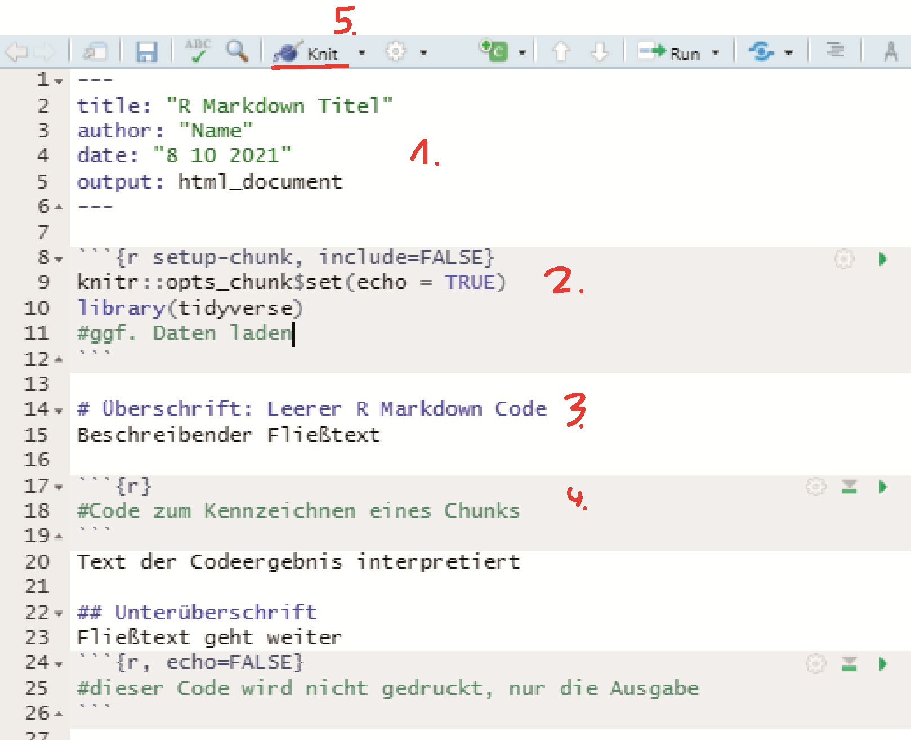

--- 
title: "R Kurs Unterlagen"
author: |
 Anna-Lena Schubert,
 Jan Goettmann,
 Jose Carlos Garcia Alanis,
 Meike Steinhilber,
 Cordula Hunt,
 Florian Kobylka
date: "`r Sys.Date()`"
site: bookdown::bookdown_site
documentclass: book
bibliography: [book.bib, packages.bib]
url: https://amd-lab.github.io/R-Kurs-Unterlagen/index.html
# cover-image: path to the social sharing image like images/cover.jpg
description: |
  Dies sind R Kurs Unterlagen für Lehre in verschiedenen studentischen
  Veranstaltungen.

link-citations: yes
github-repo:  AMD-Lab/R-Kurs-Unterlagen

---

# Über dieses Buch
TEXT


```{r include=FALSE}
# automatically create a bib database for R packages
knitr::write_bib(c(
  .packages(), 'bookdown', 'knitr', 'rmarkdown'
), 'packages.bib')
```

<!--chapter:end:index.Rmd-->

# Einführung
(Anna-Lena)


<!--chapter:end:01-Einfuehrung.Rmd-->

# Datenstruktur

+-----------------+-------------------------------------------------------+
| Thema           | Inhalte                                               |
+:===============:+:=====================================================:+
| RMarkdown       | *Titel, Chunks, knitten*                              |
+-----------------+-------------------------------------------------------+
| Hilfe           | *help-Fenster, ?, \#was passiert hier*                |
+-----------------+-------------------------------------------------------+
| Werte, Vektoren | *chr, num, log, c(), list(), typeof(), coercion,      |
|      & Listen   |   Abruf von Elementen, list(list())*                  |
+-----------------+-------------------------------------------------------+
| Workspace       | *rm(), Besen*                                         |
+-----------------+-------------------------------------------------------+
| Berechnungen    | *mit Values, Vektoren, Funktionen, z-Standardisierung*|
+-----------------+-------------------------------------------------------+
| Matrizen        | *matrix(), Indizierung*                               |
+-----------------+-------------------------------------------------------+
| tidy Daten      | *Zeilen: Beobachtungen, Spalten: Variablen*           |
+-----------------+-------------------------------------------------------+
| tidyverse       | *Installation und library (package)*                  |
+-----------------+-------------------------------------------------------+
| data.frame &    | *Unterschiede, as.data.frame(), as_tibble(), \$, [],  |
| tibble          | Zugriff auf Elemente, Reihennamen, Faktoren*          |
+-----------------+-------------------------------------------------------+
| Daten laden     | *Import per klick, read./\_, sep=,                    |
| & speichern     | dec=, .xlsx, .svs, write_csv()*                       |
+-----------------+-------------------------------------------------------+
| Daten anschauen | *View(), head(), str(), count()*                      |
+-----------------+-------------------------------------------------------+

## RMarkdown

Das R Markdown Skript ist ein besonderes Dateiformat für R Skripte. Es enthält Fließtext und eingebetteten R Code:

{width="65%"}

`Knittet` man dies Skript mit dem Wollknäul Button (5.) in der oberen Leiste, integriert es den ausgeführten Code mit dem Fließtext und druckt ein übersichtliches Dokument (html, pdf, txt oder doc). Das ist praktisch um z.B. Auswertungsergebnisse zu präsentieren.

1.  Im Header werden Titel und Dokumententyp für das Ausgabe-Dokument festgelegt
2.  Die Code Blöcke (`Chunks`) sind mit je drei rückwärts gestellten Hochkommata (`Backticks`) am Anfang und Ende des Chunks eingerahmt. Werden sie vom R Markdown Skript als solche erkannt, wird auch die Hintergrundfarbe automatisch abgeändert. Im ersten chunk sollten `globale Chunk Optionen festgelegt`, alle notwendigen `Packages geladen` und die `Daten eingelesen` werden.
3.  Den Fließtext kann man mit Überschriften (`#`) und Unterüberschriften (`##`) strukturieren, im Code kennzeichnet `#`
    Kommentare
4.  Zu Beginn eines Chunks muss man innerhalb einer geschwungenen Klammer spezifizieren(\`\`\`{...}):

-   Es ist möglich Code von anderen Programmiersprachen (z.B. Python oder TeX) einzubetten, standard ist `r`

-   (optional) Nach einem Leerzeichen: Einzigartiger Chunk-Name

-   (optional) Nach einem Komma: Befehle, um die Ausgabe des Chunks in das neue Dokument zu steuern:

    -   `include = FALSE` Weder Code noch Ergebnis erscheinen
    -   `echo = FALSE` Nur das Code-Ergebnis erscheint
    -   `message = FALSE` Nachrichten zum Code erscheinen nicht
    -   `warning = FALSE` Warnungenzum Code erscheinen nicht
    -   `fig.cap = "..."` Hiermit lassen sich Grafiken beschriften

## Hilfe

Sie merken, dass die Befehle und Funktionen zum Teil sehr spezifisch und Sie sich kaum alles behalten können. Am wichtigsten ist die Reihenfolge und Vollständigkeit der Zeichen: vergessen Sie ein Komma, ein Backtick oder eine Klammer zu, dann kann R den Code schon nicht interpretieren. Zum Glück erkennt R Studio das oft und weist einen darauf während des
Codens mit einem `roten x` neben der Zeilennummer hin. Andernfalls dürfen Sie versuchen, die Fehlermeldung beim Ausführen zu verstehen.

Wenn Sie den Namen einer Funktion oder eines Packages nicht direkt erinnern, können Sie den Anfang des Namens im `Chunk` oder in der `Console` eingeben, RStudio bietet einem nach einem kurzen Moment eine Liste möglicher Optionen an, aus der Sie wählen können. Haben Sie eine Funktion gewählt, können sie die `Tab`-Taste drücken und es werden die verschiedenen Funktionsargumente angezeigt, um die Funktion zu spezifizieren, was oft sehr hilfreich ist. Möchten Sie wissen, was eine
Funktion macht oder in welcher Reihenfolge die Funktionsargumente eingegeben werden, können Sie `?FUN` in die `Console` eintippen, wobei FUN Platzhalter für den Funktionsnamen ist. Alternativ können Sie im `Help`-tab unten rechts suchen. Die Dokumentation ist oft sehr ausführlich. Die Möglichkeit einschlägige Suchmaschinen im Internet zu verwenden ist fast zu trivial, um sie hier aufzuführen, oft werden Sie dabei auf `StackOverflow` weitergeleitet. Auf Englisch gestellte Fragen
oder Probleme führen zu besseren Treffern. Noch trivialer ist es, im Skript des Kurses oder im eigenen Code nachzuschauen. Falls Sie gründlich nachlesen möchten, gibt es auch ganze Bücher, die einem eine Einführung in R geben: z.B. `R Cookbook` oder `R for Data Science`.

## Werte & Vektoren

Datenformate in R sind von einfach zu komplex: `Value`, Vektor, `matrix`, (`array`), `data.frame`,`tibble` und `list`. Die kleinste Objekteinheit in R ist ein `Value`. Es gibt unterschiedliche Typen von `Values`:

1.  Text, bzw. Charakter (`chr`), manchmal auch String genannt,
2.  (komplexe Zahlen, `cmplx`)
3.  Nummer (`num`), bzw.`double`
4.  (ganze Zahlen, integer `int` genannt)
5.  logische Werte (`logi`), manchmal auch Boolean genannt
6.  fehlende Werte (`NA`), `Not Available`

Sie weisen einem Objektnamen einen Wert per `<-` zu (Shortkey:`ALT`&`-`), der Datentyp des `Values` wird automatisch Rkannt.
```{r, echo=TRUE, results='hide'}
var1 <- "kreativ"   # typ chr
var2 <- 3.5         # typ num
var3 <- TRUE        # typ logi
```
Mit der Funktion `typeof()` können sie sich den Datentypen anzeigen lassen.
Vektoren reihen Werten desselben Datentyps auf `c(Wert1, Wert2, ...)`:
```{r, echo=TRUE}
vec1 <- c(3, 6, 3.4)    # c() kombiniert die Werte zu einem Vektor, der dem Namen zugewiesen wird
```
Fassen Sie Werte von verschiedenen Typen zu einem Vektor zussammen, werden beide Werte zum Typen mit der kleineren Typenzahl umgewandelt (`coercion`).
```{r, echo=TRUE}
c("kreativ",3.5)   # ich versuche ein `chr` und eine `num` zu einem Vektor zu kombinieren
```
3.5 wird in `""` ausgegeben, die Nummer wurde zu Text.

### Coercion (Umwandlung von Typen)

Sie können den Datentypen auch per Funktion ändern, z.B. `as.character()`, `as.double()`:
```{r, error=TRUE}
as.character(c(1, TRUE, "abc", 4.1627))  # Verändert eine Reihe von Werten zum Typ chr
```
```{r, error=TRUE}
as.double(c(2, TRUE, "abc", 4.1627))    # Verändert die Werte zum Typ double, geht es nicht, erscheinen NAs
```
`Coercion` gibt es auch in Matrizen, Arrays (Mehrdimensionale Matrizen) und in Spaltenvektoren von Datensätzen (data.frames und tibbles). Nur Listen können verschiedene Datentypen und Elemente enthalten `list(Element1, Element2, ...)`. Das geht soweit, dass Listen selbst Listen enthalten können.

### Aufruf einzelner Elemente per Index:

Um auf Elemente zuzugreifen, können Sie deren Indexnummer verwenden:
```{r, echo=TRUE}
vec_4 <- c(1,3,3,7)   #Definition des Vektors
vec_4[2]              #Abruf des zweiten Elements des Vektors
```
Das geht sogar in verschachtelten Listen:
```{r, echo=TRUE}
mylist <- list(list(1,"a"),c(2,3)) # Definiert eine Liste aus Liste & Vector, die je aus 2 Elementen bestehen 
mylist[[1]][2]                     # Ruft Element 1 der äußeren Liste: (1,"a"), und davon Element 2 ab: "a"
```
Ich habe jetzt mehrere Variablen (Values, Vektoren, Listen) definiert, sie sind in meinem RStudio im `Environment`-tab oben rechts aufgetaucht.

## Der Workspace

Rechts oben im Fenster ist das `Environment`-tab. Hier sieht man alle im `globale Workspace` definierten Objekte (Datenstrukturen: Werte, Vektoren, Matrizen, Arrays, Listen, `data.frames`, `tibbles`; und Funktionen) aufgelistet:

{width="65%"}

Per Doppelklick können Sie die Objekte jeweils einzeln oben links im extra Fenster (`Datenansicht-tab` ) anschauen. `rm(Objektname)` ist die Funktion zum Entfernen einzelner Objekte aus dem `globalen Workspace`. Das `Besensymbol` im `Environment`-tab oben rechts fegt den `globalen Workspace` leer. Es ist zu beachten, dass R Markdown beim `knitten` nicht auf den `globalen Workspace` zugreift, sondern einen eigenen Workspace aus dem Code in den `Chunks` erstellt. Beim Ausführen
einzelner `Chunks` per Markieren und `STRG/CTRL`&`Enter` oder `grüner Pfeil rechts` wird jedoch auf den `globalen Workspace`
zugegriffen. Beim Schließen von RStudio werden Sie gefragt, ob Sie den `globalen Workspace` in die `.RData` als img speichern lassen, dann stehen die Objekte in der nächsten Sitzung wieder zur Verfügung, solange Sie dieselbe Projektdatei öffnen. Offene Skipte und offene `Datenansicht`-tabs werden beim Schließen ebenfalls mit der Projektdatei assoziiert. Geladene Packages gehen leider verloren, diese müssen Sie jedes Mal beim Starten von RStudio neu laden: `library(Packagename)`. Deshalb ist es Konvention am Anfang jedes Skriptes erstmal die Packages zu laden. Haben Sie Objekte im Workspace gespeichert, können Sie deren
Namen verwenden, um sich auf diese zu beziehen und z.B. weitere Berechnungen vorzunehmen.

## Einfache Berechnungen
### Rechnen mit Values

```{r Datatypes, echo=TRUE, results='hide'}
x <- 5       # definiert den Wert der Variable x
y <- 5       # definiert den Wert der Variable x
x + y        # Summe von x und y
x*y          # Produkt von x und y 
sqrt(x)      # Wurzel aus x
x**(1/2)     # x hoch 0.5
```
Möchten Sie das Ergebnis speichern, müssen Sie dem berechneten Wert einen Namen zuweisen:
```{r}
z <- x + y  # weist dem Namen z das Ergebnis dieser Gleichung zu, "z" erscheint im Workspace
```

### Rechnen mit Vektoren

Operationen können häufig vektorisiert, d.h. auf alle Objekte einens Vektors angewendet werden:
```{r}
e <- vec_4 * 5 # multipliziert alle Elemente des Vekors mit 5 und speichert das Ergebnis unter dem Namen e
```
Es gibt eine ganze Reihe vorgefertigter Funktionen, um mit Vektoren zu rechnen:

### Übersicht Berechnungsfunktionen

Folgende Funktionen können Sie auf `num`-Vektoren und Matrizen anwenden, je nach Funktion auch auf `chr` Vektoren oder Datensätze, wobei diese sich dann meist nur auf die Einträge in der oberen Ebene, z.B. auf die Anzahl der Spalten und nicht auf die Spalteneinträge beziehen.

+-----------------+----------------+-----------------+-----------------+
| Funktion        | Bedeutung      | Funktion        | Bedeutung       |
+:===============:+:==============:+:===============:+:===============:+
| **min(x)**      | Minimum        | **mean(x)**     | Mittelwert      |
+-----------------+----------------+-----------------+-----------------+
| **max(x)**      | Maximum        | **median(x)**   | Median          |
+-----------------+----------------+-----------------+-----------------+
| **range(x)**    | Range          | **var(x)**      | Varianz         |
+-----------------+----------------+-----------------+-----------------+
| **sort(x)**     | sortiert x     | **sd(x)**       | Sta             |
|                 |                |                 | ndardabweichung |
+-----------------+----------------+-----------------+-----------------+
| **sum(x)**      | Summe aller    | **quantile(x)** | Quantile von x  |
|                 | Elemente       |                 |                 |
+-----------------+----------------+-----------------+-----------------+
| **cor(x,y)**    | Korrelation    | **length()**    | Länge von x     |
|                 | von x und y    |                 |                 |
+-----------------+----------------+-----------------+-----------------+

### Beispiel einer z-Standardisierung eines Vektors mit 3 Einträgen

```{r, echo=TRUE}
geschwister <- c(8,4,12)                       # def. der Variable
mw_geschw <- mean(geschwister)                 # MW
mw_geschw                                      
sd_geschw <- sd(geschwister)                   # SD
sd_geschw
z_geschw <- (geschwister-mw_geschw)/sd_geschw  # z-Standardisierung des Vektors
z_geschw
```

## Matrizen

Matrizen sind 2D Datenstrukturen, sie bestehenaus Vektoren [gleicher]{.ul} Länge und enthalten [einen]{.ul} Datentyp. Mit dem
Befehl `matrix()` können sie erstellt werden:

```{r}
mat <- matrix(NaN, nrow=4, ncol=4) # Eine Matrix mat mit 4 Reihen, 4 Spalten und leeren Einträgen wird erstellt
                                   # NaN (Not a Number) ist zwar ein double, aber rechnen kann man damit nicht
mat
```

Ich habe eine 4x4 Matrix erstellt, die mit NaNs gefüllt ist. Hätte ich diverse Datentypen zugeordnet, wären diese zum niedrigeren `coerced` worden. Matrizen können mit `matrixname[Zeile,Spalte]` manipuliert werden. Beispiel:
```{r}
mat[,1] <- vec_4 # Weil Spalte 1. von mat und vec_4 dieselbe Länge haben, kann ich Spalte 1 neu zuweisen. 
mat              # Dadurch, dass der Eintrag für die Zeilennummer leer ist, beziehe ich mich auf alle Zeilen.
```
```{r}
mat[,2] <- 8  # Wird einem Bereich ein einzelner Wert zugeordnet, wird dieser vervielfacht (wie oben bei NaN)
mat
```
```{r}
mat[,3] <- c(FALSE, TRUE) # Wird eine ganzzahlige Teilmenge (2 von 4) zugewiesen, wird diese vervielfacht
mat                       # Anm.: das nennt sich recyclen,
```
Coercion: TRUE wurde zu 1 und FALSE wurde zu 0. Wenn man nun eine
bestimmte Spalte oder Zeile sehen möchte, kann man dies über die
Indizierung tun, hierbei kann man sich beliebig austoben.
```{r}
mat[,1]      # Ich möchte nur die erste Spalte über alle Zeilen ausgeben
mat[1,1]     # Nur den ersten Wert der ersten Spalte
```
Hier wird es turbulent:
```{r}
mat[c(1,3),] # Nur Zeile 1 und 3 von allen Spalten
mat[-1,2:4]  # Nicht Zeile 1 und Spalten 2-4
```
Da ich jetzt Bereiche der Matrix auswählen kann, lohnt es sich Berechnungen vorzunehmen
```{r}
(mat[,2]+mat[,1])*mat[,3]             # Spalte 2 minus Spalte 1 und dann mal Spalte 3
```

Es sind immer noch nicht angegebene Nummernwerte in der Matrix, solange ich mich beim Berechnen auf Bereiche der Matrix beschränke, die vergebene numerische Werte haben, gibt es kein Problem, ansonsten schon:
```{r}
mat[1,]                   # Zeile 1
sum(mat[1,])         # Summe über Zeile 1 mit NaN
```
Die Summe kann nicht berechnet werden. Zum Auslassen der NaNs wird das Funktionsargument `na.rm=TRUE` verwendet:
```{r}
sum(mat[1,], na.rm=TRUE)  # Summe über Zeile 1 ohne NaN
mean(mat, na.rm=TRUE)     # MW der Matrix ohne NaN
```
Nun, da wir mit dem Rechnen in Matrizen vertraut sind möchte ich die
letzte Spalte mit Einträgen füllen:
```{r}
typeof(mat)             # gebe den Typ der Einträge der Matrix aus
mat_sav <- mat          # in weiser Voraussicht speichere ich die bisherige Matrix unter anderem Namen
mat[,4] <- c("coercion","kann","nervig","sein")  # weise Spalte 4 einen Vektor mit chr Einträgen zu
mat 
typeof(mat)
```
Konnte ich eben noch den Mittelwert einer Spalte bilden, so geht das jetzt nicht mehr, da alle Einträge der Matrix zu `chr` coerced wurden. In einem typischen Datensatz sind aber Variablen verschiedener Typen (`num` und `chr`) enthalten. Dieses Problem ließe sich mit Listen lösen, welche aber unübersichtlich sind. Datensätze bestehen manchmal aus unüberschaubar vielen Einträgen und deshalb müssen sie übersichtlich strukturiert sein.

## tidy Daten

Es gibt eine Konvention dafür, wie man Datensätze, die mehreren Beobachtungseinheiten (Fällen) verschiedene Parameter (Variablen) zuordnet. Wichtig für die eigene strukturierte Arbeit ist in erster Linie Konsistenz, z.B. dass Sie bei Variablennamen aus mehreren Wörtern immer den Unterstrich als Trennzeichen verwenden. Es hat sich als überlegen für die Auswertung von Daten herausgestellt, Fälle in Zeilen und Variablen in Spalten einzuordnen, dieses Prinzip dürfte Einigen
schon von SPSS bekannt sein.

|       | Variable1 | Variable2 |           Was ist 'tidy' data?           |
|:-----:|:---------:|:---------:|:----------------------------------------:|
| Fall1 |  Wert11   |  Wert12   | [Eine Zeile]{.ul} pro [Beobachtung]{.ul} |
| Fall2 |  Wert21   |  Wert22   |  [Eine Spalte]{.ul} pro [Variable]{.ul}  |
| Fall3 |  Wert31   |  Wert32   |      Eine Tabelle pro Untersuchung       |
| Fall4 |  Wert41   |  Wert42   |             eindeutige Namen             |
| Fall5 |  Wert51   |  Wert52   |                Konsistenz                |
| Fall6 |  Wert61   |  Wert62   |                   ...                    |

Es gibt noch weitere Regeln für konsistentes und ordentliches Arbeiten in R und mit Datensätzen im Allgemeinen, z.B. dass man keine Farbcodierungen verwenden sollte. Vorerst genügt es, wenn Sie sich an die Basics hier halten. Diese Art Daten zu strukturieren lässt sich im `data.frame` und noch besser im `tibble` umsetzen: Beides sind Tabellen mit Spaltenvektoren, die jeweils verschiedene Datentypen enthalten können. Deswegen stellen beide das bevorzugte und für unsere Zwecke wichtigste Datenformat dar.

### tidyverse

Bevor wir uns dem schönsten Datenformat, den `tibble`s widmen, müssen wir das entsprechende Package einmalig in der `Console` installieren. Ich habe den Code auskommentiert, weil das Package bei mir bereits installiert ist:
```{r}
#install.packages("tidyverse")  # R kennt den Namen noch nicht, deswegen ""
```

Das Package `tidyverse` enthält eine Reihe nützlicher Packages, die eine saubere Datenverarbeitung zum Ziel haben. Packages müssen bei jeder Sitzung neu aktiviert bzw. angehängt werden. Für uns relevante Packages im tidyverse sind `tibble`, `readr`, `stringr`, `dplyr`, `purr` und `ggplot2`.
```{r, echo=T, message=F}
library(tidyverse)   # Bitte an den Anfang eines Skriptes, um beim Starten der R Session anzuhängen (attach).
```

## data.frames (df) und tibbles (tib)

Es gibt mehr Gemeinsamkeiten als Unterschiede zwischen beiden Datenformaten. Beides sind Tabellen mit Spaltenvektoren (Variablen), die je verschiedene Datentypen enthalten können. Hier zunächst die Übersicht über die Funktionen zum Managen des Datensatzes:

|       Funktion zum        |         `data.frame()`          |    `tibble()`        |
|:-------------------------:|:-------------------------------:|:--------------------:|
| Datenformat konvertieren  |        `as.data.frame()`        |      `as_tibble()`   |
|        Definieren         |      data.frame(var1,...)       |    tibble(var1,...)  |
| Aufrufen des Datensatzes  |               df                |           tib        |
| Auswählen einer Variable  |             df\$var             |        tib\$var      |
| Auswählen eines Bereiches |           df[rowIdx,colIdx]     | tib[rowIdx,colIdx]   |
| Definieren neuer Variablen|      df\$var_neu <- c(...)      |tib\$var_neu <- c(...)|
|   Reihennamen vergeben    | row.names(df) \<-c("name1",...) | relocate(tib,var)    |

Sie können die beiden Datensatz-Formate einfach in das jeweils andere konvertieren. Die Definition geht per Formel `data.frame()` und die Aneinanderreihung der Spaltenvektoren. Es bietet sich an, dabei direkt Namen für die Spaltenvektoren zu vergeben. Für tibbles geht das analog mit der Formel`tibble()`
```{r}
test_df <- data.frame("text"=mat[,4] ,         # Komma zwischen Spaltenvektoren
                      "ist_Verb"=mat_sav[,3])  # verwende die Spaltenvektoren aus den vorherigen Matrizen und weise Namen zu
test_df
```
In Bezug auf weitere Funktionen des Packages `tidyverse` sind tibbles ein wenig praktischer. Große tibbles werden übersichtlicher angezeigt (nur die ersten 10 Zeilen) wenn man sie aufruft.
```{r}
test_tib <- as_tibble(test_df)  
test_tib
```
Einzelne Spalten können ganz einfach aufgerufen werden, in dem man den \$-Operator benutzt. Schreibt man diesen direkt hinter den Namen des Datensatzes, klappt automatisch eine Liste mit allen Spalten auf:
```{r}
test_tib$text   # Mit dem $-Operator können einzelnen Spalten direkt per Name adressiert werden.
```
Es ist auch möglich, mehrere Zeilen und/oder Spalten auszugeben, dies funktioniert wie bei Matrizen per Indexnummer:
```{r}
test_tib[2:4,1] # Die Zeilen 2 bis 4 werden aus Spalte 1 ausgebenen
```
Die Adressierung einzelner Spalten und Zeilen ermöglicht dann zum Beispiel die Berechnung von Kennwerten nur für einzelnen Spalten. Z.B. kann man die Kosten für Konzertkarten im Jahr 2022 aufsummieren lassen:
```{r}
tickets_2022 <- tibble("Artist"=c("Ed Sheeran", "Billy Ellish", "The Weeknd", "Dua Lipa", "Imagine Dragons"),
                  "Kosten"=c(79.32, 282, 116, 136, 68.71 ))
sum(tickets_2022$Kosten)
```
Der \$-Operator wird für fast alle höheren Datentypen verwendet, um auf diese Zuzugreifen. Dies gilt zum Beispiel auch für die meisten Outputs von Funktionen (t-Test, Anova, SEMs) und Listen, es müssen aber wie im tibble Namen für die Listeneinträge vergeben sein:
```{r}
liist_of_things <- list(tibbi = test_tib,         # erstellt eine Liste aus diversen Objekten in meinem Workspace
                       ticki = tickets_2022,     # den Namen der Listeneinträge werden 
                       geschwi = geschwister,    # die Objekte aus dem Workspace zugeordnet
                       vari = var1)   
liist_of_things$geschwi                           # per $-Operator und Name in der Liste wird der Eintrag gewählt

```
```{r}
liist_of_things$ticki # Und so die Variable ticki (hier das ticket_2022 tibble)
```
Theoretisch könnte ich auch noch`\$Artist` hinzufügen, dann würde mir nur die erste Spalte des tibbles ausgegeben. Mir fällt auf, ich habe den Namen eine Künstlerin in tickets_2022 falsch geschrieben:
```{r}
tickets_2022$Artist[2] <- "Billy Eilish" # $-Operator und Indexing lassen sich kombinieren
```
Sie können also nicht nur Elemente aus Datensätzen abrufen, sondern diese mit dem `<-` neu zuweisen. Man kann das \$ auch verwenden um neue Spalten in die Datensätze einzufügen:
```{r}
tickets_2022$Priorität <- c(2, 4, 3, 5, 1)  # definiert eine neue Spalte im Datensatz
tickets_2022$Prioritaet <- tickets_2022$Priorität # besser ae statt ä in Variablennamen 
tickets_2022              # nun gibt es eine Spalte zu viel
```
```{r}
tickets_2022$Priorität <- NULL   # entfernt eine Spalte, vorsichtig hierbei(!)
```
Ein weitere Unterschied zwischen tibbles und data.frames ist, dass tibbles keine Reihennamen kennen. Das vereinfacht das Format. Möchten Sie trotzdem gerne Reihennamen vergeben, dann müssen Sie sich mit einer neuen Variable(z.B. Reihenname) behelfen, die Sie mit `relocate(tib,var)` an den Anfang des Datensatzes stellen.

### Faktoren

Vektoren, die kategoriale Einträge enthalten können Sie mit `factor()` als Faktor zuweisen:

```{r}
Gegut_vec <- c("m", "f", "d", "f", "f", "m", "f", "f", "f", "m","m", "f", "m", "f", "f", "m", "f", "f", "f", "m") 
Gegut_fac <- factor(Gegut_vec)                 # macht Faktor aus kategorialem Vector und speichert unter Namen
Gegut_fac                                      # ruft den Faktor auf:
```
Es werden die einzelnen Ausprägungen und die möglichen Ausprägungen als Levels ausgegeben. `levels()` gibt nur die möglichen Ausrägungen eines Faktors aus. Faktoren eignen sich oft besser als Vectoren zum Plotten und Rechnen, deswegen ist es nützlich kategoriale Spaltenvektoren im Datensatz zu Faktoren zu machen. Jetzt, wo Sie mit dem Management von Datensätzen vertraut sind wollen wir vorhandene Datensätze einlesen:

## Einlesen und Speichern von Daten

Daten können in R Studio auf unterschiedliche Weise eingelesen werden. Ich habe dieses Bild zur Abwechslung für Ihre Augen erstellt.

{width="50%"}

Es gibt frei verfügbare Datensätze in Packages, z.B. einen Datensatz zu Pinguinen: palmerpenguins.

Horst AM, Hill AP, Gorman KB (2020). palmerpenguins: Palmer Archipelago (Antarctica) penguin data. R package version 0.1.0.
<https://allisonhorst.github.io/palmerpenguins/>

Nach einmaliger Installation des Packages (`install.packages("palmerpenguins"`) muss es geladen werden:
```{r}
library(palmerpenguins) # jedes Mal beim Durchlaufen des Skripts. Ohne ""
pengu <- penguins       # penguins ist zwar schon ein tibble, aber Namenszuweisung zum Laden in den Workspace
```
In der Regel werden Sie aber einen selbst erhobenen oder einen aus dem Internet heruntergeladenen Datensatz einlesen wollen. Mein Tipp ist, den Datensatz in das Working Directory zu speichern, dann finden Sie ihn schneller und er ist in der Nähe Ihrer Auswertung, noch eleganter ist es einen Unterordner namens data in den Ordner des Working Directories anzulegen, in den Sie alle Datensätze zu ihrem Projekt speichern können. Im `File`-tab unten rechts navigieren Sie zu der Datei mit dem Datensatz und dann klicken Sie diese zum Importieren des Datensatzes an (alternativ können Sie im `Environment`-tab über den Button `Import Dataset` einen Datensatz zum Importieren auf ihrem Computer suchen). In RStudio erscheint ein Fenster zum Importieren, unten rechts wird der automatisch der dem Dateiformat und unten links angegebenen Optionen entspricht, ggf. werden sogar benötigte Packages geladen. Um einen Datensatz per Code zu importieren sind Dateiformat, die Trennzeichen (`sep`) und die Dezimalzeichen (`dec`) besonders relevant. Das Standard-Dateiformat ist `.csv`, hier sind Kommata Trennzeichen (`sep=","`) und Punkte kennzeichnen Dezimalstellen (`dec="."`). Sie können die Funktionen `read_cvs()` oder `read_delim()` für dieses Dateiformat verwenden, letztere sollte Trenn- und Dezimalzeichen automatisch erkennen. Hier ist eine Übersicht zu den Einlesefunktionen in base R (also ohne zusätzlich geladene Packages) und im tidiverse Package, der Unterschied ist, dass base R Funktionen die Daten in einen data.frame laden, tidyverse Funktionen in ein tibble:

|   Funktion zum   | sep  | dec |    in base R    |   im tidverse    |
|:----------------:|:----:|:---:|:---------------:|:----------------:|
| [autolesen]{.ul} | auto |  .  | `read.delim()`  |  `read_delim()`  |
|    autolesen     | auto |  ,  | `read.delim2()` | `read _delim2()` |
|    lesen von     |  ,   |  .  |  `read.csv()`   |   `read_csv()`   |
|    lesen von     | leer |  .  | `read.table()`  |  `read_table()`  |
| [schreiben]{.ul} |  ,   |  .  |  `write.csv()`  |  `write_csv()`   |

Wichtigstes und oft einziges Funktionsargument ist der vollständige Dateiname, er wird in `"` angegeben. Falls Sie die Datei in einem Unterordner vom Working Directory gespeichert haben, wird den Name des Unterordners mit einem `/` dem Dateinamen vorangestellt (z.B."data/Datensatz1.csv"). Das Einlesen von Daten funktioniert nur, wenn der einzulesende Datensatz per `<-` einem Namen zugewiesen wird. Beispiel zum Laden eines .csv Datensatzes:
```{r message=F}
socken <- read_delim("data/socken.csv") # liest meinen socken.csv Datensatz aus dem Unterordner
socken                                  # Daten in ein tibble namens socken
```
Excel Dateien werden mit Funktionen `read_excel()`, `read_xls()` oder `read_xlsx()` aus dem Package `readxl`, SPSS Dateien mit der Funktion `read_svs()` aus dem Package `haven` eingelesen. Auch zum Einlesen von SAS, Stata oder anderen Dateiformaten gibt es entsprechende Funktionen. Die Standardfunktion zum Abspeichern von Datensätzen in eine Datei ist `write_csv()`, bzw. in base R `write.csv()`, da dieses Dateiformat die beste Kompatibilität mit anderer Software aufweist. Beim Speichern muss
man neben dem Dateinamen und ggf. Dateipfad noch den Namen des Datensatzes als erstes Funktionsargument angeben:
```{r, message=FALSE, warning=FALSE, echo=FALSE, error=FALSE}
write_csv(tickets_2022,"data/tickets_2022.csv")  # ich speichere das tibble in meinen data Ordner
```
Es gibt noch ein weiteres erwähnenswertes Dateiformat, das von R selbst: `.RDS`. Die Funktionen `saveRDS()` und `readRDS()` bieten die beste Funktionalität in R.

## Datensätze (dat) anschauen

Um sich die geladenen Daten ganz anzuschauen kann man sie im `Workspace` anklicken, oder deren Namen an die Funktion `view(dat)` übergeben. `head(dat)` zeigt einem den Kopf des Datensatzes an, genau genommen die ersten 6 Zeilen:
```{r}
long_tib <- tibble(Person_Id=c(1:20), 
                   Gender=Gegut_fac, 
                   Eigenschaft=var1)  # definiert ein 20 x 3 tibble, 
head(long_tib)                        # zeigt die ersten 6 Zeilen jeder Variable an
```
Einen Überlick über die Datenstruktur, inklusive Factor-`levels` erhält man mit der Funktion `str(dat)`:
```{r}
str(long_tib)      # zeigt die Struktur der Daten
```
Zeile 1 gibt Auskunft über Größe und die Klasse des Objektes, tibbles sind eine Art data.frame. In den weiteren Zeilen werden die Datentypen ggf. Faktorlevel und die ersten Werte angezeigt. Mit der Funktion `count(dat,var)` lassen sich die Häufigkeiten der Levels eines Faktors ausgeben:
```{r}
count(long_tib, Gender)     # zählt im long_tib die Levels des Faktors Gender
```

<!--chapter:end:02-Datenstruktur.Rmd-->


```{r setup, include=FALSE}
library(tidyverse)
library(psych)
knitr::opts_chunk$set(echo = TRUE)
```

## Einführung in Dplyr und tidyverse

Dplyr ist Teil des tidyverse Packages und ermöglicht es, Daten sehr einfach zu manipulieren und in eine Form zu bringen, um diese dann zu analysieren. Um das zu tun greifen wir auf den Star Wars Datensatz zurück, den das dplyr Package mitliefert:

```{r}

# Lest die Daten bitte ein, der Datensatz heisst "starwars.RDS" und befindet sich in eurem Projektordner, diesmal benutzen wir den readRDS() Befehl.

starwars <- readRDS("starwars.RDS")
```

Der Datensatz enthält Informationen über unsere Star Wars Helden, ähnlich dem Datensatz, den wir uns in der letzten Sitzung ausgedacht haben:

```{r, echo=T}

head(starwars,5) # Wir lassen uns erstmal die ersten 5 Zeilen des Datensatzes ausgeben

```

Bevor wir einsteigen, schaut euch an, wie die einzelnen Variablen im Datensatz verteilt sind. Benutzt dazu den den `summary()` Befehl, was fällt euch auf ?

```{r}
summary(starwars)

```

## Dplyr: Die wichtigsten Befehle

-   Filtern von Beobachtungen nach Wert ([`filter()`](https://rdrr.io/r/stats/filter.html)).

-   Reihen neu Sortieren (`arrange()`).

-   Auswahl von Variablen nach Name (`select()`).

-   Erstellen von neuen Variablen aus bereits existierenden (`mutate()`).

-   Viele Werte zu einem einzelnen Wert zusammenfassen (`summarise()`).

Der vielleicht wichtigste Befehl ist der `group_by()` Befehl, mit dem Ihr die oben genannten Befehle auf einzelne Gruppen innerhalb eines Datensatzes anwenden könnt.

Diese 6 sogennaten "Verben" bilden die Grundlage für tidyverse.Damit ist es möglichmehrere einfache Schritte miteinander zu verketten, um ein komplexes Ergebnis zu erzielen. Alles Befehle funktionieren auf die gleiche Art und Weise:

1.  Das erste Argument ist ein Dataframe.

2.  Die nachfolgenden Argumente beschreiben, was mit dem Dataframe geschehen soll, wobei die Variablennamen (ohne Anführungszeichen) verwendet werden.

3.  Das Ergebnis ist ein neuer Dataframe

Hier ein Beispiel, zum `filter()` Befehl, dazu müsst ihr auch wissen, wie Ihr die gewünschten Beobachtungen mit Hilfe der Vergleichsoperatoren auswählen können. R bietet euch hier die Standardoperatoren:

1.  `>` (größer)

2.  `>=` (größer gleich)

3.  `<` (kleiner)

4.  `<=` (kleiner gleich)

5.  `!=` (nicht gleich)

6.  `==`(gleich)

Anmerkung: Es gibt auch noch logische Operatoren, also "und", "oder" etc. Diese Besprechen wir nicht im Detail, da das sonst zu viel würde. Die Logik der Anwendungen ist aber genau gleich wie bei den Vergleichsoperatoren, hier nur der Vollstädigkeit halber eine übersicht über diese Operatoren:\

{width="800"}

Beispiel

```{r}
# Wenn wir zum Beispiel wissen wollen, wer die größten und schwersten Charaktere aus Starwars sind, dann könnten wir dies so machen:

filter(starwars, height > 190, mass > 90)

# Wir filtern hier alle heraus, die größer sind als 190 und mehr als 90 Kilo wiegen

```

Wenn man mit Strings arbeitet sucht man häufig nach bestimmen `pattern` in den Strings, wie hier bei den Namen. Wollen wir nun alle Skywalkers filtern, müssen wir die `grepl()` Funktion aus R nutzen. Diese prüft, ob eine Zeichenfolge vorhanden ist oder nicht und gibt dann entsprechend TRUE oder FALSE aus, also perfekt für `filter()` . Bei Strings die nur aus einem Wort bestehen, funktioniert aber auch `filter(starwars, species=="human").`

Beispiel:

```{r}

filter(starwars, species == "Human")

# Alle Helden, mit dem Nachnamen Skywalker

filter(starwars, grepl("Skywalker", name))


# Es wird im Datensatz starwars nach dem String "Skywalker" in der Spalte name gesucht. 
# Das Ergebnis sieht dann so aus: 

```

Wichtig ist natürlich für uns auch der Umgang mit Faktoren. Glücklicherweise ist das viel einfacher als mit Strings:

```{r}

# Wenn wir nun nach einem bestimmten Faktor-Level Filtern wollen geht das genauso wie mit numerischen Werten:

filter(starwars, sex == "male")
```

## Übung 1

Filtert nun selbst den Datensatz nach bestimmten Kriterien

```{r}

# 1.) Filtert alle Helden, die Älter sind als 20 und größer als 160 sind

fat_starwars <- filter(starwars, Age > 20, height > 160)

# 2.) Filtert alle Helden, die Blaue Augen haben und männlich sind

filter(starwars, eye_color == "blue", sex == "male")

# 3.) Filtert alle, die zur Spezies Droid gehören

filter(starwars, species=="Droid")
```

## Dplyr: Der Piping Operator

Jetzt wisst ihr, wie man Daten filtert. Das ist aber nur eine der Basisfunktionen von dplyr. Die vielleicht wichtigste Funktion der sogenannte "piping operator" `%>%` Mit diesem könnt ihr die Befehle kombinieren, oder auch "verketten" um die Datensätze nach euren Wünschen umzugestalten. Das funktioniert auch immer nach den oben genannten Prinzipien:

1.  Das erste Argument ist ein Dataframe.

2.  Die nachfolgenden Argumente beschreiben, was mit dem Dataframe geschehen soll, wobei die Variablennamen (ohne Anführungszeichen) verwendet werden.

3.  Das Ergebnis ist ein neuer Dataframe

Wir werden hier erstmal nur die basis dplyr-Funktionen besprechen. Aber auch alle anderen Befehle lassen sich in eine "Pipeline" integrieren. Hier mal ein sehr fortgeschrittenes Beispiel, wie das aussehen kann:

```{r}

# df_clean %>% group_by(N,K,Retrievals) %>%  
#   summarise(corA = cor(mu_est_a, mu_real_a),
#             corC = cor(mu_est_c, mu_real_c)) %>%
#   mutate(z_a = fisherz(corA), z_c = fisherz(corC)) %>% 
#   filter(Retrievals== 100) %>%
#   group_by(N,K) %>%  
#   summarise(mean_a_100 = mean(z_a),
#             mean_c_100 = mean(z_c),
#             range_cor = range(mean_a_100),
#             range_cor = range(mean_a_100)) %>%
#   mutate(meanCorA_100 = fisherz2r(mean_a_100),
#          meanCorC_100 = fisherz2r(mean_c_100)) %>%
#   select(-c(mean_a_100, mean_c_100))


```

## Beispiel

Stellt euch vor, ihr wollte gerne den Mittelwert des Alters der Helden aus dem Starwars Datensatz berechnen, und das für unterschiedliche Heimatwelten und Spezies:

```{r}

# Dazu benutzen wir den Piping Operator %>%, um die Befehle zu verketten:

starwars %>% 
  group_by(species, homeworld) %>% 
  summarise(mean_Age=mean(Age))

```

Wir schreiben hier im Prinzip:

1.  Nehme den Datensatz starwars (1. Zuerst der Dataframe):

<!-- -->

    `starwars %>%`

2.  Gruppiere diesen nach Spezies und Heimatwelt (1. Verarbeitungsschritt):

    `` `group_by(species, homeworld) %>%` ``

3.  Berechne dann für jede dieser Gruppen den Mittelwert für die Variable "Age" (2. Schritt):

<!-- -->

    `summarise(meanAge=mean(Age)`

Da wir nun den Piping Operator benutzen der vom Dataframe starwars ausgeht, müssen wir auch nicht mehr bei jedem Befehl den Datensatz angeben, es reicht dies am Anfang der "Pipeline" zu tun.

Problem: Wir haben noch viele fehlende Beobachtungen. Diese müssen wir zunächst entfehrnen. Auch das können wir nun innerhalb der "Pipeline" tun. Dazu bietet R den Befehl `drop_na()` an. Dieser entfehrnt alle fehlenden Werte eines Datensatzes.

Wir müssen diesen Befehl nun einfach an eine Stelle in der Pipe einfügen, an der es Sinn macht, die Fehlenden Werte zu entfehrnen:

```{r}

# Wo könnte das hier sein ? 

starwars %>% drop_na() %>%
  group_by(species, homeworld) %>% 
  summarise(mean_Age=mean(Age))
```

Nun haben wir nach verschiedenen Gruppen die Altersmittelwerte, bereinigt von den fehlenden Werten. Und das mit nur 2 Zeilen Code :)

## Übung 2

```{r}

# 1.) Gruppiert die Daten nach der Haarfarbe und berechnet für alle vollständigen Werte den Mittelwert und die Standardabweichung für die Größe und das Gewicht. Benutzt dafür wie im vorigen Beispiel die summarise() Funktion. Mit dieser könnt ihr auch mehrere Variablen berechnen. Bindet auch den drop_na() ein. Am Ende sollte es keine NA-Werte mehr in der Ausgabe geben. 

starwars %>% drop_na() %>% group_by(hair_color) %>%
  summarise(mean_Height = mean(height),
            sd_Height= sd(height),
            mean_Mass = mean(mass),
            sd_Mass = sd(mass)) 

```

## Dplyr : Neue Variablen mit `mutate()` berechnen

Der letzte wichtige Befehl in dplyr ist `mutate()` bzw. `across()`. Letztes mal haben wir in dem Beispiel der Matrix zwei Variablen miteinander kombiniert und daraus einen neue berechnet (Größe\*5). Mit `mutate()` können wir eine Variable und mit `across()` gleich mehrere Variablen umformen, oder neu berechnen. Hier möchte ich es am Beispiel einer z-Tranformation erläutern. Diese werden wir mit dem Befehl `scale()` tun, der standardmäßig in R vorhanden ist.

## Beispiel

```{r}

starwars %>% 
  select(height,mass) %>% 
  mutate(z_height = scale(height),
         z_mass = scale(mass)) %>% 
  drop_na()

 starwars %>% select(height,mass) %>% 
  mutate(across(c(height,mass), list(z=scale))) %>%
  drop_na()

```

In diesem Beispiel haben wir zunächste nur `height` und `mass` mit dem `select()` Befehl ausgewählt, daher werden auch nur diese beiden Spalten am Ende der Pipline im Datensatz angezeigt. Dies kann hilfreich sein, wenn man einen Datensatz mit sehr vielen Variablen analysieren muss, von denen nur einige wenige interessant sind. Dies ist meiner Erfahrung nach zum Beispiel bei Fragebögen der Fall, die unterschiedliche Facetten erfassen.

Der nächste Befehl `mutate()` besteht immer aus einer Operation, die mit einer Spalte im Datensatz durchgeführt wird. Im Beispiel oben fügen wir also die Spalten `z_height` und `z_mass` hinzu, die sich jeweils aus `scale(SPALTENNAME)` berechnen und die z-Werte der jeweiligen Variablen berechnen.

Wir können auch anstatt die Variablen einzeln umzurechnen, den Befehl `scale()` direkt auf mehrere Spalten anwenden. Dazu können wir den `across()` Befehl verwenden. Hier müssen wir innerhalb von `mutate()` einfach mit `across(c(SPALTE1, SPALTE2))` einen Vektor der gewünschten Spalten übergeben und dann die Funktion(en), welche auf die Spalten angewand werden soll. Dies muss dann so definiert werden:

`mutate(across(c(height,mass), list(z=scale)))`

Diese Schreibweise hat den Vorteil das ihr

1.  In der `list()` mehrere Befehle übergeben könnt

2.  Die Originalspalten beibehalten werden

3.  Ihr den neuen Spalten direkt einen Suffix geben könnt.\
    Dieser wird automatisch als "\_suffix" an die neue Variable angehängt.

    `mutate(across(c(height,mass), list(z=scale)))` würde also zusätzliche zu Spalte1 und Spalte2 noch Spalte1_z und Spalte2_z, die den z-Wert der jeweiligen Variablen

## Aufgabe bis zum nächsten Mal

Übersetzt diese Anweisungen in dplyr-Sprache:

1.  Dataframe starwars
2.  Gruppiert diesen nach Spezies
3.  Entfehrnt alle fehlenden Werte
4.  Fasst die Variablen Age und Height zu nur einem Mittelwert zusammen
5.  z-Transformiert die Mittelwerte beider Spalten.

Befehle die Ihr dazu braucht:

`drop_na(), across()` ,`scale(), mutate(), group_by(), summarise(), mean()`

Wenn ihr es Richtig gemacht habt, sollte der Datensatz am Ende so aussehen:


*Zusatzaufgabe:*

*Ihr könnt den `summarise()` Befehl auch mit `across()` umsetzen und automatisch einen Suffix für die zusammengefassten Variablen erstellen, hierdurch spart man sich einige Tipparbeit. Das Ergebnis ist das gleiche, nur mit unterschiedlichen Spaltenamen für die "mean" Variablen.*

```{r}

starwars %>% group_by(species) %>%
  drop_na() %>%
  summarise(mean_Age = mean(Age),
            mean_Height = mean(height)) %>%
  mutate(mean_Age_z = scale(mean_Age),
         mean_Height_z = scale(mean_Height))

# mit across()

starwars %>% group_by(species) %>%
  drop_na() %>%
  summarise(across(c(Age, height), list(mean= mean))) %>%
           mutate(across(c(Age_mean, height_mean), list(z=scale)))

```

<!--chapter:end:03-Datenaufbereitung.Rmd-->

# Deskreptive Statistik
(Jose)


<!--chapter:end:04-Deskreptive_Statistik.Rmd-->

# Graphiken
(Cordula)


<!--chapter:end:05-Graphiken.Rmd-->

# Tipps

## chapters
All chapters start with a first-level heading followed by your chapter title, like the line above. There should be only one first-level heading (`#`) per .Rmd file.

## A section

All chapter sections start with a second-level (`##`) or higher heading followed by your section title, like the sections above and below here. You can have as many as you want within a chapter.

### An unnumbered section {-}

Chapters and sections are numbered by default. To un-number a heading, add a `{.unnumbered}` or the shorter `{-}` at the end of the heading, like in this section.


## cross-referenc: Chapters and sub-chapters

There are two steps to cross-reference any heading:

1. Label the heading: `# Hello world {#nice-label}`. 
    - Leave the label off if you like the automated heading generated based on your heading title: for example, `# Hello world` = `# Hello world {#hello-world}`.
    - To label an un-numbered heading, use: `# Hello world {-#nice-label}` or `{# Hello world .unnumbered}`.

1. Next, reference the labeled heading anywhere in the text using `\@ref(nice-label)`; for example, please see Chapter \@ref(cross). 
    - If you prefer text as the link instead of a numbered reference use: [any text you want can go here](#cross).

## Captioned figures and tables

Figures and tables *with captions* can also be cross-referenced from elsewhere in your book using `\@ref(fig:chunk-label)` and `\@ref(tab:chunk-label)`, respectively.

See Figure \@ref(fig:nice-fig).

```{r nice-fig, fig.cap='Here is a nice figure!', out.width='80%', fig.asp=.75, fig.align='center', fig.alt='Plot with connected points showing that vapor pressure of mercury increases exponentially as temperature increases.'}
par(mar = c(4, 4, .1, .1))
plot(pressure, type = 'b', pch = 19)
```

Don't miss Table \@ref(tab:nice-tab).

```{r nice-tab, tidy=FALSE}
knitr::kable(
  head(pressure, 10), caption = 'Here is a nice table!',
  booktabs = TRUE
)
```

## Footnotes

Footnotes are put inside the square brackets after a caret `^[]`. Like this one ^[This is a footnote.]. 

## Citations

Reference items in your bibliography file(s) using `@key`.

For example, we are using the **bookdown** package [@R-bookdown] (check out the last code chunk in index.Rmd to see how this citation key was added) in this sample book, which was built on top of R Markdown and **knitr** [@xie2015] (this citation was added manually in an external file book.bib). 
Note that the `.bib` files need to be listed in the index.Rmd with the YAML `bibliography` key.


The RStudio Visual Markdown Editor can also make it easier to insert citations: <https://rstudio.github.io/visual-markdown-editing/#/citations>


## Equations

Here is an equation.

\begin{equation} 
  f\left(k\right) = \binom{n}{k} p^k\left(1-p\right)^{n-k}
  (\#eq:binom)
\end{equation} 

You may refer to using `\@ref(eq:binom)`, like see Equation \@ref(eq:binom).


## Theorems and proofs

Labeled theorems can be referenced in text using `\@ref(thm:tri)`, for example, check out this smart theorem \@ref(thm:tri).

::: {.theorem #tri}
For a right triangle, if $c$ denotes the *length* of the hypotenuse
and $a$ and $b$ denote the lengths of the **other** two sides, we have
$$a^2 + b^2 = c^2$$
:::

Read more here <https://bookdown.org/yihui/bookdown/markdown-extensions-by-bookdown.html>.

## Callout blocks


The R Markdown Cookbook provides more help on how to use custom blocks to design your own callouts: https://bookdown.org/yihui/rmarkdown-cookbook/custom-blocks.html

<!--chapter:end:06-Tipps.Rmd-->

`r if (knitr::is_html_output()) '
# References {-}
'`

<!--chapter:end:07-references.Rmd-->

