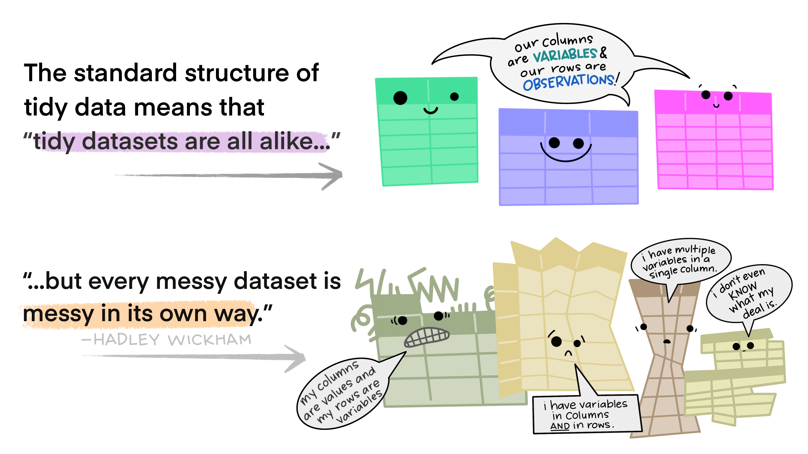

--- 
title: "Einführung in R"
author: |
 José Carlos García Alanis,
 Jan Goettmann,
 Cordula Hunt,
 Florian Kobylka,
 Anna-Lena Schubert,
 Meike Steinhilber,
 
date: "`r Sys.Date()`"
site: bookdown::bookdown_site
documentclass: book
bibliography: [book.bib, packages.bib]
url: https://amd-lab.github.io/R-Kurs-Unterlagen/index.html
# cover-image: path to the social sharing image like images/cover.jpg
description: |
  Dies ist eine Einführung in R, die in verschiedenen Lehrveranstaltungen der Arbeitseinheiten *Analyse und Modellierung komplexer Daten* und *Methodenlehre und Statistik* des Psychologischen Instituts der Johannes Gutenberg-Universität Mainz genutzt werden.

link-citations: yes
github-repo:  AMD-Lab/R-Kurs-Unterlagen

---

# Über dieses Skript

Dies ist eine Einführung in die Programmiersprache `R`, die in verschiedenen Lehrveranstaltungen der Arbeitseinheiten *Analyse und Modellierung komplexer Daten* und *Methodenlehre und Statistik* des Psychologischen Instituts der Johannes Gutenberg-Universität Mainz genutzt werden kann. `R` ist eine unter Psycholog:innen weit verbreitete Programmiersprache, mit deren Hilfe unterschiedlichste Datenarten aufbereitet und analysiert werden können. Das Programm ist *Open Source* und es gibt eine riesige Community von Entwickler:innen, die an Erweiterungen für die Software arbeiten, um Forschenden das (datenanalytische) Leben zu erleichtern.

Dieses Skript wurde als Begleitmaterial für verschiedene Lehrveranstaltungen entwickelt, in denen mit `R` gearbeitet wird. Es kann als Kursmaterial, aber auch als Nachschlagewerk verwendet werden. Nicht alle Inhalte des Skripts sind für jeden Kurs relevant. Ihre Kursleitung wird Ihnen mitteilen, wann Sie welche Teile des Skripts bearbeiten sollen. Sie können sich natürlich darüber hinaus jederzeit weiter umschauen, welche Möglichkeiten `R` noch bietet!

<div id="content">
<center>

<figure>


<figcaption align = "left"><b>Ein digitaler Cartoon mit zwei Illustrationen: Die obere zeigt das R-Logo mit einem furchteinflößenden Gesicht und ein kleines, verängstigtes, wuscheliges Monster, das unter einer dunklen Gewitterwolke eine weiße Fahne hochhält, um sich zu ergeben. Der Text darüber lautet: "at first I was like…". Der untere Cartoon zeigt ein freundliches, lächelndes R-Logo, das aufspringt, um einem glücklichen, unscharfen Monster unter einer lächelnden Sonne und neben bunten Blumen ein High-Five zu geben. Der Text über der unteren Illustration lautet "but now it’s like…"</b>
</figcaption>

</figure>

Artwork by [Allison Horst](https://github.com/allisonhorst/stats-illustrations)

</center>
</div>

## Feedback

Derzeit ist das Skript ein lebendiges Dokument, das auf Basis von Rückmeldungen ständig überarbeitet und verbessert wird. Sollten Ihnen Fehler im Skript auffallen oder sollten Sie sonstiges Feedback haben, freuen wir uns sehr, wenn Sie uns eine E-Mail senden. Schreiben Sie einfach eine E-Mail an [amd_lab@uni-mainz.de](mailto:amd_lab@uni-mainz.de?subject=R-Kurs-Unterlagen).


```{r include=FALSE}
# automatically create a bib database for R packages
knitr::write_bib(c(
  .packages(), 'bookdown', 'knitr', 'rmarkdown'
), 'packages.bib')
```

<!--chapter:end:index.Rmd-->

# Einführung

## Installation

Um R nutzen zu können, müssen Sie sich sowohl R als auch R-Studio installieren.

R ist eine Open-Source-Software, die zur Datenanalyse genutzt wird. Die große Stärke von R in der Verfügbarkeit zahlreicher Zusatzfunktionen, in Form sogenannter Packages. Entwickler:innen überall auf der Welt bieten Packages fals Lösungen für die unterschiedlichsten Probleme an, von der Datenaufbereitung über APA-formatierten Tabellen bis hin zu zahlreichen statistischen Analysen. Laden Sie sich R unter dem folgenden Link herunter und installieren Sie sich das Programm auf Ihrem PC/Laptop: [https://cran.r-project.org/](https://cran.r-project.org/)

Außerdem benötigen Sie noch R-Studio. R-Studio ist eine „integrierte Entwicklungsumgebung“ (engl: integrated development environment; *IDE*), die es deutlich einfacher macht, mit R zu arbeiten. Installieren Sie sich daher auch R-Studio auf Ihrem PC/Laptop, indem Sie folgendem Link folgen: [https://www.rstudio.com/products/rstudio/download/#download](https://www.rstudio.com/products/rstudio/download/#download)

## Erste Schritte

Nachdem Sie R und R-Studio installiert haben, können Sie Ihre ersten Schritte in R machen. Öffnen Sie dazu R-Studio und geben Sie etwas in das Feld "Konsole" (oder "Console") ein. Im Normalfall finden Sie die Konsole in der Anzeige auf der linken Seite (ggfs. befindet sich die Konsole auch links unten). Sie erkennen die Konsole daran, dass die Zeile, in die Sie etwas eingeben können, mit `>` beginnt. Diese Klammer fordert Sie auf, R-Code einzugeben! Geben Sie Folgendes in die Konsole ein:

```R
> "Hallo R!"
```
  
Wenn folgende Ausgabe erscheint, hat die Installation funktioniert:

```{r hello, echo = FALSE}
"Hallo R!"
```

Sie können auch Zahlen in die Konsole eingeben:

```{r}
42
```

Jetzt können Sie R schon als einfachen Taschenrechner benutzen! 

Addition:

```{r}
3+2
```

Subtraktion:

```{r}
3-2
```

Multiplikation:

```{r}
3*2
```

Division:

```{r}
3/2
```

Beachten Sie dabei, dass Sie auch Klammern setzen können:


```{r}
(3+2)*5
```


## Das R-Skript

In der Regel werden Sie Ihre Analysen nicht direkt in die Konsole eingeben, sondern ein *Skript* schreiben, in dem Sie Ihre Analysen dokumentieren. Dieses Skript dokumentiert Ihre Analysen, was den großen Vorteil hat, dass Ihre Analysen dadurch reproduzierbar werden. Wenn Sie Daten aufbereiten oder analysieren und dabei unterbrochen werden, können Sie sich - auch noch Tage oder Wochen später - einfach wieder an das Skript setzen, die bisherigen Analyseschritte erneut ausführen und dort weitermachen. So können Sie Ihre Analysen auch mit anderen Studierenden oder Lehrenden, die ein Projekt betreuen, teilen. Viele Forschende laden ihre R-Skripte regelmäßig ins [Open Science Framework (OSF)](osf.io) hoch, wenn sie Artikel zur Begutachtung einreichen, damit andere ihren Code und ihre Analysen auf Fehler überprüfen und nachvollziehen können.

Um ein solches Skript zu erstellen, nutzen wir den in R-Studio verfügbaren Texteditor. Sie können ein neues Skript unter „Datei $\to$ NeueDatei $\to$ R Skript“ („File $\to$ New File $\to$ R Script“ öffnen. Skripte, die R-Code enthalten, speichern wir mit der Dateiendung „.r“ oder „.R“ ab.

Das Praktische: Wenn Sie Code im Skript schreiben, können Sie diesen Code direkt ausführen. Wenn sich Ihr Cursor in einer Zeile befindet, in der Code steht, können Sie `STRG-Enter` drücken (oder oben auf das `Run`-Symbol klicken), um diese Zeile auszuführen. Wenn Sie einen Teil des Skripts markieren, wird nur genau dieser Teil ausgeführt, wenn Sie `STRG-Enter` drücken. Das Ergebnis wird Ihnen wie gewohnt in der Konsole angezeigt.

## Struktur des Skripts

Nichts ist wichtiger als gute Organisation! Damit Sie sich auch später noch daran erinnern, welche Analysen Sie durchgeführt haben, können (und sollten) Sie sich Kommentare ins Skript schreiben. In R wird `#` benutzt, um Code zu kommentieren. Wenn Sie `#` vor Code setzen, wird dieser Code beim Ausführen einfach ignoriert! So können Sie sich ganze Abschnitte dazu notieren, welche Analysen Sie gemacht haben, was Kernbefunde waren, usw., ohne dass Sie Probleme beim Ausführen Ihres Skriptes bekommen. Sie sollten Ihren Code *immer* kommentieren, um sich auch später noch daran erinnern zu können, was Sie vor einiger Zeit geschrieben haben.

```R
# 3+2
# Nichts passiert - die Rechnung wurde nicht ausgeführt, weil sie auskommentiert ist
```

Sie können Kommentare auch nutzen, um das Skript in Abschnitte zu gliedern. Wenn Sie hinter ein `#` noch ein `-` setzen, fügt der Editor einen logischen Abschnitt ein, den Sie ein- oder ausklappen können. Das ist insbesondere zur Strukturierung längerer Skripte enorm hilfreich.

## Pakete

Für R gibt es unzählige nützliche Pakete, die von Entwickler:innen auf der ganzen Welt weiterentwickelt werden. Auch an der JGU werden R-Pakete entwickelt! Diese Pakete erweitern das Grundprogramm und geben Ihnen Tools an die Hand, die Ihnen bei der Bearbeitung ganz konkreter Fragestellungen helfen können. Das Paket `psych` wurde von William Revelle entwickelt, um verschiedene Funktionen zu bündeln, die für verschiedene psychologische Fragestellungen nützlich sind. Installieren Sie das Paket mit der Funktion `install.packages()`.

```R
install.packages("psych")
```

Sobald Sie das Paket installiert haben, müssen Sie es nur noch laden, um es nutzen zu können:

```R
library(psych)
```

Und schon haben Sie Ihr erstes Paket installiert und geladen! Sobald Sie ein Paket auf Ihrem PC/Laptop installiert haben, können Sie es immer wieder verwenden. Beachten Sie aber unbedingt, dass Sie Pakete nach jedem Neustart von R neu einladen müssen.

Wenn Sie keine Idee haben, welche Funktionen ein Paket umfasst und wofür es nützlich sein könnte, können Sie ganz einfach die Hilfe-Funktion nutzen, die Sie aufrufen können, indem Sie ein Fragezeichen vor den Paketnamen setzen.

```R
?(psych)
```

## Working Directory

Wenn Sie in R arbeiten, arbeiten Sie immer in einem Verzeichnis - einem sog. "working directory". Sie können sich Ihr aktuelles working directory mit dem Befehl 'getwd()' anzeigen lassen.

```{r}
getwd()
```

In der Regel werden Sie für jedes Projekt ein eigenes working directory anlegen, in dem Sie die Daten und Skripte speichern, die zu dem Projekt gehören. Um in das richtige Verzeichnis zu wechseln, können Sie den Befehl `setwd()` nutzen. Noch einfacher geht es per Mausklick über Session &#8594;  Set Working Directory &#8594;  Choose Directory.


*Tipp*: Noch einfacher geht es mit dem R-Paket `here`: Wenn Sie bereits ein Verzeichnis für Ihr Projekt angelegt und dort ein Skript gespeichert haben (**wichtig: es muss unbedingt im Verzeichnis gespeichert sein!**), liest das Paket `here`  automatisch den Pfad aus, an dem ein Skript gespeichert ist. Das ist auch dann enorm praktisch, wenn Sie Ihre Skripte mit anderen austauschen! 

<br>
<div id="content">
<center>
<figure>


<figcaption align = "left"><b>Eine Karikatur, die zwei Pfade nebeneinander zeigt. Auf der linken Seite ist ein gruseliger, unheimlicher Wald mit Spinnweben und knorrigen Bäumen zu sehen. Auf Ästen stehen Dateipfade wie "~/mmm/nope.csv" und "setwd("/haha/good/luck/")" geschrieben. Ein verängstigtes, niedliches, pelziges Monster läuft aus dem gruseligen Wald hinaus. Rechts daneben ist ein heller, farbenfroher Pfad mit Blumen, Regenbogen und Sonnenschein, mit Schildern, auf denen "hier!" und "es ist alles hier!" steht. Ein Monster mit Rucksack und Spazierstock blickt von uns weg in Richtung des rechten Weges. Der stilisierte Text lautet "Hier: Finde deinen Pfad".</b>
</figcaption>

</figure>

Artwork by [Allison Horst](https://github.com/allisonhorst/stats-illustrations)

</center>
</div>
<br>

Dazu müssen Ihr allerdings zunächst *einmalig* das Paket "here" installieren und dann die Funktion `here()` in die Funktion `setwd()` einfügen. 
 
```R
install.packages("here")
setwd(here::here())
```

<!--chapter:end:chapters/00-Einfuehrung.Rmd-->

# Erste Schritte

## Variablen

Sicherlich wollen Sie Ihre Daten nicht nur in der Konsole ausgeben lassen und bearbeiten, sondern auch in Variablen speichern. Variablen sind Bezeichnungen, mit deren Hilfe Sie auf gespeicherte Daten zugreifen. Sobald eine Variable definiert wurde, können Sie immer wieder darauf zugreifen. Variablen werden mit Hilfe des `<-` Operators definiert.

```{r datatypes, echo = FALSE}
# Hier werden zwei Variablen - x und y - definiert
x <- 2
y <- 3
```

Sie können sich die Werte dieser Variablen ausgeben lassen, indem Sie die Variablennamen in der Konsole eingeben und Enter drücken.

```{r}
x
```

Jetzt können Sie bereits erste Berechnungen mit Variablen durchführen:

```{r}
x+y
x*y
```

In R lassen sich sämtliche Objekte - nicht nur einzelne Zahlen, sondern auch Datentabellen, Wortlisten oder sogar Ergebnisse komplizierter Analysen - in Variablen speichern. Der Workflow ist so ausgelegt, dass Sie Ergebnisse einer Analyse in einer Variable speichern und von dort aus weiterverarbeiten können, z.B. um APA-konforme Tabellen oder Grafiken zu erstellen oder sich Effektstärkemaße ausgeben zu lassen. Im weiteren Verlauf des Kurses lernen Sie andere Datentypen kennen, die in Variablen gespeichert werden können.

*Achtung*: Wenn Sie eine Berechnung mit einer Variable durchführen und das Ergebnis dieser Berechnung speichern möchten, müssen Sie es wieder eine Variable zuweisen - es wird nicht automatisch gespeichert!


```{r}
z <- x*10
```

Wenn Sie sich jetzt `x` und `z` ausgeben lassen, sehen Sie, dass sich nichts an `x` geändert hat - das Ergebnis der Berechnung wurde nicht abgespeichert. In der Variable `z` hingegen sehen Sie das Ergebnis Ihrer Berechnung.

```{r}
x
z
```

`x`, `y` und `z` sind denkbar schlechte Variablennamen! Gute Variablennamen sprechen, d.h. dass der Name eine Variable verrät, was sich "in" dieser Variable verbirgt. Deswegen sollten Sie sich immer bemühen, möglichst klare und eindeutige Variablennamen zu vergeben. 

```{r}
# Beispiele für gute Variablennamen
durchschnittliches_Alter <- 23
MW_Alter <- 23
durchschnittliches_Evaluationsergebnis_KursA <- 2
MW_Evaluationsergebnis_KursA <- 2
```

Scheuen Sie sich nicht vor langen Variablennamen! Je besser und klarer Sie Ihre Variablen definieren, desto einfacher wird es sowohl Ihnen als auch anderen fallen, Ihren Code nachzuvollziehen. Besonders einfach lesbar sind längere Variablennamen, wenn Sie unterschiedliche Elemente des Variablennamens mit einem Unterstrich trennen. Diese Konvention wird auch in diesem Kurs verwendet.

## Vektoren

Jede Spalte eines Datensatzes ist ein Vektor. In einem Vektor befinden sich mehrere Elemente eines Datentyps, also z.B. mehrere Zahlen oder mehrere Wörter. Vektoren werden mit Hilfe des "combine"-Operators `c` erstellt.

```{r}
Vektor_numeric <- c(1, 2, 3, 4, 5, 6:10)
```


Mit jedem Datentyp können Sie unterschiedliche Operationen durchführen. Um sich den Datentyp eines Vektors anzeigen zu lassen, können Sie die Funktion `mode` verwenden.

```{r}
mode(Vektor_numeric)
```
### Datentyp numeric

Mit Vektoren vom Typ `numeric` können Sie verschiedene mathematische Operationen durchführen. Sie können diese Vektoren addieren, multiplizieren, usw. Wenn Sie eine Operation wie `*2` auf den Vektor anwenden, wird diese Operation auf alle Elemente des Vektors angewendet.

```{r}
Vektor_numeric*2
```

Wenn Sie hingegen zwei gleich lange Vektoren haben, wird jedes *i*-te Element des ersten Vektors mit dem *i*-ten Element des zweiten Vektors verrechnet. Das Element an Position 1 im einen Vektor wird dann mit dem Element an Position 1 im anderen Vektor gepaart, das Element an Position 2 im einen Vektor mit dem Element an Position 2 im anderen Vektor – und so weiter.

```{r}
punkte_MC_Fragen <- c(5, 2, 2, 4, 3, 2, 1, 0, 1, 4)
punkte_offene_Fragen <- c(3, 4, 5, 0, 2, 3, 1, 3, 5, 1)
klausurergebnis <- punkte_MC_Fragen + punkte_offene_Fragen
klausurergebnis
```

### Datentyp character

Wenn Sie in einer Variable Text abspeichern wollen, erschaffen Sie eine Variable vom Datentyp `character`. Test wird mit doppelten oder einfachen Anführungszeichen angegeben:

```{r}
"Alpha" 
'Beta'
Vektor_character <- c("Lea", "Luke", "Han", "Chewy") 
mode(Vektor_character)
```

Mit Vektoren des Typs `character` können Sie natürlich keine mathematischen Operationen durchführen. Sie sind aber nützlich, um bestimmte Daten zu kodieren, wie bspw. das Geschlecht oder das Studienfach von Versuchspersonen.

```{r}
Geschlecht <- c("männlich", "weiblich", "weiblich", "divers", "weiblich")
Studienfach <- c("Psychologie", "Medizin", "Informatik", "Sportwissenschaft", "Biologie")
```

### Datentyp logical

Der Datentyp `logical` kodiert nur binäre Informationen - diese sind entweder `TRUE` oder `FALSE`.

```{r}
TRUE 
FALSE
Vektor_logical <- c(TRUE, TRUE, FALSE, TRUE) 
mode(Vektor_logical)
```

Dabei werden `TRUE` und `FALSE` als logische Bedingungen interpretiert, die erfüllt oder nicht erfüllt sein können. Vektoren dieses Datentyps sind für die Datenaufbereitung unglaublich nützlich! Mit Hilfe eines Vektors vom Typ `logical` können sie beispielsweise kodieren, welche Versuchspersonen die Studie vollständig abgeschlossen haben oder ob einzelne Beobachtungen Ausreißer darstellen. Sie werden diesen Datentyp häufig benötigen, wenn Sie in Datentabellen einzelne Fälle auswählen oder Versuchspersonen ausschließen möchte. Hierbei wird dann jeweils im Einzelfall überprüft, welche Fälle eine gewünschte Bedingung erfüllen (z.B. maximal 30 Minuten zur Bearbeitung eines Tests gebraucht haben) und daher in den weiteren Analysen eingeschlossen werden.

```{r}
# Hier wird festgehalten, welche Versuchspersonen (id) die Studie 
# vollständig abgeschlossen haben (Studie_abgeschlossen)
id <- c(1:10)
Studie_abgeschlossen <- c(TRUE, TRUE, FALSE, TRUE, TRUE, FALSE, FALSE, TRUE, TRUE, TRUE) 
```   

Mit logischen Werten kann man die logischen Operationen UND (`&`), ODER (`|` ) und NICHT (`!` ) umsetzen. UND und ODER 
verknüpfen jeweils zwei logische Bedingungen (sprich: zwei logische Werte, also `TRUE`/`FALSE`) miteinander und geben selbst einen logischen Wert zurück. 

Die Verknüpfung UND ergibt dann `TRUE`, wenn beide Bedingungen erfüllt sind, d.h. nur wenn die erste und die zweite Bedingung jeweils `TRUE` sind.


```{r}
## Logisches UND
TRUE & TRUE
TRUE & FALSE
FALSE & FALSE
```

einen logischen Wert zurück. 

Die Verknüpfung ODER ergibt dann `TRUE`, wenn mindestens eine der beiden Bedingungen erfüllt ist, d.h. wenn die erste oder die zweite Bedingung oder beide Bedingungen `TRUE` sind. Ganz wichtig: ODER gibt auch dann `TRUE` aus, wenn beide Bedingungen erfüllt sind!

```{r}
## Logisches ODER
TRUE | TRUE
TRUE | FALSE
FALSE | FALSE
```


Das logische NICHT invertiert eine logische Variable: Aus `TRUE` wird `FALSE` und umgekehrt. Das ist hier noch etwas abstrakt, wird aber später in den Kapiteln zur Datenaufbereitung noch klarer.

```{r}
## Logisches NICHT
!TRUE
!FALSE
```

### Datentyp factor

Variablen vom Datentyp `factor` sind nützlich, um kategoriale Variablen zu kodieren. Dabei wird zunächst ein Vektor vom Typ 'numeric' erstellt. Den einzelnen Werten dieses numerischen Vektors werden dann kategoriale Bezeichnungen zugewiesen.

```{r}
Bedingung <- c (0, 1, 1, 0, 1, 0, 0, 1)
Vektor_factor <- factor(x = Bedingung, 
                        levels = c(0,1),
                        labels = c("Kontrollgruppe", "Experimentalgruppe"))
Vektor_factor
mode(Vektor_factor)
```

Dazu verwenden Sie die Funktion `factor`. Dieser Funktion übergeben Sie den numerischen Vektor `Bedingung` und definieren anschließend die Stufen des Faktors mit Hilfe des Argument `levels` (hier 0 und 1) sowie die Bezeichnungen mit Hilfe des Argument `labels` (hier Kontrollgruppe und Experimentalgruppe).

Es ist immer sinnvoll, Variablen als Faktoren zu definieren, wenn sie endliche Ausprägungen haben. Experimentelle Bedingungen, Messzeitpunkte oder das Geschlecht von Versuchspersonen sind typische Kandidaten, die als Vektoren vom Typ `factor` gespeichert werden. Der Vorteil dieses Variablentyps besteht darin, dass Sie dort die Zuordnung von numerischen zu verbalen Bezeichnungen direkt vornehmen können und nachher nicht mehr nachschlagen müssen, ob "0" oder "1" nun die Experimentalgruppe kodiert. Spätestens bei der Auswertung Ihrer Daten sollten Sie solche Variablen also immer als `factor` rekodieren.

*Achtung*: Sie können mit Faktoren keine mathematischen Operationen durchführen, auch wenn ihnen eigentlich numerische Kodierungen zugrunde liegen. In R werden Vektoren vom Variablentyp `factor` diesbezüglich ebenso wie Vektoren vom Variablentyp `character` behandelt.

### Datentyp NA

Ein Vektor besteht in der Regel nicht nur aus Variablen vom Datentyp `NA`. In echten Datensätzen werden Sie aber immer mal wieder fehlende Daten haben. Diese werden in R als `NA` kodiert. 

```{r}
alter <- c (21, 25, 29, 24, NA, 19, 23, 24, 20)
```

*Achtung*: In anderer Statistiksoftware wie z.B. SPSS hat sich die Konvention entwickelt, fehlende Werte nicht mit "NA", sondern mit bestimmten nicht beobachtbaren numerischen Werten wie "-9" oder "-99" zu beschreiben. Wenn Sie mit einem solchen Datensatz arbeiten, der zuvor in einer anderen Statistiksoftware bearbeitet wurde, sollten Sie immer überprüfen, ob fehlende Werte anhand solcher numerischen Werte kodiert sind und diese als "NA" rekodieren. 

## Auswahl von Vektorelementen

Sie können auf einzelne Elemente eines Vektor zugreifen, indem Sie den Operator `[]` verwenden. In die eckigen Klammern wird die Position des Elements eingefügt, das Sie auswählen möchte. Dieses Vorgehen wird **Indizierung** genannt.

```{r}
daten <- c (3, 7, 9, 0, 1, 1, 4, 5)
daten[3]
# Hier wird das dritte Element ausgewählt
```

Sie können auch eine sogenannte **Negativindizierung** durchführen, d.h. im Index festhalten, welches Element Sie *nicht* auswählen möchten.


```{r}
daten[-3]
# Hier werden alle Elemente außer des dritten ausgewählt
```

Selbstverständlich können Sie auch gleich mehrere Elemente auswählen. Wenn Sie z.B. alles vom zweiten bis fünften Element auswählen wollen, können Sie das im Index so vermerken: `[2:5]`. Ganz allgemein gilt: Die Zahl *vor* dem Doppelpunkt gibt an, wo die Indizierung beginnt, und die Zahl *nach* dem Doppelpunkt gibt an, wo die Indizierung endet.

```{r}
daten[2:5]
# Hier werden die Elemente 2, 3, 4 und 5 ausgewählt
```

Wenn Sie mehrere Elemente auswählen möchten, die nicht direkt nebeneinander stehen, müssen Sie diese mit dem "combine"-Operator `c` verknüpfen:

```{r}
daten[c(2, 7)]
# Hier werden die Elemente 2 und 7 ausgewählt
```

Die so ausgewählten Daten können Sie natürlich wieder in einer neuen Variable speichern:

```{r}
ausgewaehlte_daten <- daten[c(2, 7)]
```

## Logische Vergleiche

Logische Vergleiche können genutzt werden, um bestimmte Fälle - z.B. einzelne Versuchspersonen - auszuwählen. Welche logischen Vergleich für einen Datentyp sinnvoll sind, hängt von diesem Datentyp ab. 


### Datentyp numeric

Wenn Sie Daten vom Typ `numeric` haben, können Sie numerische Vergleiche durchführen. Sie können zum Beispiel überprüfen, welche Ihrer Versuchspersonen älter als 18 Jahre sind. Dazu verwenden Sie den logischen Operator `>=`, den Sie als "größer oder gleich" interpretieren können (analog dazu liest sich `<=` als "kleiner oder gleich".)

```{r}
alter <- c(20, 21, 24, 25, 32, 17, 65, 22)
alter >= 18
```

Bei numerischen Vektoren können Sie folgende logischen Vergleiche durchführen: (a) gleich (`==`), (b) größer (`>`), (c) kleiner (`<`), (d) größer gleich (`>=`), (e) kleiner gleich (`<=`) oder (f) ungleich (`!=`). Wenn Sie einen logischen Vergleich mit einem gesamten Vektor durchführen, wird für jedes einzelne Element überprüft, ob es der logischen Bedingung entspricht (`TRUE`) oder nicht (`FALSE`).

```{r}
# Hier überprüfen wir, welche Versuchspersonen jünger als 18 Jahre sind
alter < 18
# Wir können auch überprüfen, welche Versuchspersonen genau 18 Jahre sind
alter == 18
```

### Datentyp character

Vektoren vom Typ `character` lassen sich darauf überprüfen, ob diese identisch mit einer bestimmten Bedingung sind.

```{r}
# Hier wird überprüft, welche Versuchspersonen Psychologie studieren
Studienfach <- c("Psychologie", "Medizin", "Informatik", "Sportwissenschaft", "Biologie")
Studienfach == "Psychologie"
```

### Datentyp factor

Dieser logische Vergleich lässt sich auch mit Daten vom Typ `factor` durchführen.

```{r}
Bedingung <- c (0, 1, 1, 0, 1, 0, 0, 1)
Bedingung <- factor(x = Bedingung, 
                        levels = c(0,1),
                        labels = c("Kontrollgruppe", "Experimentalgruppe"))
# Hier wird überprüft, welche Versuchspersonen der Experimentalgruppe angehören
Bedingung == "Experimentalgruppe"
```

### Rekodieren von Variablen mit Hilfe logischer Vergleich

Sie werden logische Vergleiche häufig anwenden, um Daten zu rekodieren. Schauen Sie sich dazu die folgenden Beispiele an.


Mit Hilfe logischer Vergleiche können Sie überprüfen, ob fehlende Werte nicht mit "NA", sondern mit "-9" kodiert wurden, um diese anschließend zu rekodieren.

```{r}
Testwerte <- c(80, 57, 93, 85, 72, 65, -9)
Testwerte == -9
```

Sie können das Ergebnis dieses logischen Vergleichs nun nutzen, um alle Werte, die als `-9` kodiert wurden, zu rekodieren. Dazu speichern Sie das Ergebnis des logischen Vergleichs einfach in einer neuen Variable ab.


```{r}
fehlende_Werte <- Testwerte == -9
```

Im nächsten Schritt benutzen Sie die neue erstellte Variable vom Typ `logical`, um alle Werte des Vektors `Testwerte`, die den Wert "-9" haben, durch "NA" zu ersetzen.


```{r}
Testwerte[fehlende_Werte] <- NA
# Hier wurde der Werte -9 durch NA ersetzt:
Testwerte
```

Ganz ähnlich können Sie bei einem Reaktionszeitexperiment alle Trials entfernen, in denen Versuchspersonen sehr lange mit ihrer Reaktion gebraucht haben, d.h. in denen sie möglicherweise mit ihrer Aufmerksamkeit abgeschweift sind.

```{r}
# Als erstes werden 1000 Trials einer Versuchsperson simuliert
RTs <- rnorm(n = 1000, mean = 500, sd = 100)
hist(RTs)
# In diesem Vektor von Reaktionszeiten werden alle RTs, die länger als 700 ms sind, entfernt
Ausreisser <- RTs > 700
RTs[Ausreisser] <- NA
hist(RTs)
```

Für die ganz Eiligen: Sie können dies auch in einem einzigen Schritt durchführen, es ist dann aber fehleranfälliger. Dazu geben Sie den logischen Vergleich direkt als Index an:

```{r}
RTs <- rnorm(n = 1000, mean = 500, sd = 100)
# Hier wird der logische Vergleich direkt als Index von RTs genutzt.
RTs[RTs > 700] <- NA
```

Alternativ könnten Sie Extremwerte natürlich durch einen sinnvollen Maximalwert ersetzen. Beispielsweise lassen sich Reaktionszeiten, die länger als 700 ms sind, auf 700 ms "deckeln".


```{r}
RTs <- rnorm(n = 1000, mean = 500, sd = 100)
# Hier wird der logische Vergleich direkt als Index von RTs genutzt.
RTs[RTs > 700] <- 700
```

Sie können auch mehrere logische Vergleiche kombinieren. In Reaktionszeitexperimenten wollen Sie meist extrem langsame sowie extrem schnelle Durchgänge ausschließen, weil Sie nicht sicher sein können, ob die Versuchspersonen vorschnell reagiert haben (extrem schnelsl) oder mit ihren Gedanken nicht bei der Sache waren (extrem langsam). Dazu können Sie mehrere logische Vergleiche kombinieren.

```{r}
# Als erstes werden 1000 Trials einer Versuchsperson simuliert
RTs <- rnorm(n = 1000, mean = 500, sd = 100)
# Dann werden untere und obere Grenzen als Variablen definiert. Dies hat den
# Vorteil, dass Sie einfach diese Variablen im Code anpassen können, wenn Sie 
# die Kriterien zur Ausreißeranalyse anpassen möchten.
untere_Grenze <- 300
obere_Grenze <- 700
# In diesem Vektor von Reaktionszeiten werden alle RTs, die schneller als 200 ms
# oder länger als 700 ms sind, entfernt. Dazu wird der logische ODER-Operator 
# benötigt; es sollen solche Trials identifiziert werden, die < 300 ms ODER 
# > 700 ms sind.
Ausreisser <- (RTs > obere_Grenze | RTs < untere_Grenze)
RTs[Ausreisser] <- NA
# Im Histogramm ist zu sehen, dass sowohl sehr schnelle als auch sehr langsame
# Trials aus den Daten entfernt wurden.
hist(RTs)
```

<!--chapter:end:chapters/01-Erste_Schritte.Rmd-->

# Datenstruktur

+-----------------+-------------------------------------------------------+
| Thema           | Inhalte                                               |
+:===============:+:=====================================================:+
| Werte, Vektoren | *chr, num, logi, c(), list(), mode(), coercion,       |
|      & Listen   |   Abruf von Elementen, list(list())*                  |
+-----------------+-------------------------------------------------------+
| Workspace       | *rm(), Besen*                                         |
+-----------------+-------------------------------------------------------+
| Berechnungen    | *Übersicht Berechnungsfunktionen, z-Standardisierung* |
+-----------------+-------------------------------------------------------+
| Matrizen        | *matrix(), 2D Indizierung*                            |
+-----------------+-------------------------------------------------------+
| tidy Daten      | *Zeilen: Beobachtungen, Spalten: Variablen*           |
+-----------------+-------------------------------------------------------+
| tidyverse       | *Installation und library (package)*                  |
+-----------------+-------------------------------------------------------+
| data.frame &    | *Unterschiede, as.data.frame(), as_tibble(), \$, [],  |
| tibble          | Zugriff auf Zeile, Spalte & Zelle, Reihennamen*       |
+-----------------+-------------------------------------------------------+
| Daten laden     | *Import per klick, read./\_, sep=,                    |
| & speichern     | dec=, .xlsx, .svs, write./\_csv()*                    |
+-----------------+-------------------------------------------------------+
| Daten anschauen | *View(), head(), str(), count()*                      |
+-----------------+-------------------------------------------------------+

## RMarkdown

Das R Markdown Skript ist ein besonderes Dateiformat für R Skripte. Es enthält Fließtext und eingebetteten R Code:

{width="60%"}

`Knittet` man dieses Skript mit dem Wollknäuel Button (5.) in der oberen Leiste, integriert es den ausgeführten Code mit dem Fließtext und druckt ein übersichtliches Dokument (html, pdf, txt oder doc). Das ist praktisch um z.B. Auswertungsergebnisse zu präsentieren.

1.  Im Header werden Titel und Dokumententyp für das Ausgabe-Dokument festgelegt
2.  Die Code Blöcke (`Chunks`) sind mit je drei rückwärts gestellten Hochkommata (`Backticks`) am Anfang und Ende des Chunks eingerahmt. Werden sie vom R Markdown Skript als solche erkannt, wird auch die Hintergrundfarbe automatisch abgeändert. Im ersten Chunk sollten `globale Chunk Optionen festgelegt`, alle notwendigen `Packages geladen` und die `Daten eingelesen` werden.
3.  Den Fließtext kann man mit Überschriften (`#`) und Unterüberschriften (`##`) strukturieren, im Code kennzeichnet `#`
    Kommentare
4.  Zu Beginn eines Chunks muss man innerhalb einer geschwungenen Klammer spezifizieren(\`\`\`{...}):

-   Es ist möglich Codechunks von anderen Programmiersprachen (z.B. Python oder TeX) einzubetten, standard ist `r`

-   (optional) Nach einem Leerzeichen: Einzigartiger Chunk-Name

-   (optional) Nach einem Komma: Befehle, um die Ausgabe des Chunks in das neue Dokument zu steuern:

    -   `include = FALSE` Weder Code noch Ergebnis erscheinen
    -   `echo = FALSE` Nur das Code-Ergebnis erscheint
    -   `message = FALSE` Nachrichten zum Code erscheinen nicht
    -   `warning = FALSE` Warnungenzum Code erscheinen nicht
    -   `fig.cap = "..."` Hiermit lassen sich Grafiken beschriften

## Hilfe

Sie merken, dass die Befehle und Funktionen zum Teil sehr spezifisch sind und Sie sich kaum alles behalten können. Am wichtigsten ist die Reihenfolge und Vollständigkeit der Zeichen: Vergessen Sie ein Komma, ein Backtick oder eine Klammer zu setzen, dann kann R den Code schon nicht interpretieren. Zum Glück erkennt R Studio das oft und weist einen darauf während des Codens mit einem `roten x` neben der Zeilennummer hin. Andernfalls dürfen Sie versuchen, die Fehlermeldung beim Ausführen zu verstehen.

Wenn Sie den Namen einer Funktion oder eines Packages nicht direkt erinnern, können Sie den Anfang des Namens im `Chunk` oder in der `Console` eingeben, RStudio bietet einem nach einem kurzen Moment eine Liste möglicher Optionen an, aus der Sie wählen können. Haben Sie eine Funktion gewählt, können Sie die `Tab`-Taste drücken und es werden die verschiedenen Funktionsargumente angezeigt, um die Funktion zu spezifizieren, was oft sehr hilfreich ist. Möchten Sie wissen, was eine Funktion macht oder in welcher Reihenfolge die Funktionsargumente eingegeben werden, können Sie `?FUN` in die `Console` eintippen, wobei FUN Platzhalter für den Funktionsnamen ist. Alternativ können Sie im `Help`-tab unten rechts suchen. Die Dokumentation ist oft sehr ausführlich. Die Möglichkeit einschlägige Suchmaschinen im Internet zu verwenden ist fast zu trivial, um sie hier aufzuführen. Oft werden Sie dabei auf `StackOverflow` weitergeleitet. Auf Englisch gestellte Fragen
oder Probleme führen zu besseren Treffern. Noch trivialer ist es, im Skript des Kurses oder im eigenen Code nachzuschauen, die Tasten `STRG/CTRL`+`F` habe ich schon 1000 Mal berührt, sie könnten dabei hilfreich sein. Falls Sie bei anderen Autoren nachlesen möchten, gibt es Bücher zu R, die meist sogar kostenlos online zur Verfügung stehen und einem eine Einführung in R geben: Z.B. `R Cookbook` oder `R for Data Science`.

## Wiederholung: Werte & Vektoren

Datenformate in R sind von einfach zu komplex: `Value`, Vektor, `matrix`, (`array`), `data.frame`,`tibble` und `list`. Die kleinste Objekteinheit in R ist ein `Value`. Die unterschiedlichen Datentypen von `Values` sind bereits bekannt:

1.  Text, bzw. Charakter (`chr`), auch String genannt,
2.  Nummer (`num`), auch `double`
3.  logische Werte (`logi`)
4.  fehlende Werte (`NA`), `Not Available`

Sie weisen einem Objektnamen einen Wert per `<-` zu (Shortkey:`ALT`&`-`), der Datentyp des `Values` wird automatisch Rkannt.
```{r, echo=TRUE, results='hide'}
var1 <- "kreativ" # Typ chr
var2 <- 3.5       # Typ num
var3 <- TRUE      # Typ logi     
```
Mit der Funktion `mode()` können Sie sich den Datentypen anzeigen lassen.
Vektoren reihen Werte desselben Datentyps auf `c(Wert1, Wert2, ...)`:
```{r, echo=TRUE}
# c() kombiniert die Werte zu einem Vektor, der dem Variablennamen vec1 zugewiesen wird:

vec1 <- c(3, 6, 3.4)   
```
Versuchen Sie aus verschiedenen Typen einen Vektor zu bilden, werden sie zu dem komplexeren Typen von beiden umgewandelt. Die Datentypen-Übersichtstabelle ist von komplex zu einfach (1-4) geordnet. Die Umwandlung des Datentypen nennt sich `coercion`:
```{r, echo=TRUE}
# Versuche `chr` und `num` zu einem Vektor zu kombinieren:

c("kreativ",3.5)  
```
3.5 wird in `""` ausgegeben, die Nummer wurde zu Text.

### Coercion (Umwandlung von Typen)

Sie können den Datentypen auch per Funktion ändern, z.B. `as.character()`, `as.double()`:
```{r, error=TRUE}
# Verändere die Werte unterschiedlicher Typen zum Typ chr:

as.character(c(1, TRUE, "abc", 4.1627))  
```
```{r, error=TRUE}
# Coerce zum Typ num. Ist dies nicht möglich, erscheinen NAs:

as.double(c(2, TRUE, "abc", 4.1627))      
```
`Coercion` gibt es auch in Matrizen, Arrays (Mehrdimensionale Matrizen) und in Spaltenvektoren von Datensätzen (data.frames und tibbles). Nur Listen können verschiedene Datentypen und Elemente enthalten `list(Element1, Element2, ...)`. Das geht soweit, dass Listen selbst Listen enthalten können.

### Aufruf per Index von Daten aus mehreren Ebenen

Ihnen ist bekannt, dass Sie zum Aufruf einzelner Elemente deren Indexnummer verwenden können:
```{r, echo=TRUE}
vec_4 <- c(1,3,3,7) # Definition eines Vektors

vec_4[2]            # Abruf des 2. Elements von vec_4   
```
Das geht auch in verschachtelten Listen:
```{r, echo=TRUE}
# Definiere eine Liste, die eine Liste und einen Vektor enthält:
# (Anm.: hier habe ich keine Namen für die Elemente vergeben)

mylist <- list(list(1,"a"),  
               vec_4)        

# Rufe Element 1 der äußeren Liste: (1,"a"), und davon dann Element 2 ab:

mylist[[1]][2]                        
```
Ich habe jetzt mehrere Variablen (Values, Vektoren, Listen) definiert, sie sind in meinem RStudio im `Environment`-tab oben rechts aufgetaucht.

## Der Workspace

Rechts oben im Fenster ist das `Environment`-tab. Hier sieht man alle im `globale Workspace` definierten Objekte (Datenstrukturen: Werte, Vektoren, Matrizen, Arrays, Listen, `data.frames`, `tibbles`; und Funktionen) aufgelistet:

{width="60%"}
Bei Werten, Vektoren und Matrizen steht sogar der Datentyp des Objektes mit dabei. Per Doppelklick können Sie die Objekte jeweils einzeln oben links im extra Fenster (`Datenansicht-tab` ) anschauen. `rm(Objektname)` ist die Funktion zum Entfernen einzelner Objekte aus dem `globalen Workspace`. Das `Besensymbol` im `Environment`-tab oben rechts fegt den `globalen Workspace` leer. Es ist zu beachten, dass R Markdown beim `knitten` nicht auf den `globalen Workspace` zugreift, sondern einen eigenen Workspace aus dem Code in den `Chunks` erstellt. Beim Ausführen einzelner `Chunks` per Markieren und `STRG/CTRL`&`Enter` oder `grüner Pfeil rechts` wird jedoch auf den `globalen Workspace` zugegriffen. Beim Schließen von RStudio werden Sie gefragt, ob Sie den `globalen Workspace` in die `.RData` als img speichern lassen, dann stehen die Objekte in der nächsten Sitzung wieder zur Verfügung, solange Sie dieselbe Projektdatei öffnen. Offene Skipte und offene `Datenansicht`-tabs werden beim Schließen ebenfalls mit der Projektdatei assoziiert. Geladene Packages gehen leider verloren, diese müssen Sie jedes Mal beim Starten von RStudio neu laden: `library(Packagename)`. Deshalb ist es Konvention am Anfang jedes Skriptes erstmal die Packages zu laden. Haben Sie Objekte im Workspace gespeichert, können Sie deren Namen verwenden, um sich auf diese zu beziehen und z.B. weitere Berechnungen vorzunehmen.

## Wiederholung: Einfache Berechnungen

```{r, echo=TRUE, results='hide'}
x <- 5   # definiert den Wert der Variable x
y <- 5   # definiert den Wert der Variable y
x+y      # Summe von x und y
x*y      # Produkt von x und y 
sqrt(x)  # Wurzel aus x
x**(1/2) # x hoch 0.5

# Weise der Variable z das Ergebnis der Gleichung x+y zu. "z" erscheint im Workspace:

z <- x+y 

# Multipliziere die Elemente von vec_4 mit 5 und speichere als Variable e:

e <- vec_4*5   
```
Es gibt eine ganze Reihe vorgefertigter Funktionen, um mit Vektoren zu rechnen:

### Übersicht Berechnungsfunktionen

Folgende Funktionen können Sie auf `num`-Vektoren und Matrizen anwenden, je nach Funktion auch auf `chr` Vektoren oder Datensätze, wobei diese sich dann meist nur auf die Einträge in der oberen Ebene, z.B. auf die Anzahl der Spalten und nicht auf die Spalteneinträge beziehen.

+-----------------+----------------+-----------------+-----------------+
| Funktion        | Bedeutung      | Funktion        | Bedeutung       |
+:===============:+:==============:+:===============:+:===============:+
| **min(x)**      | Minimum        | **mean(x)**     | Mittelwert      |
+-----------------+----------------+-----------------+-----------------+
| **max(x)**      | Maximum        | **median(x)**   | Median          |
+-----------------+----------------+-----------------+-----------------+
| **range(x)**    | Range          | **var(x)**      | Varianz         |
+-----------------+----------------+-----------------+-----------------+
| **sort(x)**     | sortiert x     | **sd(x)**       | Sta             |
|                 |                |                 | ndardabweichung |
+-----------------+----------------+-----------------+-----------------+
| **sum(x)**      | Summe aller    | **quantile(x)** | Quantile von x  |
|                 | Elemente       |                 |                 |
+-----------------+----------------+-----------------+-----------------+
| **cor(x,y)**    | Korrelation    | **length()**    | Länge von x     |
|                 | von x und y    |                 |                 |
+-----------------+----------------+-----------------+-----------------+

#### Beispiel einer z-Standardisierung eines Vektors mit 3 Einträgen

```{r, echo=TRUE}
# Def. der Variable geschwister:

geschwister <- c(8,4,12)    

# MW:

mw_geschwister <- mean(geschwister) 

mw_geschwister

# SD :

sd_geschwister <- sd(geschwister)                

sd_geschwister

# z-Standardisierung des Vektors:

z_geschwister <- (geschwister-mw_geschwister)/sd_geschwister  

z_geschwister
```
## Matrizen

Matrizen sind 2D Datenstrukturen, sie bestehen aus Vektoren [gleicher]{.ul} Länge und enthalten [einen]{.ul} Datentyp. Mit dem
Befehl `matrix()` können sie erstellt werden:
```{r}
# Erstelle die Matrix bsp_mat mit 4 Zeilen, 4 Spalten und leeren Einträgen: 

bsp_mat <- matrix(NaN, nrow=4, ncol=4) # NaN (Not a Number) ist vom Typ `num`
bsp_mat
```
Ich habe eine 4x4 Matrix erstellt, die mit NaNs gefüllt ist. Hätte ich diverse Datentypen zugeordnet, wären diese zum komplexeren `coerced` worden. Matrizen können mit `matrixname[Zeilennummer,Spaltenummer]` manipuliert werden. Praktischerweise stehen die entspechenden Indizes neben der oben angezeigten Matrix. Beispiele zum Auswählen und Zuweisen neuer Werte:
```{r}
# Weil Spalte 1. von mat und vec_4 dieselbe Länge haben, kann ich die Spalte 1 neu zuweisen. Dadurch, dass der Eintrag für die Zeilennummer leer ist, beziehe ich mich auf alle Zeilen:

bsp_mat[,1] <- vec_4 
bsp_mat             
```
```{r}
# Recycling: Wird einem Bereich ein einzelner Wert zugeordnet, wird dieser vervielfacht (wie oben bei NaN):

bsp_mat[,2] <- 8  
bsp_mat
```
```{r}
# Definiere `logi` Einträge in `num` Matrix:

bsp_mat[,3] <- c(FALSE, TRUE, FALSE, TRUE)  
bsp_mat                                
```
Coercion: TRUE wurde zu 1 und FALSE wurde zu 0. Wenn man nun eine bestimmte Zeile oder Spalte betrachten möchte, kann man dies auch über die Indizierung tun, hierbei kann man sich beliebig austoben. Die Regeln dafür sind dieselben wie bei Vektoren, nur in 2D, wobei stets `[Zeile, Spalte]` gilt.
```{r}
bsp_mat[,1]   # Wählt alle Zeilen von Spalte 1

bsp_mat[4,1]  # Wählt Zeile 4 von Spalte 1    
```
Hier wird es turbulent:
```{r}
bsp_mat[c(1,3),] # Wählt Zeilen 1 & 3 von allen Spalten

bsp_mat[-1,2:4]  # Wählt alle Zeilen außer 1, und Spalten 2-4
```
Da ich jetzt Bereiche der Matrix auswählen kann, kann ich vielleicht Berechnungen vornehmen:
```{r} 
mode(bsp_mat)  # Ist bsp_mat numerisch?
bsp_mat

# Spalte 2 minus Spalte 1 und dann mal Spalte 3:

(bsp_mat[,2]-bsp_mat[,1])*bsp_mat[,3]  
```
Es sind immer noch nicht angegebene Nummernwerte in der Matrix. Da ich mich beim Berechnen auf Bereiche der Matrix beschränke, die vergebene numerische Werte haben (Spalten 1 bis 3 ohne NaN Einträge), habe ich ein sinnvolles Ergebnis bekommen. Was passiert, wenn ich mit NaN Einträgen rechnen möchte?
```{r}
bsp_mat[1,]      # wählt Zeile 1

# Bilde die Summe über Zeile 1 mit NaN:

sum(bsp_mat[1,]) 
```
Die Summe der Zeile führt zu keinem interpretierbaren Ergebniss. Zum Auslassen der NaNs wird das Funktionsargument `na.rm=TRUE` verwendet (rm steht für remove):
```{r}
# Bilde die Summe über Zeile 1 ohne NaN:

sum(bsp_mat[1,], na.rm=TRUE) 

# Bilde den MW der Matrix ohne NaN:

mean(bsp_mat, na.rm=TRUE)    
```
Nun, da wir mit dem Rechnen in Matrizen vertraut sind, möchte ich die letzte Spalte mit Einträgen füllen:
```{r}
# Speichere bsp_mat unter sav_mat zur späteren Verwendung:

sav_mat <- bsp_mat    

# Weise Spalte 4 einen `chr`-Vektor zu:

bsp_mat[,4] <- c("coercion","kann","nervig","sein")  
bsp_mat

mode(bsp_mat) # Bestimmt Typ der Matrix
```
Konnte ich eben noch den Mittelwert einer Spalte bilden, so geht das jetzt nicht mehr, da alle Einträge der Matrix zu `chr` coerced wurden. In einem typischen Datensatz sind aber Variablen verschiedener Typen (`num` und `chr`) enthalten. Dieses Problem ließe sich mit Listen lösen, welche aber unübersichtlich sind. Datensätze bestehen manchmal aus unüberschaubar vielen Einträgen und deshalb sollten sie wenigstens übersichtlich strukturiert sein.

## tidy Daten

Es gibt eine Konvention dafür, wie man Datensätze, die mehreren Beobachtungseinheiten (Fällen) verschiedene Parameter (Variablen) zuordnet. Wichtig für die eigene strukturierte Arbeit ist in erster Linie Konsistenz, z.B. dass Sie bei Variablennamen aus mehreren Wörtern immer den Unterstrich als Trennzeichen verwenden. Es hat sich als überlegen für die Auswertung von Daten herausgestellt, Fälle in Zeilen und Variablen in Spalten einzuordnen. Dieses Prinzip dürfte einigen schon von SPSS bekannt sein.

|       | Variable1 | Variable2 |           Was ist 'tidy' data?           |
|:-----:|:---------:|:---------:|:----------------------------------------:|
| Fall1 |  Wert11   |  Wert12   | [Eine Zeile]{.ul} pro [Beobachtung]{.ul} |
| Fall2 |  Wert21   |  Wert22   |  [Eine Spalte]{.ul} pro [Variable]{.ul}  |
| Fall3 |  Wert31   |  Wert32   |      Eine Tabelle pro Untersuchung       |
| Fall4 |  Wert41   |  Wert42   |             eindeutige Namen             |
| Fall5 |  Wert51   |  Wert52   |                Konsistenz                |
| Fall6 |  Wert61   |  Wert62   |                   ...                    |

{width="60%"}

Es gibt noch weitere Regeln für konsistentes und ordentliches Arbeiten in R und mit Datensätzen im Allgemeinen, z.B. dass man keine Farbcodierungen verwenden sollte. Vorerst genügt es, wenn Sie sich an die Basics hier halten. Diese Art Daten zu strukturieren lässt sich im `data.frame` und noch besser im `tibble` umsetzen: Beides sind Tabellen mit Spaltenvektoren, die jeweils verschiedene Datentypen enthalten können. Deswegen stellen beide das bevorzugte und für unsere Zwecke wichtigste Datenformat dar. 

### tidyverse

Bevor wir uns dem übersichtlichsten Datenformat, den `tibble`s widmen, müssen wir das entsprechende Package einmalig in der `Console` installieren. Ich habe den Code auskommentiert, weil das Package bei mir bereits installiert ist:
```{r}
# R kennt den Namen von zu installierenden Packages noch nicht, deswegen in "":

#install.packages("tidyverse")  
```
Das Package `tidyverse` enthält eine Reihe nützlicher Packages, die eine saubere Datenverarbeitung zum Ziel haben. Packages müssen bei jeder Sitzung neu aktiviert bzw. angehängt werden. Für Sie relevante Packages im tidyverse sind `tibble`, `readr`, `stringr`, `dplyr`, `purr` und `ggplot2`.
```{r, echo=T, message=F}
# Bitte gewöhnen Sie sich an, Packages am Anfang eines Skriptes zu laden, da Sie dies nach jedem Neustart einer R Session wiederholen müssen:

library(tidyverse)   
```

## data.frames (df) und tibbles (tib)

Es gibt mehr Gemeinsamkeiten als Unterschiede zwischen beiden Datenformaten. Beides sind Tabellen mit Spaltenvektoren (Variablen), die je verschiedene Datentypen enthalten können. Hier zunächst die Übersicht über die Funktionen zum Managen des Datensatzes:

|       Funktion zum        |         `data.frame()`          |    `tibble()`        |
|:-------------------------:|:-------------------------------:|:--------------------:|
| Datenformat konvertieren  |        `as.data.frame()`        |      `as_tibble()`   |
|        Definieren         |      data.frame(var1,...)       |    tibble(var1,...)  |
| Aufrufen des Datensatzes  |               df                |           tib        |
| Auswählen einer Variable  |             df\$var             |        tib\$var      |
| Auswählen eines Bereiches |           df[rowIdx,colIdx]     | tib[rowIdx,colIdx]   |
| Definieren neuer Variablen|      df\$var_neu <- c(...)      |tib\$var_neu <- c(...)|
|   Reihennamen vergeben    | row.names(df) \<-c("name1",...) | relocate(tib,var)    |

Sie können die beiden Datensatz-Formate einfach in das jeweils andere konvertieren. Datensätze lassen sich auch per Formel definieren: `data.frame()` oder `tibble()`, wobei hier die Spaltenvektoren aneinandergereiht werden. Es bietet sich an, dabei direkt Namen für die Spaltenvektoren zu vergeben:
```{r}
# Erzeuge einen data.frame durch Verwendung der Spaltenvektoren aus den vorherigen Matrizen, denen Namen zugewiesen werden (Denken Sie beim Definieren der Spaltenvektoren daran diese mit einem Komma voneinander zu trennen):

test_df <- data.frame("text"=bsp_mat[,4] ,     
                      "ist_Verb"=sav_mat[,3])  
test_df
```
In Bezug auf weitere Funktionen des Packages `tidyverse` sind tibbles ein wenig praktischer. Große tibbles werden beim Aufrufen etwas übersichtlicher angezeigt (nur die ersten 10 Zeilen).
```{r}
# Konvertiere data.frame zu tibble:

test_tib <- as_tibble(test_df)   
test_tib
```
Einzelne Spalten können ganz einfach aufgerufen werden, in dem man den \$-Operator benutzt. Schreibt man diesen direkt hinter den Namen des Datensatzes, klappt automatisch eine Liste mit allen Spalten auf:
```{r}
# Rufe Spalte text aus Datensatz test_tib auf:

test_tib$text    
```
Es ist auch möglich, mehrere Zeilen und/oder Spalten auszugeben. Dies funktioniert wie bei Matrizen per Indexnummer:
```{r}
# Gibe Zeilen 2 bis 4 aus Spalte 1 aus:

test_tib[2:4,1]     
```
Die Adressierung einzelner Spalten und Zeilen ermöglicht dann zum Beispiel die Berechnung von Kennwerten nur für einzelne Spalten. Z.B. kann man die Kosten für Konzertkarten im Jahr 2022 aufsummieren lassen:
```{r}
# Definiere ein tibble mit 2 Variablen:

tickets_2022 <- tibble("Artist"=c("Ed Sheeran", "Billy Ellish", "The Weeknd", "Dua Lipa", "Imagine Dragons"),
                  "Kosten"=c(79.32, 282, 116, 136, 68.71 ))

# Berechne die Summe einer dieser beiden Variablen:

sum(tickets_2022$Kosten)
```
Der \$-Operator wird für fast alle höheren Datentypen verwendet, um auf diese zuzugreifen. Dies gilt zum Beispiel auch für die meisten Outputs von Funktionen (t-Test, Anova, SEMs) und Listen, es müssen aber wie im tibble, Namen für die Listeneinträge vergeben worden sein:
```{r}
# Erstelle eine Liste mit diversen Objekten aus meinem Workspace und vergebe Namen (über welche Sie auf die Listeneinträge zugreifen können):

list_of_thingis <- list(tibbi = test_tib,         
                       ticki = tickets_2022,      
                       geschwi = geschwister,     
                       vari = var1)

# Per $-Operator und Name in der Liste wird ein Eintrag gewählt:

list_of_thingis$geschwi  

# Wurde kein Name für den Listeneintrag vergeben, führt der Aufruf per Name ins Leere:

mylist$vec_4
```
```{r}
 # Mit mehreren $ können Sie tiefere Ebenen erreichen:

list_of_thingis$ticki$Artist    
```
Mir fällt auf, dass ich den Namen einer Künstlerin in tickets_2022 falsch geschrieben habe, das möchte ich ändern:
```{r}
tickets_2022$Artist[2] <- "Billy Eilish"  # $-Operator und Indexing per Nummer lassen sich auch kombinieren
```
Sie können also nicht nur Elemente aus Datensätzen abrufen, sondern diese mit dem `<-` neu zuweisen. Sie können das \$ auch verwenden um ganz neue Spalten in die Datensätze einzufügen:
```{r}
# Definiere eine neue Spalte im Datensatz:

tickets_2022$Priorität <- c(2, 4, 3, 5, 1) 

# Besser ae statt ä im Variablennamen: 

tickets_2022$Prioritaet <- tickets_2022$Priorität

tickets_2022                                                               
```
Nun gibt es eine Spalte zu viel. Ich möchte sie wieder löschen vorsichtig hiermit(!): 
```{r}
tickets_2022$Priorität <- NULL # Entfernt die Spalte 
```
Ein weiterer Unterschied zwischen tibbles und data.frames ist, dass tibbles keine Reihennamen kennen. Das vereinfacht das Format. Möchten Sie trotzdem gerne Reihennamen vergeben, müssen Sie sich mit einer neuen Variable (z.B. var_name) behelfen, die Sie mit `relocate(tib,var)` an den Anfang des Datensatzes stellen.

Mit dem Hinzufügen und Abändern von Spaltenvektoren haben wir schon ein bisschen an der Oberfläche der Möglichkeiten zur Datenaufbereitung gekratzt, die in der nächsten Sitzung ausführlich behandelt werden. Jetzt, wo Sie mit dem Management von Datensätzen vertraut sind, wollen wir vorhandene Datensätze einlesen:  

## Einlesen und Speichern von Daten

Daten können in R Studio auf unterschiedliche Weise eingelesen werden.

{width="60%"}

Es gibt Packages mit frei verfügbaren Datensätzen, z.B. einen Datensatz zu Pinguinen: palmerpenguins.

Horst AM, Hill AP, Gorman KB (2020). palmerpenguins: Palmer Archipelago (Antarctica) penguin data. R package version 0.1.0.
<https://allisonhorst.github.io/palmerpenguins/>

Nach einmaliger Installation des Packages (`install.packages("palmerpenguins"`) muss es geladen werden:
```{r}
# Jedes Mal beim Durchlaufen des Skripts soll das Package angehängt werden (ohne "", weil R das Package bereits installiert hat und kennt):

library(palmerpenguins) 

# penguins ist zwar schon ein tibble, aber im Workspace rechts ist es nicht zu sehen, daher weise ich es dem Namen pingus zu:

pingus <- penguins      
```
In der Regel werden Sie aber einen selbst erhobenen oder einen aus dem Internet heruntergeladenen Datensatz einlesen wollen. Mein Tipp ist, den Datensatz in das Working Directory zu speichern, dann finden Sie ihn schneller und er ist in der Nähe Ihrer Auswertung, noch eleganter ist es einen Unterordner namens data in den Ordner des Working Directories anzulegen, in den Sie alle Datensätze zu ihrem Projekt speichern können. Im `File`-tab unten rechts navigieren Sie zu der Datei mit dem Datensatz und dann klicken Sie diese zum Importieren des Datensatzes an (alternativ können Sie im `Environment`-tab über den Button `Import Dataset` einen Datensatz zum Importieren auf ihrem Computer suchen). In RStudio erscheint ein Fenster zum Importieren, unten rechts wird der automatisch der dem Dateiformat und unten links angegebenen Optionen entspricht, ggf. werden sogar benötigte Packages geladen. Um einen Datensatz per Code zu importieren sind Dateiformat, die Trennzeichen (`sep`) und die Dezimalzeichen (`dec`) besonders relevant. Das Standard-Dateiformat ist `.csv`, hier sind Kommata Trennzeichen (`sep=","`) und Punkte kennzeichnen Dezimalstellen (`dec="."`). Sie können die Funktionen `read_cvs()` oder `read_delim()` für dieses Dateiformat verwenden, letztere sollte Trenn- und Dezimalzeichen automatisch erkennen. Hier ist eine Übersicht zu den Einlesefunktionen in base R (also ohne zusätzlich geladene Packages) und im tidiverse Package, der Unterschied ist, dass base R Funktionen die Daten in einen data.frame laden, tidyverse Funktionen in ein tibble:

| Funktion zum| sep  | dec |    in base R    |   im tidverse    |
|:----------------:|:----:|:---:|:---------------:|:----------------:|
| [autolesen]{.ul} | auto |  .  | `read.delim()`  |  `read_delim()`  |
|    autolesen     | auto |  ,  | `read.delim2()` | `read _delim2()` |
|    lesen von     |  ,   |  .  |  `read.csv()`   |   `read_csv()`   |
|    lesen von     | leer |  .  | `read.table()`  |  `read_table()`  |
| [schreiben]{.ul} |  ,   |  .  |  `write.csv()`  |  `write_csv()`   |

Wichtigstes und oft einziges Funktionsargument ist der vollständige Dateiname, er wird in `"` angegeben. Falls Sie die Datei in einem Unterordner vom Working Directory gespeichert haben (ich erstelle mir meist einen Unterordner namens data), wird der Name des Unterordners mit einem `/` dem Dateinamen vorangestellt (z.B."data/Datensatz1.csv"). Das Einlesen von Daten funktioniert nur, wenn der einzulesende Datensatz per `<-` einem Namen zugewiesen wird. Beispiel zum Laden eines .csv Datensatzes:
```{r message=F}
# Lese meinen socken.csv Datensatz aus dem Unterordner data in ein tibble namens socken:

socken <- read_delim("data/socken.csv") 
socken 
```
Excel Dateien werden mit Funktionen `read_excel()`, `read_xls()` oder `read_xlsx()` aus dem Package `readxl`, SPSS Dateien mit der Funktion `read_svs()` aus dem Package `haven` eingelesen. Auch zum Einlesen von SAS, Stata oder anderen Dateiformaten gibt es entsprechende Funktionen. Die Standardfunktion zum Abspeichern von Datensätzen in eine Datei ist `write_csv()`, bzw. in base R `write.csv()`, da dieses Dateiformat die beste Kompatibilität mit anderer Software aufweist. Beim Speichern müssen Sie neben dem Dateinamen und ggf. dem Dateipfad noch den Namen des Datensatzes, den Sie speichern möchten, als erstes Funktionsargument angeben:
```{r, message=FALSE, warning=FALSE, echo=FALSE, error=FALSE}
# Speichere das tibble tickets_2022 in den vorher von mir erstellten Unterordner namens data:

write_csv(tickets_2022,"data/tickets_2022.csv")  
```
Es gibt noch ein weiteres erwähnenswertes Dateiformat, das von R selbst: `.RDS`. Die Funktionen `saveRDS()` und `readRDS()` bieten die beste Funktionalität in R.

## Datensätze (dat) anschauen

Um sich einen geladenen Datensatz komplett anzuschauen, können Sie diesen im `Workspace` anklicken, oder deren Namen an die Funktion `view(dat)` übergeben. Der Datensatz pingus hat 344 Zeilen, das kann ich im Workspace sehen. Da er als tibble gespeichert ist, könnte ich diesen per Name aufrufen (nur die ersten 10 Zeilen würden dargestellt werden). Mit der Funktion `head(dat)` wird einem der Kopf des Datensatzes ausgegeben, genau genommen die ersten 6 Zeilen. Die Funktion ist besonders nützlich für große `data.frames`, da diese beim Aufrufen per Name die Console überfüllen. 
```{r}
# Zeige die ersten 6 Zeilen jeder Variable an:

head(pingus) 
```
Einen Überlick über die Datenstruktur, inklusive Factor-`levels` (der Faktorstufen) erhalten Sie mit der Funktion `str(dat)`:
```{r}
# Zeige die Struktur der Daten:

str(pingus)   
```
Zeile 1 gibt Auskunft über Größe und die Klasse des Objektes, tibbles sind eine Art data.frame. In den weiteren Zeilen werden die Datentypen bzw. Faktorlevel und die ersten Werte der Spaltenvectoren angezeigt.

### Häufigkeit von Factorlevels

Faktoren und die Zuweisung mit der Funktion `factor()` kennen Sie bereits aus dem vorherigen Kapitel. Die Funktion `levels(Faktor)` gibt die möglichen Ausprägungen einer Faktorvariable wieder. Faktoren eignen sich oft besser als Vektoren zum Plotten, Gruppieren oder für Häufigkeitstabellen. Mit der Funktion `count(dat,var)` lassen sich beispielsweise die Häufigkeiten der Levels eines Faktors ausgeben:
```{r}
# Zähle in pingu die Häufigkeiten der Levels des Faktors species:

count(pingus, island)   
```
Mit der ersten deskriptiven Statistik zu einem Datensatz in R schließen wir dieses Kapitel ab. Es folgen geschickte Methoden zur Datenaufbereitung.

<!--chapter:end:chapters/02-Datenstruktur.Rmd-->

# Datenaufbereitung mit dplyr

```{r include=FALSE}
library(tidyverse)
library(psych)
knitr::opts_chunk$set(echo = TRUE)
```

## Einführung in Dplyr und tidyverse

Dplyr ist Teil des tidyverse Packages und ermöglicht es, Daten sehr einfach zu manipulieren und in eine Form zu bringen, um diese zu analysieren. Der größte Vorteil dabei ist die einfache Syntax des Packages. Diese ermöglicht es, komplexe Operationen und Umformungen mit relativ wenigen Codezeilen zu realisieren. Um `dplyr` kennenzulernen, werden wir mit dem `Starwars` Datensatz arbeiten. Dieser enthält verschiedenen Informationen zu unterschiedlichen Charakteren der Star Wars Saga, wie zum Beispiel das Alter, Geschlecht, Heimatplanet oder Alienrasse. Zunächst lesen wir den Datensatz mit `readRDS()` ein und verschaffen uns dann einen ersten Überblick über den Datensatz:

```{r}

# Der Datensatz befindet sich im Buch im Verzeichnis "Data". 
# Daher muss der Pfad beim einlesen des Datensatzes mit angegeben werden.

starwars <- readRDS("starwars.RDS")
```

Wir benutzen den `head()` Befehl, um uns die ersten 5 Zeilen des Datensatzes anzeigen zu lassen.

```{r, echo=T}
# Wir lassen uns zunächst die ersten 5 Zeilen des Datensatzes ausgeben. 


head(starwars,5) 

# Analog können wir auch mit den Befehl `tail()`, die letzten n Zeilen eines Datensatzes anzeigen.


tail(starwars,5)

```

Nachdem wir nun eine erste "Augapfeldiagnostik" des Datensatzes betrieben haben, sollten wir uns nun die einzelnen Variablen genauer ansehen. Um einen ersten Überblick in die unterschiedlichen Parameter der Variablen zu bekommen, eignet sich der `summary()` Befehl. Dieser berechnet die wichtigstens Kennwerte der im Datensatz enthaltenen Variablen wie Mittelwert, Median, Quantile, Minimum, Maximum und fehlende Werte.

```{r}

summary(starwars)

# Wir sehen nun die Unterschiedlichen Verteilungsinformationen jeder Variablen. Für factors bzw. character Variablen, werden hier die Häufigkeiten der einzelnen Kategorien angezeigt. 

```

## Dplyr: Die wichtigsten Befehle

Wie am Anfang des Kapitels bereits erwähnt, ermöglicht es `dplyr` mit relativ einfachen Mitteln, komplexe Operationen und Transformationen in Datensätzen vorzunehmen. Hierzu hat `dplyr` eine eigene Syntax entwickelt, die sich sehr stark von der ursprünglichen R-Syntax unterscheidet. Diese baut auf wenigen, relativ intuitiven Befehlen auf, welche verkettet werden können. Zunächst eine Übersicht der wichtigsten Befehle:

-   Filtern von Beobachtungen nach Wert ([`filter()`](https://rdrr.io/r/stats/filter.html)).

-   Reihen neu Sortieren (`arrange()`).

-   Auswahl von Variablen nach Name (`select()`).

-   Erstellen von neuen Variablen aus bereits existierenden (`mutate()`).

-   Viele Werte zu einem einzelnen Wert zusammenfassen (`summarise()`).

Der vielleicht wichtigste Befehl ist der `group_by()` Befehl, mit dem die oben genannten Befehle auf einzelne Gruppen innerhalb eines Datensatzes anwendbar sind.

Diese 6 sogennaten "Verben" bilden die Grundlage von `dplyr`. Mit ihnen ist es möglich mehrere einfache Schritte miteinander zu verketten, um ein komplexes Ergebnis zu erzielen. Alles Befehle funktionieren auf die gleiche Art und Weise. Jede Operation ist durch die gleiche Struktur gekennzeichnet:

1.  Das erste Argument ist ein Dataframe.

2.  Die nachfolgenden Argumente beschreiben, was mit dem Dataframe geschehen soll, wobei die Variablennamen (ohne Anführungszeichen) verwendet werden.

3.  Das Ergebnis ist ein neuer Dataframe

## Beispiel: Filtern von Beobachtungen mit `filter()`

Um effektiv nach bestimmten Werten zu filtern, müssen für jede Operation die Kriterien nach denen gefiltetert werden soll definiert werden. Dies geschiet mit Hilfe der bereits eingeführten logischen Operatoren. Im ersten Beispiel sollen alle Beobachtungen, in welchen die Variablen `height` und `mass` größer als `190` bzw. `90` sind angezeigt werden:

```{r}
# Es werden hier nun alle Helden aus dem Datensatz ausgegeben, die größer als 1,90 m und schwerer als 90 Kilogramm sind

filter(starwars, height > 190, mass > 90)

```

### Filtern von Strings / Factors

Logische Operatoren lassen sich sehr gut auf numerische / bzw. kontinuierliche Variablen anwenden, um diese nach bestimmten Kriterien zu filtern. Wenn mit Strings oder Factors gearbeitet wird, sucht man häufig nach bestimmen `pattern` in den Strings, wie hier bei den Namen.

Sollen nun alle Beobachtungen mit "Skywalker" im Namen gefiltert werden, kann die `grepl()` Funktion aus R genutzt werden. Diese prüft, ob eine Zeichenfolge vorhanden ist oder nicht und gibt dann entsprechend `TRUE` oder `FALSE` aus, was ein filtern ermöglicht. Dies ist vorallem bei Strings, die aus mehr als einem Wort bestehen, dass durch ein Leerzeichen getrennt ist sehr praktisch. Bei Strings die nur aus einem Wort bestehen oder Factors, kann auch mit einem einfach `==` Vergleich gearbeitet werden: Beispiel:

```{r}

# Hier werden alle Beobachtungen mit der Spezies "Human" gefiltert. 

filter(starwars, species == "Human")

# Analog hierzu kann genau so auch nach bestimmten Faktorstufen gefiltert werden:

filter(starwars, sex == "male")

# Um komplexere Strings zu filtern, kann die grepl() funktion integriert werden. Hier werden alle Beocbachtungen gefiltert, welche innerhalb der Variable "name" den String "Skywalker" enthalten. So erhalten wir alle Skywalker Charaktere, die im Datensatz vorhanden sind:

filter(starwars, grepl("Skywalker", name))


```

## Dplyr: Der Piping Operator

Die vielleicht wichtigste Funktion in `dplyr` ist der sogenannte "piping operator" `%>%`. Mit diesem können beliebig viele Befehle kombiniert, oder auch "verkettet" werden, um einen Datensatz umzuformen. Hierbei bleiben die oben vorgestellten Prinzipien gültig:

1.  Das erste Argument ist ein Dataframe.

2.  Die nachfolgenden Argumente beschreiben, was mit dem Dataframe geschehen soll, wobei die Variablennamen (ohne Anführungszeichen) verwendet werden.

3.  Das Ergebnis ist ein neuer Dataframe

In diesem Kapitel werden nur die basis dplyr-Funktionen besprochen und wie diese in einer Pipline integriert werden können. Prinzipiell lassen sich jedoch auch alle anderen R-Befehle in eine "Pipeline" integrieren, wie zum Beispiel statistische Transformationen. Es spielt keine Rolle, welche Befehle innerhalb einer Pipeline ausgeführt werden, solange die oben genannten Prinzipien eingehalten werden.

Hier ein sehr fortgeschrittenes Beispiel, wie dies aussehen kann. Es wurden in diesem Beispiel Funktionen aus unterschiedlichen Paketen verwendet (z.B. `fisherz()` aus dem `psych` Package), als auch Funktionen von R (`cor()`) um aus einem sehr großen Datensatz mit 1 Millionen Beobachtungen, mittlere Korrelationen zwischen unterschiedlichen Variablen zu berechnen:

```{r}

# df_clean %>% group_by(N,K,Retrievals) %>%  
#   summarise(corA = cor(mu_est_a, mu_real_a),
#             corC = cor(mu_est_c, mu_real_c)) %>%
#   mutate(z_a = fisherz(corA), z_c = fisherz(corC)) %>% 
#   filter(Retrievals== 100) %>%
#   group_by(N,K) %>%  
#   summarise(mean_a_100 = mean(z_a),
#             mean_c_100 = mean(z_c),
#             range_cor = range(mean_a_100),
#             range_cor = range(mean_a_100)) %>%
#   mutate(meanCorA_100 = fisherz2r(mean_a_100),
#          meanCorC_100 = fisherz2r(mean_c_100)) %>%
#   select(-c(mean_a_100, mean_c_100))


```

## Beispiel

Um nun verschiedene Operationen zu einer Pipeline zu verketten, können wir zwischen die einzelnen `dplyr` Befehle den Pining Operator `%>%` schalten.

Soll zum Beispiel der Mittelwert des Alters der Helden aus dem Starwars Datensatz für verschiedene Gruppen (hier Heimatwelten und Spezies) berechnet werden, können hierfür der `group_by()` und der `summarise()` Befehl kombiniert werden. Zunächst Gruppieren wir den Datensatz nach den Variablen `species` und `homeworld` und berechnen dann mit `summarise()` eine neue Variable `mean_Age` für jede Gruppenkombination. Hierbei wird innerhalb von `summarise()` der Mittelwert der `Age` Variablen berechnet und in der neuen Variablen `mean_Age` gespeichert. Hierbei gelten die oben genannten Prinzipien, welche dann mit `%>%` verkettet werden:

1.  Das erste Argument ist ein Dataframe: hier `starwars`

2.  Die nachfolgenden Argumente beschreiben, was mit dem Dataframe geschehen soll: `group_by(species, homeworld)` und `summarise(mean_Age=mean(Age))`

3.  Das Ergebnis ist ein neuer Dataframe, der nur noch die Gruppenvariablen `Homeworld` und `Species`, sowie die neu berechnete Variable `mean_Ages` enthält:

```{r}

# Dazu benutzen wir den Piping Operator %>%, um die Befehle zu verketten:

starwars %>% 
  group_by(species, homeworld) %>% 
  summarise(mean_Age=mean(Age))

```

Natürlichsprachlich dargestellt werden also folgende Operationen ausgeführt:

1.  Nehme den Datensatz starwars (1. Zuerst der Dataframe):

<!-- -->

    `starwars %>%`

2.  Gruppiere diesen nach Spezies und Heimatwelt (1. Verarbeitungsschritt):

    `` `group_by(species, homeworld) %>%` ``

3.  Berechne dann für jede dieser Gruppen den Mittelwert für die Variable "Age" (2. Schritt):

<!-- -->

    `summarise(meanAge=mean(Age)`

Da nun den Piping-Operator die einzelnen Elemente miteinander verkettet, ist es nicht mehr notwendig, den Datensatz innerhalb der einzelnen Befehle als Argument anzugeben, so wie im Beipsiel von `filter()`. Es muss lediglich der Ausgangsdatensatz am Anfang der Pipeline angeben werden.

## Dplyr : Neue Variablen mit `mutate()` berechnen

Der letzte wichtige Befehl in `dplyr` ist `mutate()` bzw. `across()`. Mit `mutate()` bzw. `across()` ist es möglich eine Variable bzw. mehrere Variablen umzuformen, oder neu zu berechnen. Dies wird hier anhand einer z-Tranformation erläutert. Dies ermöglicht der Befehl `scale()`, der standardmäßig in R vorhanden ist.

## Beispiel

```{r}

starwars %>% 
  select(height,mass) %>% 
  mutate(z_height = scale(height),
         z_mass = scale(mass)) %>% 
  drop_na()

 starwars %>% select(height,mass) %>% 
  mutate(across(c(height,mass), list(z=scale))) %>%
  drop_na()

```

In diesem Beispiel wurden zunächst nur `height` und `mass` mit dem `select()` Befehl ausgewählt, daher werden auch nur diese beiden Spalten am Ende der Pipline im Datensatz angezeigt. Dies kann hilfreich sein, wenn man einen Datensatz mit sehr vielen Variablen analysieren muss, von denen nur einige wenige interessant sind. Dies ist z.B. bei Fragebögen der Fall, die unterschiedliche Facetten erfassen.

Der nächste Befehl `mutate()` besteht immer aus einer Operation, die mit einer Spalte im Datensatz durchgeführt wird. Im Beispiel oben fügen werden die Spalten `z_height` und `z_mass` berechnet, die sich jeweils aus `scale(SPALTENNAME)` zusammensetzen und die z-Werte der jeweiligen Variablen ausgeben.

Anstatt beide Variablen einzeln zu transformieren, kann den Befehl `scale()` auch direkt auf mehrere Spalten angewendet werden. Dazu kann der `across()` Befehl verwendet werden. Hier muss innerhalb von `mutate()` einfach mit `across(c(SPALTE1, SPALTE2))` ein Vektor der zu tranformierenden Spalten übergeben werden, sowie die Funktion(en), welche auf die Spalten angewand werden soll. Dies muss dann wie folgt definiert werden:

`mutate(across(c(height,mass), list(z=scale)))`

Diese Schreibweise hat den Vorteil das

1.  In der `list()` mehrere Befehle übergeben werden können

2.  Die Originalspalten beibehalten werden

3.  Den neuen Spalten direkt einen Suffix zugewiesen werden kann.\
    Dieser wird automatisch als "\_suffix" an die neue Variable angehängt.

```{r}


starwars %>% mutate(across(c(height,mass), list(z=scale)))
     
```

<!--chapter:end:chapters/03-Datenaufbereitung.Rmd-->

---
editor_options: 
  markdown: 
    wrap: 72
---

# Graphiken mit ggplot2

```{r setup, include=FALSE}
library(tidyverse)
knitr::opts_chunk$set(echo = TRUE)
# colors: #8fd744 #35b779 #21918d #31688e
```

## Exkurs: Warum viridis?

Das `viridis` Paket in R stellt eine Reihe an Colormaps bereit, die
folgenden Anspruch an sich stellen:

-   gute **Lesbarkeit** und Unterscheidbarkeit in Graphiken
-   auch bei **Farbenblindheit** oder **Farbsehschwäche**
-   bleibt bei **Grauskala**(-druck) erhalten

Praktisch bedeutet das, die Farbkarten sind:

-   **farbenfroh**: sie umspannen weite Teile der Farbpalette damit
    Unterschiede einfach zu erkennen sind
-   **einheitlich**: Punkte nah beieinander haben ähnliche Farben und
    Punkte weit auseinander stark unterschiedliche Farben - und das
    möglichst konsistent über den gesamten Farbraum hinweg\
    $\rightarrow$ *ein fester Abstand wird also an verschiedenen Stellen
    im Farbraum als perzeptuell gleich wahrgenommen, dh. keine mal
    schnellen mal langsamen Farbton- oder Helligkeitsänderungen*

Gerade die Einheitlichkeit ist wichtig, sie sorgt dafür, dass keine
Gebiete überbetont werden, während Kontrast an anderen Strellen nicht
gegeben ist. Hier die viridis Farbskala oben und jet (langjährig die
Standardfarben in Matlab) unten:

<center>

{width="250"}

</center>

Bei jet stechen besonders Gelb und Türkis heraus - in einer Graphik gibt
das Artefakte durch die Darstellung, weil unauffällige Daten durch die
Farbwahl auf einmal außergewöhnlich wirken. Außerdem werden an anderen
Stellen Unterschiede in den Daten dadurch unterschlagen, dass in weiten
Teilen des roten und blauen Spektrums in jet fast keine Farbstufen
enthalten sind. viridis versucht dieses Problem zu beheben und wirkt
homogen - ohne "Spitzen und Täler".

Zusätzlich muss berücksichtigt werden, dass Graphiken auch bei
Grauskaladruck noch interpretierbar bleiben. Das macht eine Grauskala
aus viridis und jet:

<center>

{width="250"}

</center>

Bei der oberen viridis Skala vermindert sich die Interpretierbarkeit nur
minimal, während man bei der unteren Skala nicht mehr zwischen hohen und
niedrigen Werten unterscheiden kann. Tatsächlich wirkt es so, als ob die
mittleren Bereiche besonders auffällig wären - Bereiche die meistens um
die 0 herum liegen!

Im `viridis` Paket gibt es 8 Colormaps, aus denen man wählen kann und
die alle diese Kriterien erfüllen:

<center>

{width="80%"}

</center>

::: {.footnotes}
source: [viridis
Dokumentation](https://www.rstudio.com/resources/cheatsheets/)
:::

## `ggplot2` - Einführung

`ggplot2` ist ein Paket zur graphischen Darstellung in R, das auf dem
Buch ["The Grammar of
Graphics"](https://www.amazon.com/Grammar-Graphics-Statistics-Computing/dp/0387245448/ref=as_li_ss_tl)
von Leland Wilkinson basiert. Wie bei `dplyr` ist die Codestruktur an
Grammatik orientiert und somit einfach nachzuvollziehen. Ablauf der
Graphikerstellung in `ggplot2` lässt sich wie folgend zusammenfassen:

-   [Daten]{style="color:#8fd744"} bereitstellen

-   Wie werden Variablen in der Graphik in [Ästhetik
    umgewandelt]{style="color:#35b779"}? - `aesthetics()`

    -   Was ist die x-Achse, was die y-Achse?
    -   Wonach wird farbkodiert?
    -   ...

-   Welche [graphische Darstellung]{style="color:#21918d"}?

    -   Scatterplot - `geom_point()`
    -   Histogram - `geom_histogram()`
    -   Linienplot - `geom_line()`
    -   ...

-   Ggf. weitere [Details]{style="color:#31688e"} definieren, wie zB die
    Achsenlabel

Um eine Graphik zu "bauen" kann man also dieser Struktur folgen:

<br>

**ggplot**(data = [DATA]{style="color:#8fd744"},
aes([MAPPINGS]{style="color:#35b779"})) +

> [GEOM_FUNCTION]{style="color:#21918d"} (mapping =
> aes([MAPPINGS]{style="color:#35b779"}), position =
> [POSITION]{style="color:#31688e"}) +

> [LABEL_FUNCTION]{style="color:#31688e"} +

> [THEME_FUNCTION]{style="color:#31688e"} +

> [COORDINATE_FUNCTION]{style="color:#31688e"} +

> [SCALE_FUNCTION]{style="color:#31688e"} +

> [FACET_FUNCTION]{style="color:#31688e"}

<br> Dabei sind [DATA]{style="color:#8fd744"},
[MAPPINGS]{style="color:#35b779"} und
[GEOM_FUNCTION]{style="color:#21918d"} notwendig, während [der
Rest]{style="color:#31688e"} nicht notwendig ist, da es gute
Standardeinstellungen gibt.

<br> **Vorsicht**: In `ggplot2` sind Lagen mit `+` verknüpft und nicht
mit `%>%`! <br>

::: {.footnotes}
source: [ggplot2 Cheat
Sheet](https://www.rstudio.com/resources/cheatsheets/)
:::

## Vor der Visualisierung: Die Daten

Wir arbeiten mit einem Datensatz, der die Superhelden von Marvel und DC
miteinander vergleicht. Die Daten finden sich auf GitHub
("<https://github.com/cosmoduende/r-marvel-vs-dc>"), sind aber auf zwei
Files aufgeteilt, die wir erst einzeln laden und dann zusammenführen
müssen. Um eine Vorlage zu geben, ist der Code dafür hier aufgenommen,
ist aber zu fortgeschritten für den meisten Gebrauch, und kann für
dieses Kapitel auch ignoriert werden.

Erst werden die zwei Files von GitHub heruntergeladen und den Variablen
`MarvelCharacters` und `MarvelStats` zugewiesen. Dabei werden fehlende
Werte als `NA` kodiert:

```{r message=FALSE}
MarvelCharacters <- read_csv("https://raw.github.com/cosmoduende/r-marvel-vs-dc/main/dataset_shdb/heroesInformation.csv", 
                             na = c("-", "-99.0"))
MarvelStats <- read_csv("https://raw.github.com/cosmoduende/r-marvel-vs-dc/main/dataset_shdb/charactersStats.csv")
```

Wir wählen nur die Charaktere aus Marvel und DC aus und machen ein
bisschen weiteres preprocessing:

```{r}
marvelDcInfo <- MarvelCharacters %>%
  rename(Name = name) %>%                  # `name` soll `Name` heißen
  filter(Publisher == "Marvel Comics" |    # wir wählen nur Charaktere von Marvel oder... 
           Publisher == "DC Comics")  %>%  # ...von DC
  filter(!duplicated(Name)) %>%            # alle Duplikate löschen wir
  select(Name, Gender, Race, Publisher, Weight, Height) # wir wollen nur bestimmte Spalten
```

Dann fügen wir die Datensätze zusammen:

```{r}
MarvelDC <- inner_join(marvelDcInfo, MarvelStats, by = "Name")
MarvelDC<- MarvelDC %>% 
  # einige Zeilen sind falsch kodiert und enthalten eine andere Skala,
  # deswegen schließen wir alle Zeilen mit Intelligence = 1 aus. 
  filter(Intelligence > 1) 
```

Damit haben wir einen Datensatz `MarvelDC`mit dem wir weiterarbeiten
können!

Um `ggplot` [Daten]{style="color:#8fd744"} zu geben können wir sie
entweder in den Klammern definieren:

    ggplot(data = MarvelDC)    # Info: das "data = " kann auch weggelassen werden.

Oder man gibt sie via Pipeline an `ggplot` weiter - beides ist
äquivalent:

    MarvelDC %>%
    ggplot()

Dieser Code funktioniert allerdings noch nicht, da wir nur die
[Daten]{style="color:#8fd744"} haben, aber noch keine
[MAPPINGS]{style="color:#35b779"} und auch keine
[GEOM_FUNCTION]{style="color:#21918d"} - die beiden anderen
erforderlichen Angaben.

## Ästhetische Mapping

Das [ästhetische Mapping]{style="color:#35b779"} (`aesthetics`) kann
entweder direkt in `ggplot` definiert werden, dann gilt es für **alle**
weiteren Schritte, oder es kann in der jeweiligen [graphischen
Funktion]{style="color:#21918d"} definiert werden, dann gilt es nur für
diese `geom_*` Funktion.

<center>

::: {style="float: center; width: 80%;"}
| `aesthetics` | Bedeutung                                                            |
|--------------|----------------------------------------------------------------------|
| x            | Welche Variable soll auf die x-Achse?                                |
| y            | Welche Variable soll auf die y-Achse?                                |
| shape        | Nach den Werten welcher Variable soll die Form vergeben werden?      |
| color        | Nach den Werten welcher Variable soll die Farbe vergeben werden?     |
| fill         | Nach den Werten welcher Variable soll die Füllfarbe vergeben werden? |
:::

</center>

<br> `aesthetics` in `ggplot()` werden an alle `geom_*` weitergegeben.
`aesthetics` in `geom_*` sind spezifisch für diese [graphische
Funktion]{style="color:#21918d"} (und können geerbte Werte
überschreiben).

<br> Hier ein Beispiel, das sich wie folgend liest: "Nehme MarvelDC als
[Daten]{style="color:#8fd744"}. Die [x-Achse]{style="color:#35b779"}
soll `Publisher` sein und die [y-Achse]{style="color:#35b779"} `Combat`.
Stelle das in einem [Boxplot]{style="color:#21918d"} dar."

```{r, fig.dim=c(4, 4), fig.align='center'}
ggplot(data = MarvelDC, aes(x = Publisher, y = Combat)) +
  geom_boxplot()    
```

Um eine [farbliche]{style="color:#35b779"} Trennung nach Geschlecht zu
haben, erweitern wir das Beispiel: "Nehme MarvelDC als
[Daten]{style="color:#8fd744"}. Die [x-Achse]{style="color:#35b779"}
soll `Publisher` sein und die [y-Achse]{style="color:#35b779"} `Combat`.
Stelle das in einem [Boxplot]{style="color:#21918d"} dar. Wähle
unterschiedliche [Farben]{style="color:#35b779"} für `Gender` und fülle
die Plots damit."

```{r, fig.width=6, fig.asp=0.7, fig.align='center'}
ggplot(data = MarvelDC, aes(x = Publisher, y = Combat)) +
  geom_boxplot(aes(fill = Gender))    
```

## Graphischen Funktionen

Mit den [graphischen Funktionen]{style="color:#21918d"} (`geom_*`) gibt
man an, welche Art der graphischen Darstellung man will. Beispiele sind:

<center>

::: {style="float: center; width: 80%;"}
| `aesthetics`       | Anzahl Variablen: | x ist dabei:   | y ist dabei:   |
|--------------------|-------------------|----------------|----------------|
| `geom_bar()`       | 1                 | diskret        | \-             |
| `geom_histogram()` | 1                 | kontinuierlich | \-             |
| `geom_qq()`        | 1                 | kontinuierlich | \-             |
| `geom_boxplot()`   | 2                 | diskret        | kontinuierlich |
| `geom_violin()`    | 2                 | diskret        | kontinuierlich |
| `geom_point()`     | 2                 | kontinuierlich | kontinuierlich |
| `geom_smooth()`    | 2                 | kontinuierlich | kontinuierlich |
:::

</center>

::: {.footnotes}
source: [ggplot2 Cheat
Sheet](https://www.rstudio.com/resources/cheatsheets/)
:::

### Säulen- und Balkendiagramm

`geom_bar` ist eine [graphische Funktion]{style="color:#21918d"} um
Häufigkeiten einer diskreten Variable in einem
[Säulen-]{style="color:#21918d"} oder
[Balkendiagramm]{style="color:#21918d"} zu visualisieren.

```{r, fig.dim=c(4, 4), fig.align='center'}
ggplot(data = MarvelDC,        # Nehme Daten MarcelDC
       aes(x = Publisher)) +   # auf der x-Achse soll Publisher sein
  geom_bar()                   # stelle in einem Barplot dar
```

Marvel hat doppelt soviele Superhelden wie DC! Wollen wir wissen, wie
viele es genau sind, können wir mithilfe eines
[Graphik-Labels]{style="color:#21918d"} die Zählung hinzufügen:

```{r, fig.dim=c(4, 4), fig.align='center'}
ggplot(data = MarvelDC, 
       aes(x = Publisher)) +
  geom_bar() +
  geom_label(stat = "count",  # vergebe Label mithilfe der Statistik "zählen"
             aes(label = ..count..)) 
```

Indem wir eine [Farbkodierung]{style="color:#35b779"} vergeben, können
wir in diesem Säulendiagramm das Geschlechterverhältnis beurteilen. Da
hier mit [Farben gefüllt]{style="color:#35b779"} wird, ist das Argument
`fill`.

```{r, fig.dim=c(5, 4), fig.align='center'}
ggplot(data = MarvelDC,      
       aes(x = Publisher,    
           fill = Gender)) +    # vergebe Füllfarbe nach Geschlecht
  geom_bar()                 
```

In der Graphik oben haben wir den default-Parameter für
[Position]{style="color:#31688e"} verwendet, weil wir nichts anderes
definiert haben. Das ist `stack`. Bei `stack`werden die Teile
übereinander "gestapelt" dargestellt. Da weit mehr Charaktere aus Marvel
stammen, kann die [Position]{style="color:#31688e"} `fill` dafür sorgen,
dass wir das Geschlechterverhältnis besser beurteilen können. `fill`
erstellt Balken gleicher Länge, sodass eine Beurteilung der relativen
Anteile leichter fällt. Erst nehmen wir allerdings die `NA` Fälle
heraus, damit wir bei Marvel und DC je nur zwei Kategorien haben.

```{r, fig.dim=c(5, 4), fig.align='center'}
MarvelDC %>%                  
  filter(!is.na(Gender)) %>%    # Schließe Gender=NA aus
  ggplot(aes(x = Publisher,    
             fill = Gender)) + 
  geom_bar(position = "fill")   # mache alle Balken gleich lang
```

Die [x]{style="color:#35b779"} oder [y]{style="color:#35b779"} Angabe
entscheidet darüber, ob ein [Säulen-]{style="color:#21918d"} oder
[Balkendiagramm]{style="color:#21918d"} entsteht. Oben haben wir die
Daten als `x` an die Funktion gegeben und ein
[Säulendiagramm]{style="color:#21918d"} erhalten. Geben wir die Daten
als `y` weiter, erhalten wir ein
[Balkendiagramm]{style="color:#21918d"}:

```{r, fig.dim=c(6, 3), fig.align='center'}
MarvelDC %>%               
  filter(!is.na(Gender)) %>%
  ggplot(aes(y = Publisher,     # auf der y-Achse soll Publisher sein 
             fill = Gender)) +
  geom_bar(position = "fill")
```

Dieselbe Information können wir auch in Kreisform darstellen, in
sogenannten [Polarkoordinaten]{style="color:#31688e"}:

```{r, fig.dim=c(6, 6), fig.align='center'}
MarvelDC %>%
  filter(!is.na(Gender)) %>%
  ggplot(aes(y = Publisher, 
             fill = Gender)) +
  geom_bar(position = "fill") +
  coord_polar()                 # stelle das in Polarkoordinaten dar
```

Hier sieht man, dass bei DC Comics weniger als ein Viertel aller Helden
weiblich sind, während es bei Marvel etwas mehr als ein Viertel sind.

### Histogramm

`geom_histogram` ist eine [graphische Funktion]{style="color:#21918d"}
um Häufigkeiten einer kontinuierlichen Variable zu visualisieren.
Beispielsweise können wir schauen, wie schnell die Superhelden unterwegs
sind:

```{r, fig.dim=c(5, 4), fig.align='center'}
ggplot(MarvelDC,                
       aes(x = Speed)) +        # auf der x-Achse soll Speed sein  
  geom_histogram(               # stelle das in einem Histogramm dar
    bins = 10)                  # Anzahl der Kategorien soll 10 sein
```

Unterscheidet sich die Geschwindigkeit der Helden zwischen Marvel und
DC?

```{r, fig.dim=c(6, 4), fig.align='center'}
ggplot(MarvelDC, 
       aes(x = Speed, 
           fill = Publisher)) + 
  geom_histogram(bins = 10,             
                 alpha = 0.7,         # "Durchsichtigkeit" bei 70%
                 position = "dodge")  # Position Balken: nebeneinander
```

Offensichtlich nicht, die Verteilungen sind sich relativ ähnlich.

Bei `Speed` fällt uns allerdings direkt auf, dass es nicht sehr
normalverteilt aussieht. Ein [Histogramm]{style="color:#21918d"} lässt
hier einen ersten Eindruck zu, aber eine visuelle Prüfung der
Normalverteilung sollten wir lieber über einen
[qq-Plot]{style="color:#21918d"} vornehmen.

### QQ-Plot

Also erstellen wir einen [qq-Plot]{style="color:#21918d"} von `Speed`,
sowohl mit Punkten als auch mit Vergleichslinie:

```{r, fig.dim=c(5, 4), fig.align='center'}
ggplot(MarvelDC, 
       aes(sample = Speed)) +  # erstelle Quantile von: Speed
  geom_qq() +                  # erstelle QQ-Plot Punkte
  geom_qq_line()               # erstelle QQ-Plot Vergleichslinie
```

Bei `Speed` zeigen sich deutliche Abweichungen von einer
Normalverteilung. Diese Variable ist nicht normalverteilt. Das gilt auch
für alle anderen Eigenschaften (hier nicht gezeigt). Nur der
Summenscore, `Total`, zeigt im [qq-Plot]{style="color:#21918d"} eine
Verteilung nahe der Normalverteilung:

```{r, fig.dim=c(5, 4), fig.align='center'}
ggplot(MarvelDC, 
       aes(sample = Total)) + # erstelle Quantile von: Total
  geom_qq() + 
  geom_qq_line()
```

### Boxplot

`geom_boxplot`ist eine [graphische Funktion]{style="color:#21918d"} um
kontinuierliche Verteilungen getrennt nach einer diskreten Gruppierung
darzustellen. Die Frage, die wir beantworten wollen lautet: Hat Marvel
oder DC die stärkeren Superhelden? - Dafür betrachten wir den `Total`
Wert jedes Helden.

```{r, fig.dim=c(4, 4), fig.align='center'}
ggplot(MarvelDC, 
       aes(x = Publisher, y = Total)) + 
  geom_boxplot()
```

Auf den ersten Blick mithilfe eines [Boxplots]{style="color:#21918d"}
gibt es keine Unterschiede zwischen Marvel Comics und DC Comics.

```{r, fig.width=6, fig.asp=0.7, fig.align='center'}
ggplot(MarvelDC, 
       aes(x = Publisher, y = Total, 
           fill= Gender)) + 
  geom_boxplot()
```

Betrachten wir `Total` aufgespalten nach Geschlecht, so scheint Marvel
etwas stärkere Männer und schwächere Frauen zu haben - allerdings sind
die Unterschiede so gering, dass es sich wahrscheinlich um zufällige
Schwankungen und nicht um belastbare Effekte handelt! Wir gehen also
davon aus, dass keins der Universen dem anderen überlegen ist.

### Violinen-Plot

`geom_violin` ist ebenfalls eine [graphische
Funktion]{style="color:#21918d"} um kontinuierliche Verteilungen
getrennt nach einer diskreten Gruppierung darzustellen - und lässt etwas
mehr Aufschluss auf die Daten zu (zB wie die grobe Verteilung der Werte
ist).

```{r, fig.width=6, fig.asp=0.7, fig.align='center'}
ggplot(MarvelDC, 
       aes(x = Publisher, y = Total, 
           fill= Gender)) + 
  geom_violin(            # stelle in einem Violinenplot dar
    trim=FALSE)           # schneide Spitzen nicht ab
```

### Beeswarm Plot mit dem Paket `ggbeeswarm`

Das package `ggbeeswarm` bietet eine ähnliche Darstellung durch die
[graphische Funktion]{style="color:#21918d"} `geom_quasirandom`:

```{r, fig.width=6, fig.asp=0.7, fig.align='center'}
library(ggbeeswarm)
MarvelDC %>%
  filter(!is.na(Gender)) %>%
  ggplot(aes(y = Total, x = Publisher,
             colour = Gender)) +
  
  geom_quasirandom(dodge.width = 1) # stelle das als beeswarm dar
```

Weder [Violinen-Plot]{style="color:#21918d"} noch
[Beeswarm-Plot]{style="color:#21918d"} deuten darauf hin, dass Marvels
Superhelden stärker und cooler sind, als die von DC. Wir müssen also
weiterhin bei der Annahme bleiben, dass beide Universen gleich gut sind.

### Scatterplot

Ein [Scatterplot]{style="color:#21918d"} mit `geom_point` stellt die
[Daten]{style="color:#8fd744"} als Punkte im Raum zweier
kontinuierlicher Variablen dar. Beispielsweise können wir `Power` und
`Durability` aller Helden gegeneinander darstellen:

```{r, fig.width=6, fig.asp=0.8, fig.align='center', warning=FALSE}
ggplot(data = MarvelDC, 
       aes(x = Power, y = Durability)) + 
  geom_point()                           # stelle als Scatterplot dar
```

Auch diese Graphik können wir einfach nach Publisher
[farblich]{style="color:#35b779"} kodieren. Hier sollen die Punkte
[Farbe]{style="color:#35b779"} haben, aber es wird nichts mit Farbe
gefüllt, deswegen ist das Argument hier `color`:

```{r, fig.width=7, fig.asp=0.7, fig.align='center', warning=FALSE}
ggplot(data = MarvelDC, 
       aes(x = Power, y = Durability, 
           color = Publisher)) +      # getrennte Farben für Publisher
  geom_point()    
```

Die Daten beider `Publisher`sind weit verteilt, es ist also keineswegs
so, dass DCs Superhelden weniger `Power`haben, als die von Marvel.

Wollen wir zusätzlich nach Geschlecht unterscheiden, so geht das
beispielsweise über die [Form]{style="color:#35b779"} der Punkte
mithilfe des Arguments `shape`:

```{r, fig.width=7, fig.asp=0.7, fig.align='center', warning=FALSE}
ggplot(data = MarvelDC, 
       aes(x = Power, y = Durability, 
           color = Publisher, 
           shape = Gender)) +    # getrennte Formen für Gender
  geom_point()    
```

### (Linearer) Fit

Die `Power` und `Durability`Daten können wir mit einer Funktion fitten.
Damit können wir visuell prüfen, ob es bei Marvel und DC einen anderen
Zusammenhang zwischen `Power`und `Durability`gibt. Dafür verwendet man
die [graphischen Funktion]{style="color:#21918d"} `geom_smooth`. Um ein
**lineares** Modell zu erhalten, müssen wir das Argument `method = "lm"`
für "linear model" setzen. Um y durch x vorherzusagen, brauchen wir die
Formel `y ~ x`:

```{r, fig.width=7, fig.asp=0.7, fig.align='center', warning=FALSE}
ggplot(data = MarvelDC, 
       aes(x = Power, y = Durability, 
           color = Publisher, 
           shape = Gender)) +
  geom_point()    + 
  geom_smooth(method = "lm",      # lineares Modell
              formula = 'y ~ x',  # y sagen wir durch x vorher
              se = FALSE)         # keine Fehlerbalken
```

Jetzt haben wir aber 5 Fits! Je für Geschlecht und Publisher - nicht nur
für die beiden Publisher wie wir wollten!

Das liegt daran, dass wir sowohl [Farbe]{style="color:#35b779"} als auch
[Form]{style="color:#35b779"} innerhalb von `ggplot`bei den allgemeinen
`aesthetics` definiert haben. Um nur einen linearen Fit für jeden
Publisher zu erhalten, nicht aber nach Geschlecht aufgespalten, müssen
wir die [Form]{style="color:#35b779"}-Kennung für Geschlecht nur an
`geom_point` geben. Auf diese Weise kann sie nicht mehr an `geom_smooth`
weitergegeben werden. Die [Farb]{style="color:#35b779"}-Kennung für
Publisher geben wir nur an die Linien, also nur an `geom_smooth`. Mit
`se=TRUE` erstellen wir zusätzlich Fehlerintervalle um die linearen
Fit-Funktionen herum. So erhalten wir einen linearen Fit der `Power` und
`Durability`der Superhelden farblich getrennt nach Marvel und DC:

```{r, fig.width=7, fig.asp=0.7, fig.align='center', warning=FALSE}
ggplot(data = MarvelDC, 
       aes(x = Power, y = Durability)) +
  geom_point(aes(shape = Gender)) +  # Trennung gilt nur für Punkte
  geom_smooth(aes(color = Publisher),
              method = "lm",      
              formula = 'y ~ x',  
              se = TRUE)         
```

Auch hier zeigen sich weiterhin keine Unterschiede zwischen den
Publishern. Wir müssen wohl endgültig annehmen, dass Mavel nicht das
alleinige Recht auf coole Superhelden hat.

### Linienplot

Um [Linienplots]{style="color:#21918d"} zu veranschaulichen, wählen wir
eine übersichtliche Menge an Datenpunkten aus, zB einige der X-Men. Die
Datenpunkte trennen wir [farblich]{style="color:#35b779"} nach
Geschlecht und verbinden alle Punkte durch eine
[Linie]{style="color:#21918d"}.

```{r, fig.width=5, fig.asp=0.7, fig.align='center'}
# Erstelle Vektor der X-Men Charaktere: 
XMen <- c("Wolverine", "Jean Grey", "Storm", "Beast", "Cyclops", "Professor X", "Raven")

MarvelDC %>%
  filter(Name %in% XMen) %>%    # Verwende nur X-Men
  ggplot(aes(x = Power,            
             y = Durability)) +
  geom_point(                   # stelle in Scatterplot dar
    aes(color = Gender),        # vergebe Farbe der Punkte nach Gender
             size = 3) +        # Punkte sollen Größe 3 haben
  geom_line()                   # verbinde Punkte mit Linie
```

Da wir die [Farbe]{style="color:#35b779"} innerhalb von `geom_point`
definiert haben, haben wir in den allgemeinen `aesthetics`keine
Gruppierung enthalten. Deswegen verbindet die
[Linie]{style="color:#21918d"} einfach alle Datenpunkte. Informativer
ist es natürlich, wenn wir getrennte Linien für die Geschlechter haben,
das erreichen wir, indem wir die [Farbdefinition]{style="color:#35b779"}
in den allgemeinen `aesthetics`durchführen und nicht innerhalb von
`geom_point`:

```{r, fig.width=5, fig.asp=0.7, fig.align='center'}
XMen <- c("Wolverine", "Jean Grey", "Storm", "Beast", "Cyclops", "Professor X", "Raven")

MarvelDC %>%
  filter(Name %in% XMen) %>%
  ggplot(aes(x = Power, 
             y = Durability, 
             color = Gender)) +     # Farbe nach Gender (Punkte & Linie)
  geom_point(size = 3) +          
                 
  geom_line(aes(linetype = Gender)) # zusätzlich unterschiedliche Linen nach Gender
```

Wollen wir ablesen, welcher Charakter welche Werte aufweist, können wir
mit `geom_label`[Textlabels]{style="color:#21918d"} zu unserem Plot
hinzufügen. Außerdem [skalieren]{style="color:#31688e"} wir die Achsen
so, dass wir den absoluten Null Punkt sehen und beide Achsen symmetrisch
laufen.

```{r, fig.width=5, fig.asp=0.7, fig.align='center'}
XMen <- c("Wolverine", "Jean Grey", "Storm", "Beast", "Cyclops", "Professor X", "Raven")

MarvelDC %>%
  filter(Name %in% XMen) %>%
  ggplot(aes(x = Power, 
             y = Durability,
             color = Gender)) +
  geom_point(size = 3) + 
  geom_line(aes(linetype = Gender)) +
  geom_label(aes(label = Name,      # Füge Label hinzu mit: "Name"
                 color = Gender)) + # färbe Labels nach Geschlecht
  xlim(c(0, 110))+                  # x-Achse soll laufen von 0-110
  ylim(c(0, 110))                   # y-Achse soll laufen von 0-110
```

## Sonstige Funktionalität

### Labels

[Label]{style="color:#31688e"} sind die wahrscheilich wichtigste
zusätzliche Funktionalität, die fast immer benötigt wird um einen Plot
allgemein verständlich zu machen. Mithilfe von `labs()` können Titel,
Untertitel, Achsenbeschriftungen und eine Caption zu einem Plot
hinzugefügt werden. zB für den Plot der X-Men:

```{r, fig.width=5, fig.asp=0.7, fig.align='center'}
XMen <- c("Wolverine", "Jean Grey", "Storm", "Beast", "Cyclops", "Professor X", "Raven")

MarvelDC %>%
  filter(Name %in% XMen) %>%
  ggplot(aes(x = Power, 
             y = Durability, 
             color = Gender)) +
  geom_point(size = 3) + 
  geom_line(aes(linetype = Gender)) +
  geom_label(aes(label = Name, 
                 color = Gender)) +
  xlim(c(0, 110)) +
  ylim(c(0, 110)) +

  # Füge Beschriftungen hinzu: Titel, x- & y-Achsen, Caption
  labs(title = "Power and durability of the X-Men",
         x = "Power", 
         y = "Durability",
         caption = "dataset source: https://github.com/cosmoduende/r-marvel-vs-dc" )
```

Ein weiteres Beispiel:

```{r, fig.width=6, fig.asp=0.7, fig.align='center'}
ggplot(MarvelDC, 
       aes(x = Publisher, y = Total, 
           fill= Gender)) + 
  geom_boxplot() +

  labs(title = "Total skills of Marvel and DC superheros",
         subtitle = "Separate for their gender", 
         x = "Publisher", 
         y = "Total skills",
         caption = "dataset source: https://github.com/cosmoduende/r-marvel-vs-dc" )
```

### Thema

Es gibt verschiedene `themes` die das grundlegende
[Graphiklayout]{style="color:#31688e"} bestimmen.

-   `theme_bw()` - weißer Hintergrund mit grid Linien

-   `theme_gray()` - grauer Hintergrund mit hellen grid Linien (default)

-   `theme_dark()` - dunkler Hintergrund mit grid Linien

-   `theme_minimal()` - minimales `theme`

-   `theme_void()` - leeres `theme`

[Minimalistisches Thema]{style="color:#31688e"}:

```{r, fig.width=6, fig.asp=0.7, fig.align='center'}
ggplot(MarvelDC, 
       aes(x = Publisher, y = Total, 
           fill= Gender)) + 
  geom_boxplot() +
  
  theme_minimal()         # verwende Thema: Minimal
```

[Dunkles Thema]{style="color:#31688e"}:

```{r, fig.width=6, fig.asp=0.7, fig.align='center'}
ggplot(MarvelDC, aes(x = Publisher, y = Total, fill= Gender)) + 
  geom_boxplot() +
  
  theme_dark()            # verwende Thema: Dunkel
```

### Position

Mit `position` kann die [Positionierung]{style="color:#31688e"}
graphischer Elemente zueinander eingestellt werden. Positionsarten sind
zB:

-   `identity` - wahre Werte an wahrer Position, hier kann man Plots zB
    durch den alpha Parameter entzerren

-   `stack` - Elemente aufeinander schichten (default)

-   `dodge` - Elemente nebeneinander zeigen

-   `jitter` - Zufälliges Rauschen auf die (x,y) Positions jedes
    Elements addieren um den Plot zu entzerren

[dodge]{style="color:#31688e"} = nebeneinander:

```{r, fig.dim=c(6, 4), fig.align='center'}
MarvelDC %>%
  filter(!is.na(Alignment),            # verwende nur Alignment
         Alignment != "neutral") %>%   # good and bad
  ggplot(aes(x = Intelligence, 
             fill = Alignment)) +
  geom_histogram(bins = 15,
                 alpha = 0.6,
                 
                 position = "dodge")   # Position: nebeneinander
```

[stack]{style="color:#31688e"} = aufeinander:

```{r, fig.dim=c(6, 4), fig.align='center'}
MarvelDC %>%
  filter(!is.na(Alignment), 
         Alignment != "neutral") %>%
  ggplot(aes(x = Intelligence, 
             fill = Alignment)) +
  geom_histogram(bins = 15,
                 alpha = 0.6,
                 
                 position = "stack")  # Position: aufeinander
```

[identity]{style="color:#31688e"} = hintereinander:

```{r, fig.dim=c(6, 4), fig.align='center'}
MarvelDC %>%
  filter(!is.na(Alignment), 
         Alignment != "neutral") %>%
  ggplot(aes(x = Intelligence, 
             fill = Alignment)) +
  geom_histogram(bins = 15,
                 alpha = 0.6,
                 
                 position = "identity")  # Position: hintereinander
```

### Legenden

Die [Legende]{style="color:#31688e"} wird von `ggplot` automatisch
erstellt und kann einfach an die Positionen `bottom`, `right`, `left`
und `top` gelegt werden:

```{r, fig.width=5, fig.asp=1, fig.align='center'}
ggplot(MarvelDC, aes(x = Publisher, y = Total, 
                     fill= Gender)) + 
  geom_boxplot() +
  theme_minimal() + 
  labs(title = "Total skills of Marvel and DC superheros",
         subtitle = "Separate for their gender", 
         x = "Publisher", 
         y = "Total skills",
         caption = "dataset source: https://github.com/cosmoduende/r-marvel-vs-dc" ) +
  
  theme(legend.position="top")   # positioniere Legende oben
```

### Koordinatensysteme

Das wichtigste [Koordinatensystem]{style="color:#31688e"} ist zweifellos
das kartesische. In R kann man aber zB auch
[Polarkoordinaten]{style="color:#31688e"} verwenden, oder das
[kartesische System "drehen"]{style="color:#31688e"}

-   `coord_flip` - [dreht ein kartesisches
    Koordinatensystem]{style="color:#31688e"} um (x wird zu y und
    umgekehrt) - empfohlen ist allerdings, das über die Definition von
    [x]{style="color:#35b779"} und [y]{style="color:#35b779"} direkt zu
    lösen.

-   `coord_polar` - [Polarkoordinaten]{style="color:#31688e"}

Polarkoordinaten haben wir vorne beim Balkendiagramm schon gesehen.

### Farbskalen

`scale` bestimmt auf welche [Farbskala]{style="color:#31688e"} die
[Daten]{style="color:#8fd744"} abgebildet werden. Am Beispiel von
`viridis`:

-   `scale_color_viridis_d()` - diskretes [viridis
    Spektrum]{style="color:#31688e"} für das Argument `color`

-   `scale_color_viridis_c()` - kontinuierliches [viridis
    Spektrum]{style="color:#31688e"} für das Argument `color`

-   `scale_fill_viridis_d()` - diskretes [viridis
    Spektrum]{style="color:#31688e"} für das Argument `fill`

Über `option` kann im Paket `viridis` auf eine andere der enthaltenen
Skalen zugegriffen werden:

-   `scale_fill_viridis_d(option=inferno)` - diskretes [inferno
    Spektrum]{style="color:#31688e"} für das Argument `fill`

Neben dem viridis Package gibt es auch den ColorBrewer in R, der unter
anderem folgende Farbkarten kennt (am Beispiel von `fill` Skalen):

-   `scale_fill_brewer(palette="Set1")` andere mögliche Einstellungen
    für `palette`:
    `"Set2", "Set3", "Accent", "Dark2", "Pastel1", "Pastel2"`

Wenn man allerdings schon ein Farbspektrum selbst definiert, ist es
empfehlenswert ein *colorblind friendly* Schema wie alle Skalen aus dem
`viridis` Package zu benutzen.

Im folgenden Beispiel erstellen wir eine Liste der besten Superhelden
der X-Men, der Avengers und der Guardians of the Galaxy. Dann
veranschaulichen wir in einem Balkendiagramm welcher Art sie angehören.
Also ob es Menschen sind, oder Mutanten, oder Androiden.

```{r, fig.width=6, fig.asp=0.7, fig.align='center'}
# Charaktere der X-Men, der Guardians of the Galaxy und der Avengers
XMen <- c("Wolverine", "Jean Grey", "Storm", "Beast", "Cyclops", "Professor X", "Raven")
GoG <- c("Groot", "Quill", "Rocket Raccoon")
Avengers <- c("Iron Man", "Captain America", "Black Widow", "Hulk", "Hawkeye", "Thor", "Spiderman", "Vision")

# ein Vektor mit den coolsten Superhelden
BestHeros <- c(XMen, GoG, Avengers)

MarvelDC %>%
  filter(Name %in% BestHeros) %>%     # Nur Charaktere aus 'BestHeros'
  ggplot(aes(y = Race,                # y soll 'Race' sein
             fill= Race)) +           # vergebe Füllfarbe nach 'Race'
  geom_bar() +                        # stelle als Balken dar
  theme_bw() +                        # in scharz-weißem Thema
  
  # Beschrifte
  labs(title = "Races of superheros",
       subtitle = "X-Men, Avengers and Guardians of the Galaxy",
         x = "Count", 
         y = "",
         caption = "dataset source: https://github.com/cosmoduende/r-marvel-vs-dc" ) +
  
  scale_fill_viridis_d()              # verwende Farben aus viridis
```

### Variablenskalen

Mit `ggplot2` können Variablen einfach auf unterschiedliche
[Skalen]{style="color:#31688e"} übertragen werden. Diese Funktionalität
kann mit x oder y verwendet werden, zB:

-   `scale_x_log10()`

-   `scale_x_sqrt()`

-   `scale_x_reverse()`

## Facetten

[Facettierung]{style="color:#31688e"} bedeutet, dass ein Plot in mehrere
Plots aufgeteilt wird, abhängig von den Werten einer oder mehrerer
diskreter Variablen. Der einfachste Weg geht über `facet_wrap()`. zB
erweitern wir das [Balkendiagramm]{style="color:#21918d"} von oben,
welches uns die Art der Superhelden zeigt, um die größten Gegner dieser
Helden. Nachdem wir einen Vektor erstellt haben, in dem unsere größten
Helden und Bösewichte sind, [facettieren]{style="color:#31688e"} wir
nach `Alignment`, dh wir erstellen unterschiedliche Grids für die Guten
und die Bösen:

```{r, fig.width=8, fig.asp=0.6, fig.align='center'}
# Gegner der X-Men, der Guardians of the Galaxy und der Avengers
VXMen <- c("Magneto", "Gambit", "Apocalypse", "Mystique")
VGoG <- c("Ronin", "Thanos")
VAvengers <- c("Loki", "Ultron", "Doctor Doom", "Galactus")

# ein Vektor mit den coolsten Superhelden und ihren größten Gegnern
HerosVillains <- c(BestHeros, VXMen, VGoG, VAvengers)

MarvelDC %>%
  filter(Name %in% HerosVillains) %>%  # Nur wenn in 'HerosVillains'
  ggplot(aes(y = Race,                 # y soll 'Race' sein
             fill= Race)) +            # vergebe Füllfarbe nach 'Race'
  geom_bar() +                         # stelle als Balken dar
  theme_bw() +                         # in scharz-weißem Thema
  
  # Beschrifte
  labs(title = "Races of superheros and their villains",
       subtitle = "X-Men, Avengers and Guardians of the Galaxy",
         x = "Count", 
         y = "",
         caption = "dataset source: https://github.com/cosmoduende/r-marvel-vs-dc" ) +
  scale_fill_viridis_d() +             # verwende Farben aus viridis
  
  facet_wrap(~ Alignment)              # trenne Grids nach 'Alignment'
```

Damit haben ein eine vollständigen, beschrifteten und hübschen Plot

## Zwischenübungen

1.  Welches Universum hat mehr Helden, welches mehr Bösewichte?
    Veranschauliche die Verhältnisse.

2.  Unterscheidet sich die Verteilung von Intelligenz zwischen Helden
    und Bösewichten? Stelle in einem Histogramm dar.

3.  Stelle die Intelligenz getrennt nach Helden und Bösewichten in einem
    [Violinenplot]{style="color:#21918d"} dar.

### Lösung Zwischenübungen

1.  Welches Universum hat mehr Helden, welches mehr Bösewichte?
    Veranschauliche die Verhältnisse.

```{r, fig.dim=c(6, 3), fig.align='center'}
MarvelDC %>%
  ggplot(aes(y = Publisher, 
             fill = Alignment)) +
  geom_bar(position = "fill")
```

2.  Unterscheidet sich die Verteilung von Intelligenz zwischen Helden
    und Bösewichten? Stelle in einem [Histogramm]{style="color:#21918d"}
    dar.

```{r, fig.dim=c(6, 4), fig.align='center'}
MarvelDC %>%
  filter(!is.na(Alignment), 
         Alignment != "neutral") %>%
  
  ggplot(aes(x = Intelligence, 
             fill = Alignment)) +
  geom_histogram(bins = 15,
                 position = "dodge", 
                 alpha = 0.6)
```

3.  Stelle die Intelligenz getrennt nach Helden und Bösewichten in einem
    [Violinenplot]{style="color:#21918d"} dar.

```{r, fig.dim=c(6, 4), fig.align='center'}
MarvelDC %>%
  filter(!is.na(Alignment), 
         Alignment != "neutral") %>%
  
  ggplot(aes(x = Alignment, y = Intelligence, 
             fill = Alignment)) +
  geom_violin(trim = FALSE, 
              alpha = 0.2) 
```

## Aufgaben bis zum nächsten Mal

1.  Erstelle einen Barplot (`geom_bar`) mit vertikalen bars getrennt für
    die Geschlechter. Marvel und DC sollen durch Farben kodiert sein.

2.  Erstelle ein Histogramm von `Durability`. Wähle eine adäquate Anzahl
    an `bins` aus.

3.  Facettiere den Plot aus Aufgabe 2 nach Publisher.

4.  Beschrifte den Plot aus Aufgabe 3, wähle persönliche Einstellungen
    für:

-   Farbskala
-   Thema
-   Legendenposition

*Zusatzaufgabe: Wähle einen adäquaten Plot um die folgende inhaltliche
Frage zu beantworten. Gibt es bei Marvel Comics einen positiven
Zusammenhang zwischen der Intelligenz und der totalen Superhelden-Kraft?
- Google wie man auch den Regressionskoeffizienten im Plot angezeigt
bekommt.*

### Lösung Aufgaben bis zum nächsten Mal

1.  Erstelle einen [Barplot]{style="color:#21918d"} (`geom_bar`) mit
    vertikalen bars getrennt für die Geschlechter. Marvel und DC sollen
    soll durch [Farben]{style="color:#35b779"} kodiert sein.

```{r, fig.dim=c(6, 4), fig.align='center'}
MarvelDC %>%
  ggplot(aes(x = Gender, 
             fill = Publisher)) +
  geom_bar()
```

2.  Erstelle ein [Histogramm]{style="color:#21918d"} von `Durability`.
    Wähle eine adäquate Anzahl an `bins` aus.

```{r, fig.dim=c(4, 4), fig.align='center'}
MarvelDC %>%
  ggplot(aes(x = Durability)) +
  geom_histogram(bins = 10)
```

3.  [Facettiere]{style="color:#31688e"} den Plot aus Aufgabe 2 nach
    Publisher.

```{r, fig.dim=c(7, 4), fig.align='right'}
MarvelDC %>%
  ggplot(aes(x = Durability, 
             fill = Publisher)) +
  geom_histogram(bins = 10) +
  facet_wrap(~ Publisher)
```

4.  [Beschrifte]{style="color:#31688e"} den Plot aus Aufgabe 3, wähle
    persönliche Einstellungen für:

-   [Farbskala]{style="color:#31688e"}
-   [Thema]{style="color:#31688e"}
-   [Legendenposition]{style="color:#31688e"}

Beispielsweise:

```{r, fig.dim=c(7, 5), fig.align='left'}
MarvelDC %>%
  ggplot(aes(x = Durability, 
             fill = Publisher)) +
  geom_histogram(bins = 10) +
  facet_wrap(~ Publisher) +
  
  labs(title = "The durability of superheros",
         subtitle = "separate for Marvel Comics and DC Comics",
         x = "Durability", 
         y = "Count",
         caption = "dataset source: https://github.com/cosmoduende/r-marvel-vs-dc" ) +
  theme_dark() +
  theme(legend.position = "left") +
  scale_fill_viridis_d(option = "inferno")
```

Oder:

```{r, fig.dim=c(6, 6), fig.align='center'}
MarvelDC %>%
  ggplot(aes(x = Durability, 
             fill = Publisher)) +
  geom_histogram(bins = 10) +
  facet_wrap(~ Publisher) +
  
  labs(title = "The durability of superheros",
         subtitle = "separate for Marvel Comics and DC Comics",
         x = "Durability", 
         y = "Count",
         caption = "dataset source: https://github.com/cosmoduende/r-marvel-vs-dc" ) +
  theme_gray() +
  theme(legend.position = "bottom") +
  scale_fill_brewer(palette = "Set1")
```

*Zusatzaufgabe: Wähle einen adäquaten Plot um die folgende inhaltliche
Frage zu beantworten. Gibt es bei Marvel Comics einen positiven
Zusammenhang zwischen der Intelligenz und der totalen Superhelden-Kraft?
- Google wie man auch den Regressionskoeffizienten im Plot angezeigt
bekommt.*

```{r, fig.width=7, fig.asp=0.7, fig.align='center', warning=FALSE}
# Paket um Korrelationskoeffizienten hinzuzufügen:
library(ggpubr)

MarvelDC %>% 
  filter(Publisher == "Marvel Comics") %>%    # nur Marvel
  
  ggplot(aes(x = Intelligence, y = Total)) +  # Intelligence gegen Total
  geom_point()    +                           # stelle als Scatterplot dar
  geom_smooth(method = "lm",                  # fitte lineares Modell...
              formula = 'y ~ x',              # ...sage y duch x vorher...
              se = TRUE) +                    # ...und zeige SE-Intervall
  
  # um Korrelationskoeffizienten hinzuzufügen:
  stat_cor(method = "pearson", label.x = 3, label.y = 550)
```

Ja, es gibt einen positiven Zusammenhang (*r*= 0.52).

<!--chapter:end:chapters/05-Graphiken.Rmd-->

